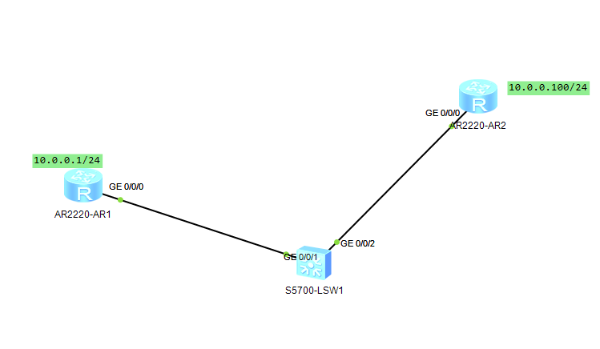
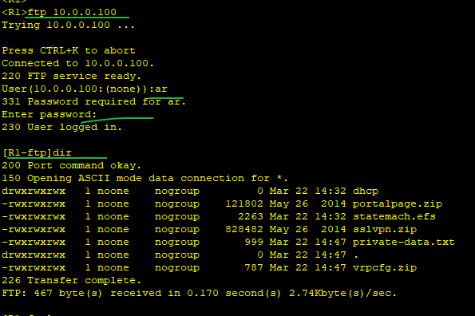
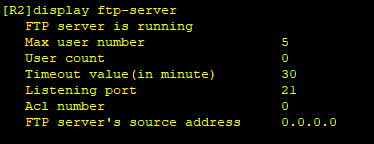
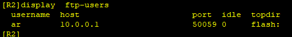
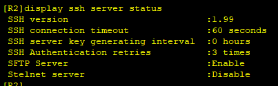
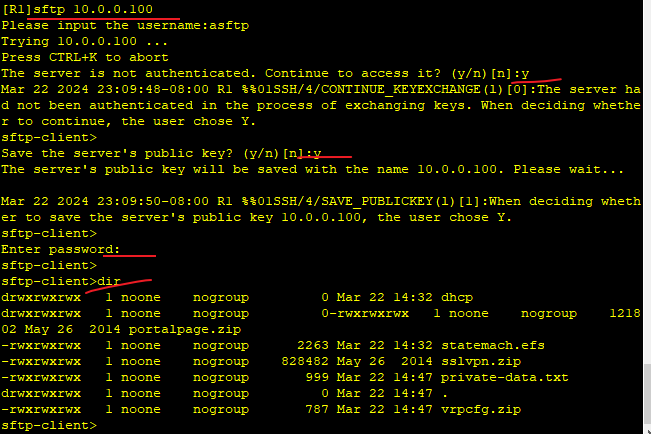

---
tags:
  - network
  - HCIA
---
模拟FTP server的实验
1. 使用路由器模拟对应的ftp client 以及ftp server, 并实现对应的文件下载
2. 使用路由器模拟sftp client和sftp server的操作


## FTP

拓扑图:



### 1. 配置IP
```
system-view
	sysname R1
	interface GigabitEthernet 0/0/0
		ip address 10.0.0.1 24
	ftp server enable : 打开ftp server 功能

```


### 2. 配置FTP 用户

```
aaa
	local-user ar password cipher huawei
	local-user ar service-type ftp
	local-user ar privilege level 15
	local-user ar ftp-directory flash:
```

到此就配置好了一台ftp server, 在另一台路由器上就可以进行登录.


查看ftp server信息
```
display ftp-server 
```


登录上去后, 查看ftp user信息


## SFTP

### 1. 配置接口并打开sftp
```
system-view
	display rsa local-key-pair public # 公钥查看
	sysname R1
	interface GigabitEthernet 0/0/0
		ip address 10.0.0.1 24
	sftp server enable 
```

### 2. 配置vty

```
user-interface vty 0 4
	authentication-mode aaa
	protocol inbound ssh # 输入协议为ssh

```

### 3. 配置sftp用户信息

```
# 默认带了public key, 故生成跳过生成key操作
aaa
	local-user asftp password cipher huawei
	local-user asftp service-type ssh
	local-user asftp privilege level 15
	local-user asftp ftp-directory flash:
ssh user asftp authentication-type password
```

### 4. 查看sftp服务
```
display ssh server status
```


### 5. sftp client打开 ssh client
```
ssh client first-time enable
```
sftp 登录




