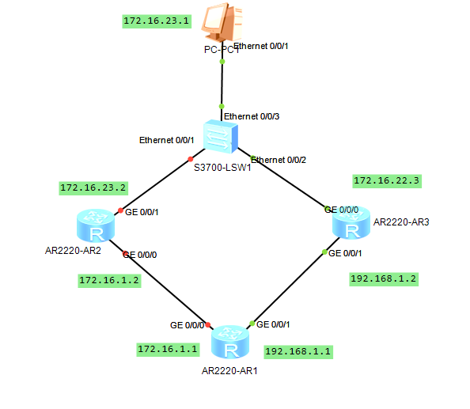
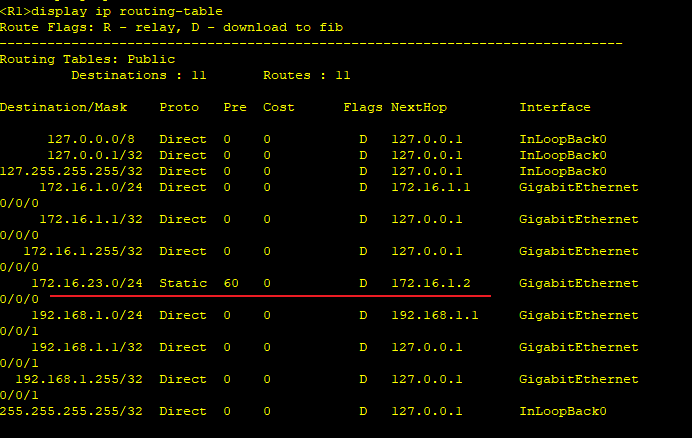
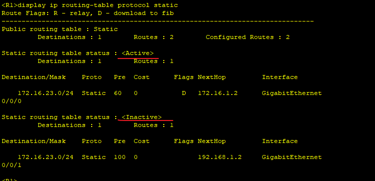
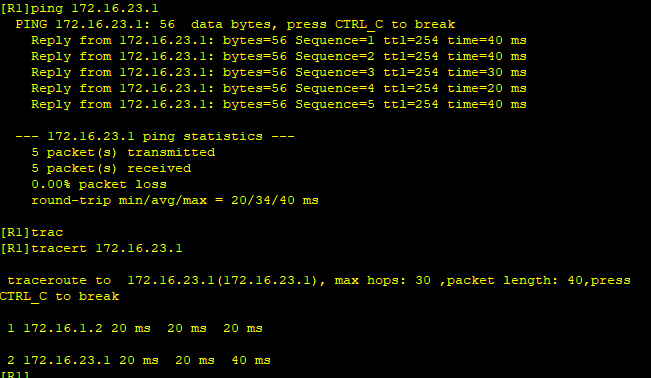
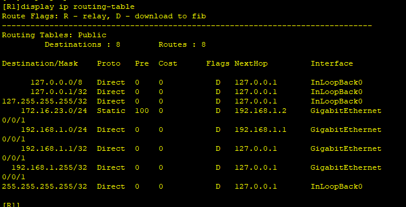
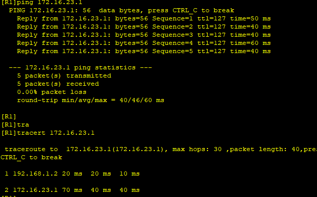

---
tags:
  - HCIA
  - network
---
`浮动路由`即两条权限不一样的路由, 此时download到路由表中的只有权限比较高的,  而权限比较低的会被隐藏; 当权限高的路由出故障, 不能正常通信时, 权限低的路由会加载到路由表中, 替换掉原来权限高的.

拓扑图如下:



实验内容:
1. 配置两条权重不一样的路由在R1
2. 通常负载路径为  R1->R2->R4
3. 当R2出问题(G0/0/0 shutdown), 路径为 R1->R3->R4

### 1. 配置IP
```
R1
system-view 
	sysname R1
	interface G0/0/0
		ip address 172.16.1.1 24
	interface G0/0/1
		ip address 192.168.1.1 24

R2
system-view 
	sysname R2
	interface G0/0/0
		ip address 172.16.1.2 24
	interface G0/0/1
		ip address 172.16.23.2 24


R3
system-view 
	sysname R3
	interface G0/0/1
		ip address 192.168.1.2 24
	interface G0/0/2
		ip address 172.16.23.3 24

```


### 2. 添加路由
```
R1
ip route-static 172.16.23.1 24 GigabitEthernet0/0/0 172.16.1.2
ip route-static 172.16.23.1 24 GigabitEthernet0/0/1  192.168.1.2 preference 100

```


可以看到设置了preference为100, 其权限低,  状态为 inactive.  即路径会从R2走.

此时可以看到已经可以ping通R4路由, 并且路径为 R1->R2->R4

### 3. 测试
关闭R2的接口来模拟R2故障, 来看路由的切换.
```
R2
system-view
	interface g0/0/0
		shutdown
	interface g0/0/1
		shutdown

R1:  检查一下R1的routing-table
display ip routing-table 
```

可以看到已经切换到了新的路由,  权重为低100的那个.



