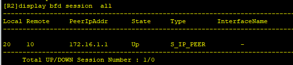
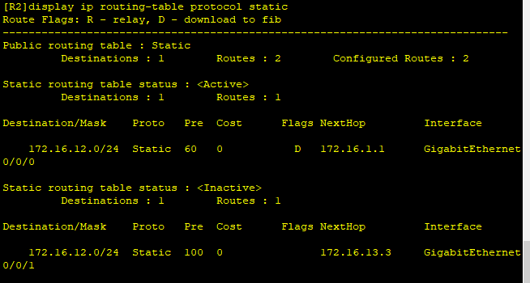
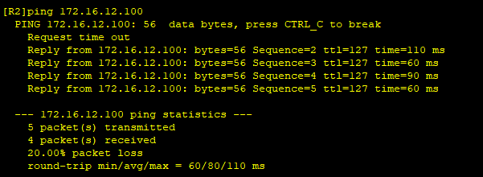
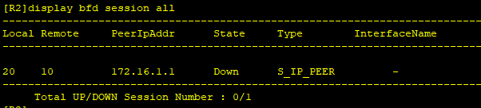

---
tags:
  - network
  - HCIA
  - BFD
---
静态路由的缺点是`无法及时感知拓扑的变化`, 此实验让静态路由和BFD联动,  及时感知拓扑的变化, 并调整路由路径.

拓扑图下:


如图所示,  在R2上配置两条静态路径, 分别通过R1和R3到PC1, 优先从R1通过.
当SW1和R1连接出现故障时,  R2无法感知到, 并且R2会继续通过R1到PC1, 这导致消息的丢失.

实验目的：
配置BFD和静态路由联动, 并且感知到R1和SW1之间的连接问题, 并迅速切换路由路径.

### 1 IP 分配
```
R1:
interface g0/0/0  
	ip address 172.16.1.1  24
interface g0/0/1  
	ip address 172.16.12.1  24

R2
interface g0/0/0  
	ip address 172.16.1.2  24
interface g0/0/1  
	ip address 172.16.13.2  24

R3
interface g0/0/0  
	ip address 172.16.13.3  24
interface g0/0/1  
	ip address 172.16.12.3  24


```


### 2. BFD 配置
```
R1:
bfd    # 激活BFD 功能
quit

# 创建一个BFD会话
bfd ad bind peer-ip 172.16.1.2 
	discriminator local 10   #设置一个本地标示, 和对端的远程表示对应
	discriminator remote 20   # 设置一个远程标示,和对端的本地对应
	commit


R2
bfd    # 激活BFD 功能
quit

# 创建一个BFD会话
bfd ad bind peer-ip 172.16.1.1
	discriminator local 20   #设置一个本地标示, 和对端的远程表示对应
	discriminator remote 10   # 设置一个远程标示,和对端的本地对应
	commit

```




### 3. route 配置
```
R2
ip route-static 172.16.12.100 24 GigabitEthernet0/0/0 172.16.1.1 track bfd-session ad

ip route-static 172.16.12.100 24 g0/0/1 172.16.13.3 preference 100

```



此时，R2就和PC1就联通了。
### 4. test

1. shutdown R1 interface
2. check R2 routing-table
3. R2 ping PC1

```
R1
interface GigabitEthernet0/0/0
	shutdown

R2
display ip routing-table protocol static
display bfd session all
ping 172.16.12.100
```




可以看到此时就已经自动切换到备用路由了.


