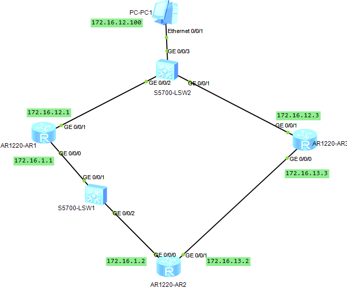
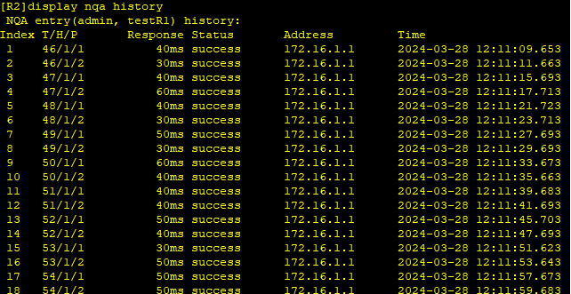
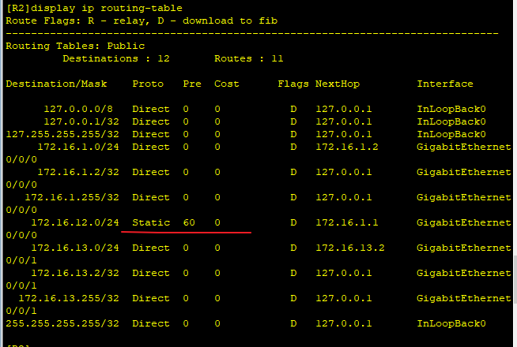
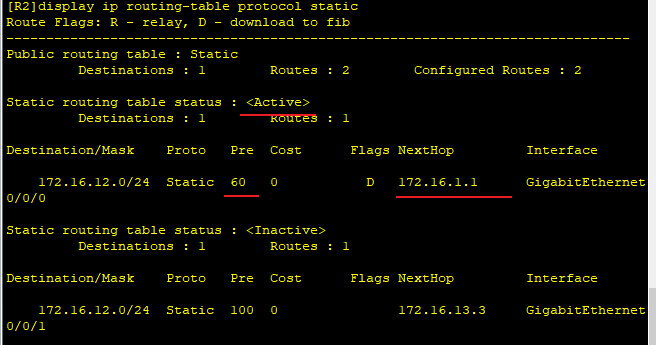
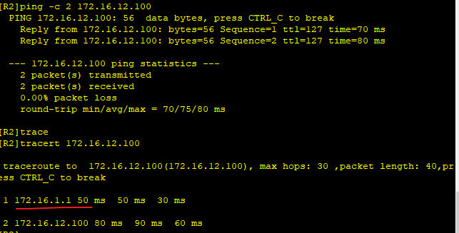
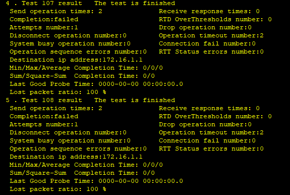
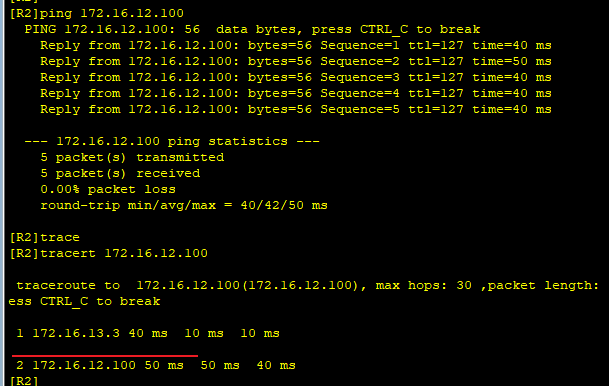

---
tags:
  - HCIA
  - NQA
  - network
---
NQA(network Quality Analysis网络质量分析)
[[03_2静态路由和BFD联动]] 上一节使用BFD和静态路由联动来动态感知网络拓扑的变化,  本节使用另一种方法NQA来达到类似的效果.

拓扑图跟上一节一样:


### 1. 关闭BFD
```
R2
system-view 
undo bfd


R1
system-view 
undo bfd

```


### 2.配置NQA

```
# 在R2上配置一个NQA
nqa test-instance admin testR1
	test-type icmp
	destination-address ipv4 172.16.1.1
	frequency 6     # 每一轮测试间隔时间
	probe-count 2   # 每轮的次数
	interval seconds 2  # 每次测试间隔时间
	timeout 2
	start now


```






可以看到现在使用的R1路由.

### 3. 静态路由和NQA联动
```
R2
ip route-static 172.16.12.100 24 GigabitEthernet0/0/0 172.16.1.1 track nqa admin testR1
```



### 4. test

```
# shutdown R1 接口
interface g0/0/0 
	shutdown


# 测试联通性
ping 172.16.12.100


```




可以看到，关闭R1后,路由切换到了 R3上.


