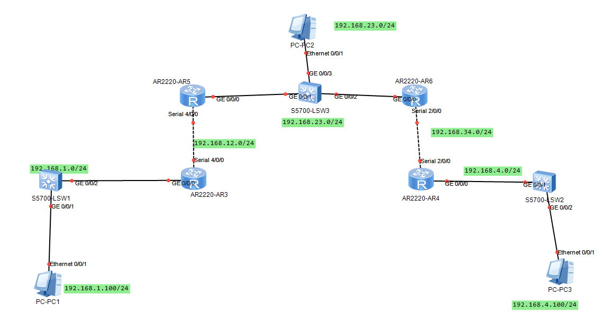
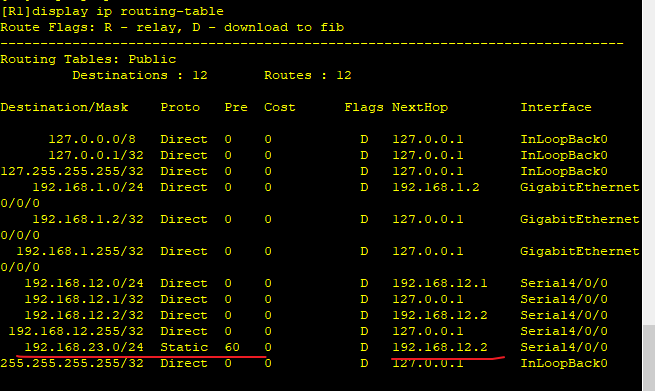
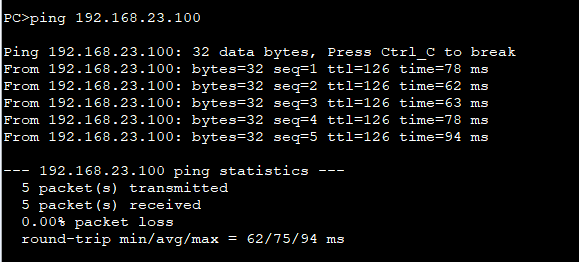
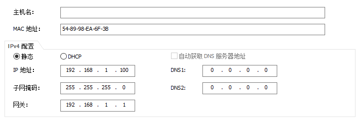
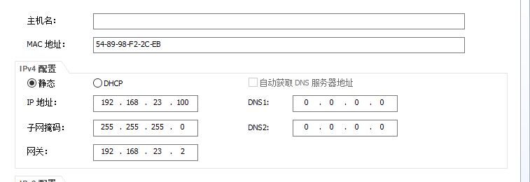
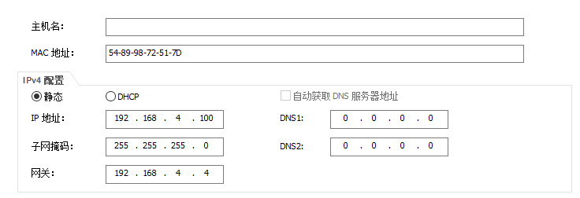
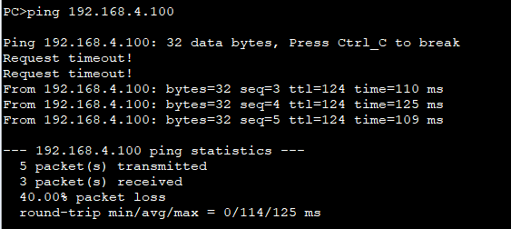
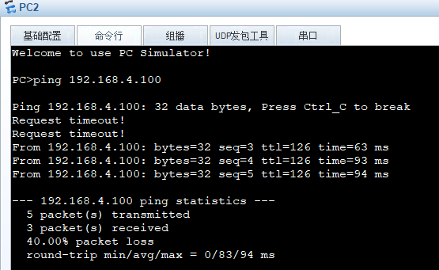

---
tags:
  - network
  - HCIA
---
本实验配置静态路由使用.
拓扑图如下:


实验目标：
1. PC1 可以ping通PC2，PC3
2. PC2 同样可以ping通 PC1 PC3
3. same to PC3


### 1. 设置路由器接口IP
```
# R1
system-view
	sysname R1
interface GigabitEthernet0/0/0
	undo shutdown
	ip address 192.168.1.1 24
	quit
interface Serial 4/0/0
	ip address 192.168.12.1 24
	undo shutdown 

# R2
system-view
	sysname R2

interface Serial 4/0/0
	ip address 192.168.12.2 24
	undo shutdown 
interface GigabitEthernet 0/0/0
	ip address 192.168.23.2 24


# R3
interface GigabitEthernet 0/0/0
	ip address 192.168.23.3 24
interface Serial 2/0/0
	ip address 192.168.34.3 24
	undo shutdown

	
#R4
system-view
	sysname R4
interface Serial 2/0/0
	ip address 192.168.34.4 24
interface GigabitEthernet 0/0/0
	ip address 192.168.4.4 24

```

### 2. PC1 & PC2
给R1添加静态路由, 使得PC1可以ping通PC2
```
#  配置路由, 让R1知道如何转发PC1的数据到 PC2
# 所有到PC2的数据通过Serial4出去, 下一跳地址为R2
ip route-static 192.168.23.100 24 Serial4/0/0 192.168.12.2

```

#### 2.1 R2 添加静态路由
R2添加静态路由, 使得PC2可以ping通PC1


```
# 添加静态路由, 让PC2返回数据转发到R1
ip route-static 192.168.1.100 24 Serial4/0/0 192.168.12.1
```






### PC1  & PC3
```
# R1 转发PC3 数据到R2
ip route-static 192.168.4.100 24 Serial4/0/0 192.168.12.2

# R2 转发PC3数据到R3 
ip route-static 192.168.4.100 24 GigabitEthernet0/0/0 192.168.23.3

# R2 转发PC1数据到R1, 上一步已经配置

# R3 转发PC3数据到R4
ip route-static 192.168.4.100 24 Serial 2/0/0 192.168.34.4


# R3 转发PC1数据到R2
ip route-static 192.168.1.100 24 GigabitEthernet 0/0/0 192.168.23.2

# R4 转发PC1数据到R3
ip route-static 192.168.1.100 24 Serial 2/0/0 192.168.34.3 


#### 删除路由
undo ip route-static 192.168.4.100 24 Serial2/0/0 192.168.4.4

```






### PC2 & PC3


```
# R2 转发PC3 数据到 R3, 上一步已配

# R3 转发PC3 数据到 R4, 上一步已配

# R4 转发PC2 数据到 R3
ip route-static 192.168.23.100 24 Serial2/0/0 192.168.34.3


# R3 转发PC2 数据到 R2
ip route-static 192.168.23.100 24 GigabitEthernet0/0/0  192.168.23.2

```




