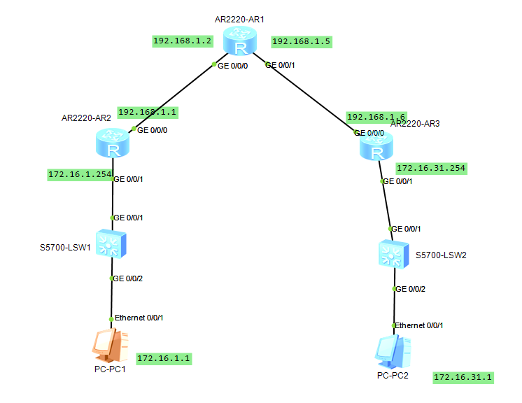
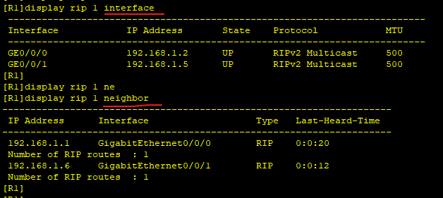
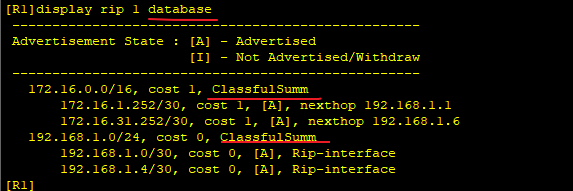
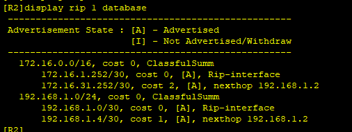
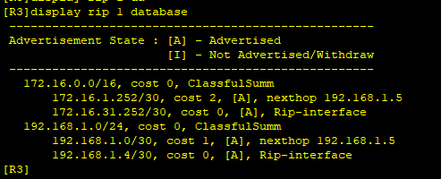

---
tags:
  - RIPV2
  - HCIA
  - network
---
拓扑图如下：



1. 配置IP
2. 配置RIPV2
3. 查看通过RIPV2学习到的路由

### IP
```
R1
system-view
	sysname R1
	interface G0/0/0 
		ip address 192.168.1.2 30
	interface G0/0/1 
		ip address 192.168.1.5 30

R2
system-view
	sysname R2
	interface G0/0/0 
		ip address 192.168.1.1 30
	interface G0/0/1 
		ip address 172.16.1.254 30

R3
system-view
	sysname R3
	interface G0/0/0 
		ip address 192.168.1.6 30
	interface G0/0/1 
		ip address 172.16.31.254 30


```


### RIPV2 配置
```
R1
rip 1
	version 2
	network 192.168.1.0


R2
rip 1
	version 2
	network 192.168.1.0
	network 172.16.0.0


R3
rip 1
	version 2
	network 192.168.1.0
	network 172.16.0.0


R1
display rip 1 interface 
display rip 1 neighbor
```
查看R1上那些端口打开了RIP



### 查看学习到的路由
```
R1
display rip 1 database 
```







