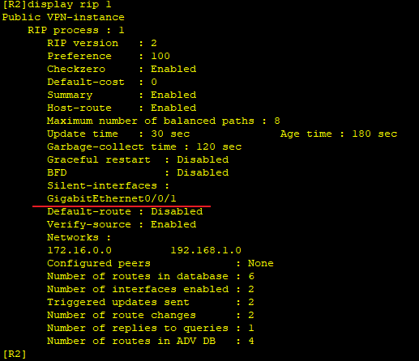

---
tags:
  - network
  - HCIA
---
使用上一节的[[04_1RIPv2配置]] 的拓扑图。


R2 R3都打开了G0/0/1端口的RIPV1, 但是此端口并没有连接路由, 发送的RIP报文会消耗PC,SW已经带宽的资源,  故我们可以让此端口只接收RIP报文,  而不发送.

### silent g0/0/1
```
R2
rip 1
	silent-interface g0/0/1

```




