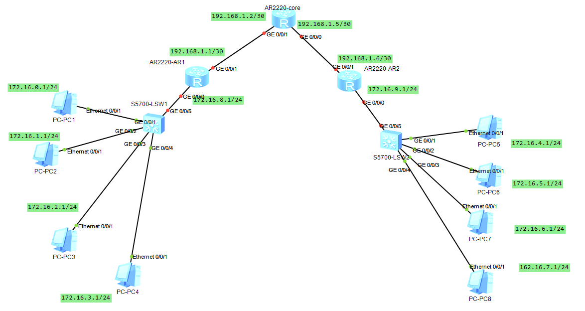
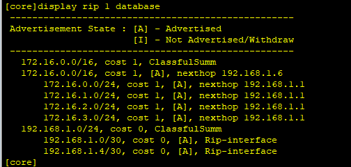
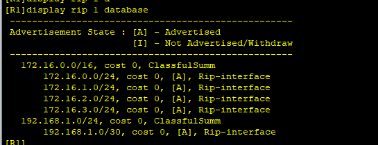
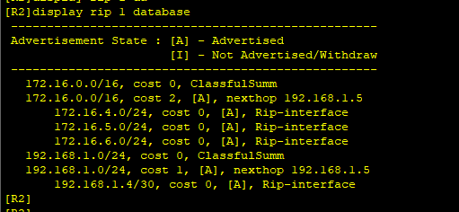
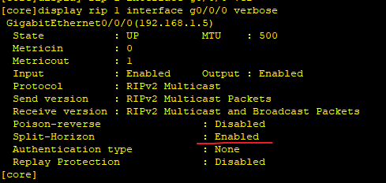
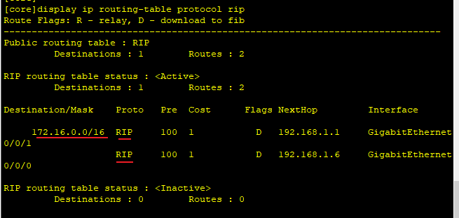
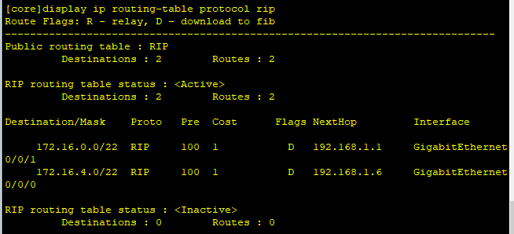

---
tags:
  - network
  - HCIA
  - RIP
---
拓扑图如下:



从图中可以看到R1, R2 连接了很多的子网(此处使用PC表示子网),  当打开RIP后,  R1, R2,core路由器会学习到很多的子路由(因为RIP会打开 `水平分割`功能, 此功能会默认关闭路由汇总.).
问题1:  水平分割 关闭路由汇总, 我们可以手动打开
问题2: 自动的路由汇总粒度比较大, 可以使用手动路由汇总来指定

### 1. ip 配置
```
core
system-view
	sysname core
	interface g0/0/0
		ip address 192.168.1.5 30
	interface g0/0/1
		ip address 192.168.1.2 30
	rip 1
		network 192.168.1.0

R1
system-view
	sysname R1
	interface g0/0/0
		ip address 172.16.0.2 24
	interface g0/0/1
		ip address 192.168.1.1 30
	interface g0/0/2
		ip address 172.16.1.2 24
	interface g4/0/0
		ip address 172.16.2.2 24
	interface g4/0/1
		ip address 172.16.3.2 24
	rip 1
		version 2
		network 192.168.1.0
		network 172.16.0.0


R2
system-view
	sysname R2
	interface g0/0/0
		ip address 172.16.4.2 24
	interface g0/0/1
		ip address 192.168.1.6 30
	interface g0/0/2
		ip address 172.16.5.2 24
	interface g6/0/1
		ip address 172.16.6.2 24
	interface g6/0/0
		ip address 172.16.7.2 24
	rip 1
		version 2
		network 192.168.1.0
		network 172.16.0.0

```


### 2. RIPv2配置

```
core
	rip 1
		version 2
		network 192.168.1.0

R1
	rip 1
		version 2
		network 192.168.1.0
		network 172.16.0.0

R2
	rip 1
		version 2
		network 192.168.1.0
		network 172.16.0.0

```

### 3. 查看路由, 并打开summary









可以看到三个路由器都学习到了很多的详细路由, 并且`summary` 功能已经打开了, 但是看起来IP并没有summary, 这是因为`水平分割|毒性逆转`功能打开.

```
core
rip 1
	summary always

R1
rip 1
	summary always

R2
rip 1
	summary always
```

可以看到, 当打开所有的sumamry后,  core路由器进行了IP summary,  并且进行路由负载,  但是此ip summary粒度比较大. 
如:  172.16.0.1 通过R2 并不能到达, 这回导致丢包.

对于此情况，我们可以进行手动sumamry.

### 4. manual summary
```
R1  manual summary
interface g0/0/1
	rip summary-address 172.16.0.0  255.255.252.0


R2  manual summary
interface g0/0/1
	rip summary-address 172.168.4.0 255.255.252.0
```




