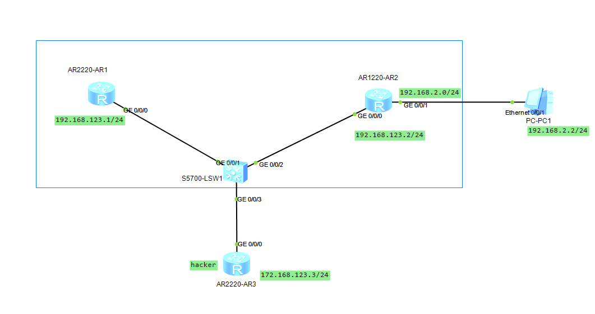
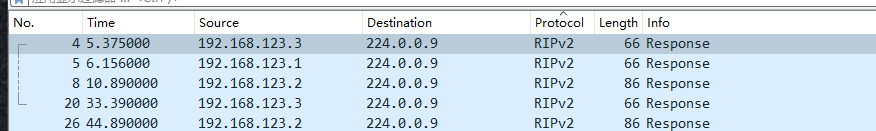
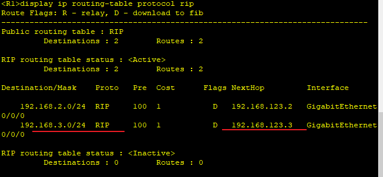
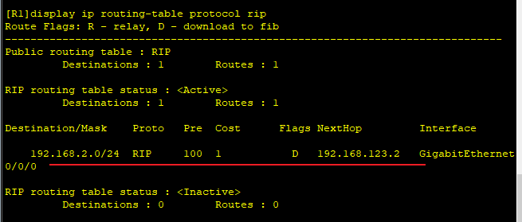
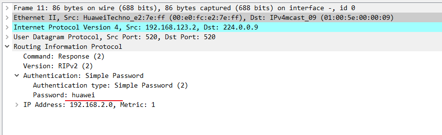
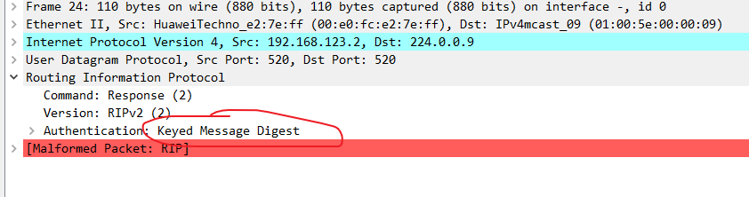

---
tags:
  - HCIA
  - RIP
  - network
---


本节主要用于实验RIP的认证.
如何所示 R1 R2属于一个内网,  通过交换机相连,  R3是hacker,  连接到交换机后, 向内网广播一些无用的RIP包信息,  使得内容路由器的RIP信息不正确, 而且大大占用网络带宽, 由此可导致内容不能正常工作.
此实验:
1. 打开RIP的认证
2. 查看打开认证后, R3的RIP信息别丢弃


### IP & RIP 配置

```
R1
system-view 
	sysname R1
	interface g0/0/0
		ip address 192.168.123.1 24
	rip 1
		version 2
		network 192.168.123.0

R2
system-view 
	sysname R2
	interface g0/0/0
		ip address 192.168.123.2 24
	interface g0/0/1
		ip address 192.168.2.1 24
	rip 1
		version 2
		network 192.168.123.0
		network 192.168.2.0

R3
system-view 
	sysname R3
	interface g0/0/0
		ip address 192.168.123.3 24
	interface g0/0/1
		ip address 192.168.3.1 24
	rip 1
		version 2
		network 192.168.123.0
		network 192.168.3.0
```




通过抓包可以发现, 有收到R3的包,  并且添加了R3的RIP 信息。


### 认证打开

```
# 简单认证, 密码传输使用明文
R1
	interface g0/0/0
		rip authentication-mode simple cipher huawei


R2
	interface g0/0/0
		rip authentication-mode simple cipher huawei


# MD5认证, 传输密文
R1
interface g0/0/0
	rip authentication-mode md5 usual cipher huawei


R2
interface g0/0/0
	rip authentication-mode md5 usual cipher huawei


```



可以看到, 配置简单的密码认证后,  已经没有了R3信息, 并且密码传输为明文.



修改为MD5类型后,  密码传输为密文.


