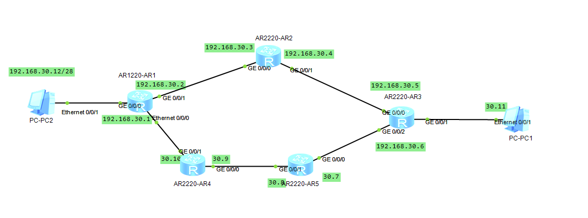
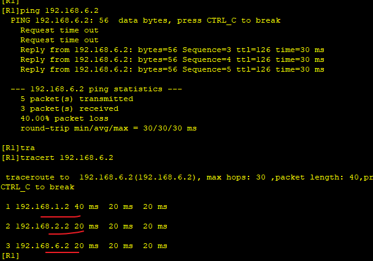
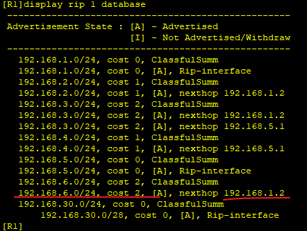
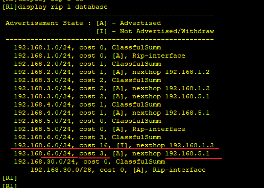
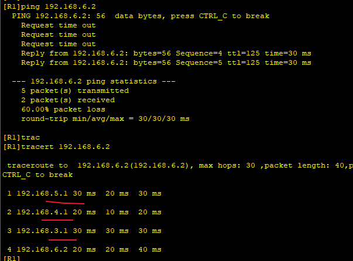

---
tags:
  - network
  - RIP
  - HCIA
---
拓扑图如下：

按照RIP度量,  从R2到R3路径最短, 故会选择R2;  但是R4->R5路径的带宽更好,  从此路径更合理.
故实验目的:
1. 手动更改度量值, 让路径选择R4->R5


### IP & RIP 配置

```
R1
system-view 
	sysname R1
	interface G0/0/0
		ip address 192.168.30.1 28
	interface G0/0/1
		ip address 192.168.5.2  24
	interface g0/0/2
		ip address 192.168.1.1  24
	rip 1
		version 2
		network 192.168.30.0
		network 192.168.5.0
		network 192.168.1.0

R2
system-view 
	sysname R2
	interface G0/0/0
		ip address 192.168.1.2 24
	interface G0/0/1
		ip address 192.168.2.1 24
	rip 1
		version 2
		network 192.168.1.0
		network 192.168.2.0

R3
system-view 
	sysname R3
	interface G0/0/0
		ip address 192.168.2.2 24
	interface G0/0/1
		ip address 192.168.6.1 24
	interface g0/0/2
		ip address 192.168.3.1 24
	rip 1
		version 2
		network 192.168.6.0
		network 192.168.3.0
		network 192.168.2.0

R4
system-view 
	sysname R4
	interface G0/0/0
		ip address 192.168.4.2 24
	interface G0/0/1
		ip address 192.168.5.1 24
	rip 1
		version 2
		network 192.168.4.0
		network 192.168.5.0

R5
system-view 
	sysname R5
	interface G0/0/0
		ip address 192.168.3.2 24
	interface G0/0/1
		ip address 192.168.4.1 24
	rip 1
		version 2
		network 192.168.3.0
		network 192.168.4.0


```



可以看到R1到PC1的路径是通过R2过去的。

### 修改度量值
```
## 在R1上修改目的地址为192.168.6.0/24的cost值
R1
acl 2000
	rule permit source 192.168.6.0 0.0.0.0 # 配置一条规则用于匹配目标地址
interface G0/0/2
	rip metricin 2000 10 # 比表示符合规则2000的,其度量值添加10
```


可以看到从R2通过的cost为16,  从R4->R5通过的cost为3.
看一下ping的结果



