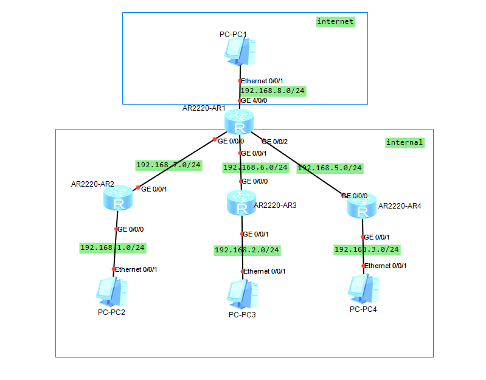
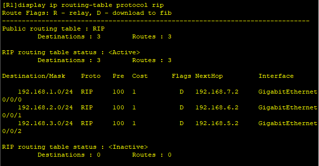
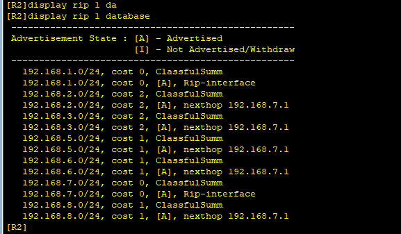
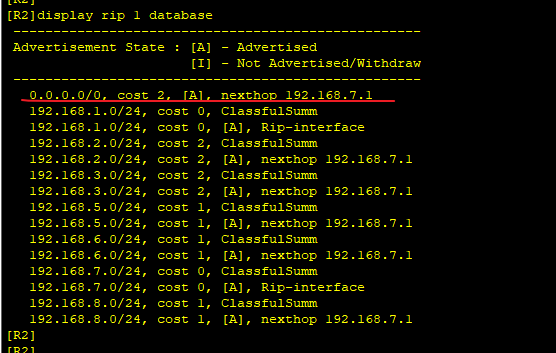

---
tags:
  - network
  - HCIA
  - RIP
---
拓扑图如下:



所有的内网路由器会通过R1连接到互联网, 那么内网中所有的PC要上网的话, 如何做呢?   在R2 R3 R4上配置一条下一跳为R1的默认路由就可以让所有PC到internet的流量出去. 但是这种方法比较繁琐, 既不能感知拓扑变化, 手动配置有比较容易出错.
我们可以让R1通过RIP发布一个默认路由到内网中, 这样R2/3/4就可以动态学习到此默认路由.

实验：
配置R1通过RIP发送默认路由

### IP & RIP 配置
```
R1
system-view
	sysname R1
	interface g0/0/0
		ip address 192.168.7.1 24
	interface g0/0/1
		ip address 192.168.6.1 24
	interface g0/0/2
		ip address 192.168.5.1 24
	interface g4/0/0
		ip address 192.168.8.1 24
	rip 1
		version 2
		network 192.168.5.0
		network 192.168.6.0
		network 192.168.7.0
		network 192.168.8.0
		silent-interface g4/0/0


R2
system-view
	sysname R2
	interface g0/0/0
		ip address 192.168.1.1 24
	interface g0/0/1
		ip address 192.168.7.2 24
	rip 1
		version 2
		network 192.168.1.0
		network 192.168.7.0
		silent-interface g0/0/0

R3
system-view
	sysname R3
	interface g0/0/0
		ip address 192.168.6.2 24
	interface g0/0/1
		ip address 192.168.2.1 24
	rip 1
		version 2
		network 192.168.2.0
		network 192.168.6.0
		silent-interface g0/0/1


R4
system-view
	sysname R4
	interface g0/0/0
		ip address 192.168.5.2 24
	interface g0/0/1
		ip address 192.168.3.1 24
	rip 1
		version 2
		network 192.168.5.0
		network 192.168.3.0
		silent-interface g0/0/1

```





### R1 发布默认路由

```
R1
ip route-static 0.0.0.0 0.0.0.0 192.168.8.2  # 默认路由
rip 1
	default-route originate cost 1  # 发布默认路由

```




