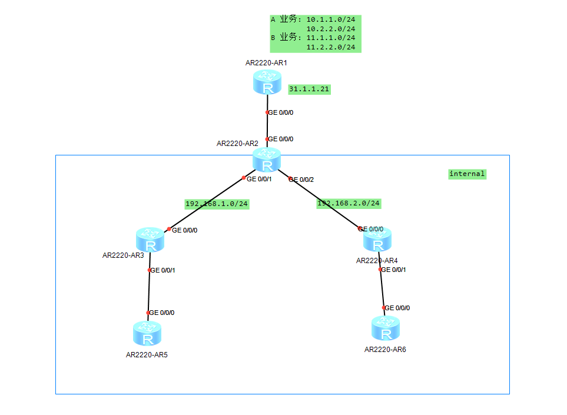
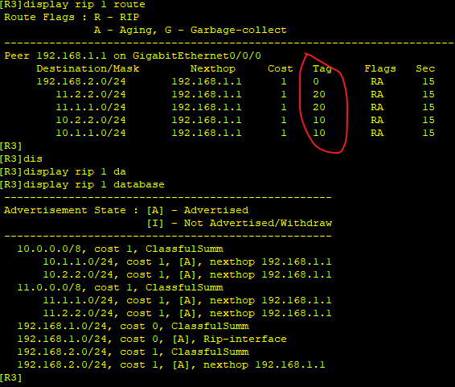
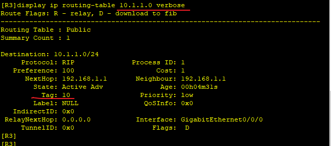

---
tags:
  - network
  - HCIA
---
拓扑图如下:


R2位于RIP域的边界, 它直连外部网络.  在该网络中存在A,B两个业务,  这两个业务在不同的IP网段,  现在R2配置了到达这两个业务网段的静态路由, 为了让整个RIP域动态的学习到这些路由,  R2需要将静态路由重分发到RIP.  
RIP域内的路由器学习到这些达到外部的路由后,  要区分出到达A,B业务的路由. 此时可以在R2上操作RIP, 为它们设置不同的路由tag.

### IP&RIP 配置
```
R1
system-view
	sysname R1
	interface g0/0/0
		ip address 31.1.1.21 24

R2
system-view
	sysname R2
	interface g0/0/0
		ip address 31.1.1.22 24
	interface g0/0/1
		ip address 192.168.1.1 24
	interface g0/0/2
		ip address 192.168.2.1  24
	rip 1
		version 2
		network 192.168.1.0 
		network 192.168.2.0 

R3
system-view
	sysname R3
	interface g0/0/0
		ip address 192.168.1.2 24
	rip 1
		version 2
		network 192.168.1.0 
		network 192.168.2.0 

R4
system-view
	sysname R4
	interface g0/0/0
		ip address 192.168.2.2 24
	rip 1
		version 2
		network 192.168.1.0 
		network 192.168.2.0 


```


### 静态路由配置
```
R2
ip route-static 10.1.1.0 24 G0/0/0 31.1.1.21 tag 10
ip route-static 10.2.2.0 24 G0/0/0 31.1.1.21 tag 10
ip route-static 11.1.1.0 24 G0/0/0 31.1.1.21 tag 20
ip route-static 11.2.2.0 24 G0/0/0 31.1.1.21 tag 20

rip 1
	import-route static
```


### 查看学习到的静态路由

```
R3
display rip 1 route
display rip 1 database
display ip routing-table 10.1.1.0 verbose

```






