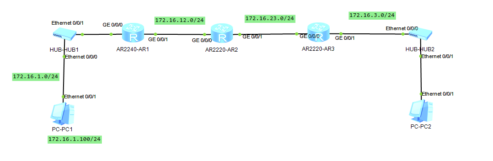
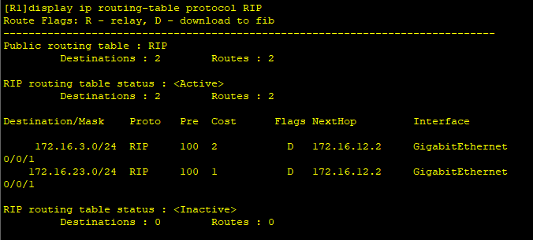
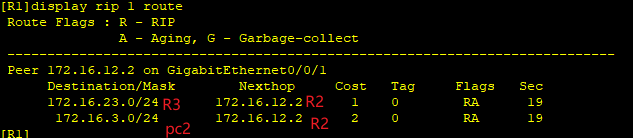
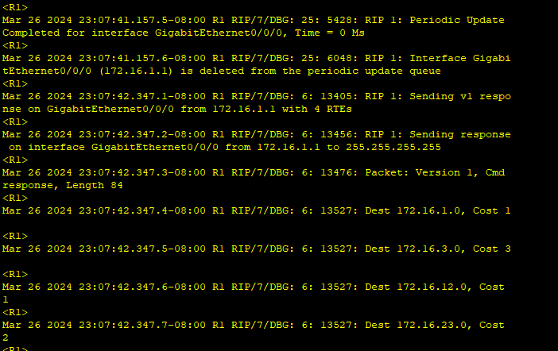
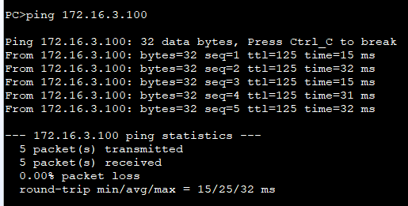

---
tags:
  - RIP
  - network
  - HCIA
---
本节配置一个简单的RIP网络, 路由之间实现RIP协议,并且能够动态学习路由.
1. 配置IP
2. 配置RIP动态学习路由
3. PC1/2 互通


网络拓扑图如下:


### 1. 配置IP
```
R1:
system-view
	sysname R1
	interface GigabitEthernet0/0/0
		ip address 172.16.1.1 24
	interface GigabitEthernet0/0/1 
		ip address 172.16.12.1 24

R2:
system-view
	sysname R2
	interface GigabitEthernet0/0/0
		ip address 172.16.12.2 24
	interface GigabitEthernet0/0/1 
		ip address 172.16.23.2 24

R3:
system-view
	sysname R3
	interface GigabitEthernet0/0/0
		ip address 172.16.23.3 24
	interface GigabitEthernet0/0/1 
		ip address 172.16.3.3 24
```


### 2. 配置RIP
```
#R1:
rip 1    #开打RIP, 此处的1表示进程ID, 可以配置多个RIP
	network 172.16.0.0     # 此处配置的只能是大类地址(A/B/C类)

R2:
rip 2
	network 172.16.0.0

R3:
rip 3
	network 172.16.0.0

## R1 G0/0/0 端口连接PC1,其实是不需要发送RIP报文的,可以关闭G0/0/0 端口

R1:
rip 1
	silent-interface  GigabitEthernet0/0/0
```


### 3. 查看学习的动态路由
```
# 查看学习到的路由
display ip routing-table protocol RIP
```




R1学习到两条路由, 并且知道G0/0/1 的对端IP.
第一条: 说明去到 172.16.23.0 网段(R3), cost为1, 而且下一跳为R2.
第二条: 去到172.16.3.0/24 (PC2),  cost为2(经过R2,R3). 下一跳为R2.

### 4. debug信息

```
# 普通模式下
debugging rip 1   # 表示要看 RIP 进程1 的信息
terminal debugging   # 表示 终端debug

# 此时就可以看到RIP发送的包信息
```


### 5 连通测试




