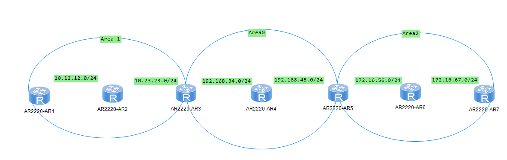
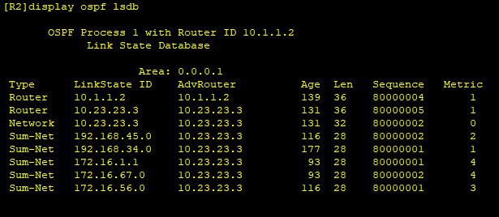
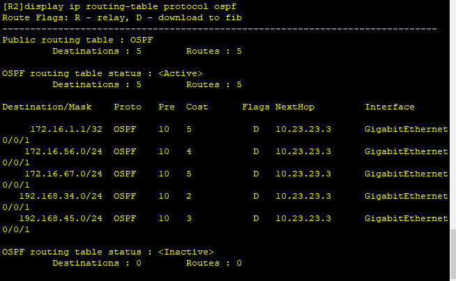
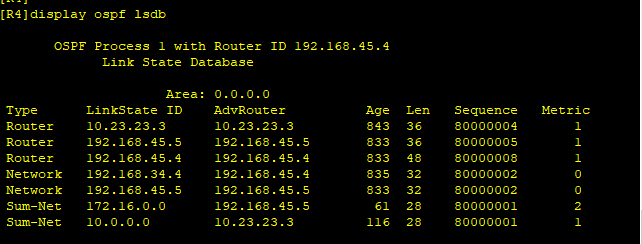
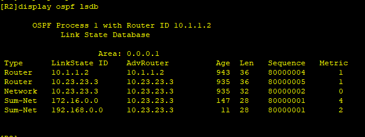
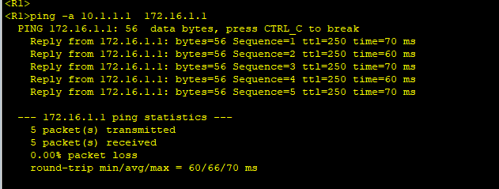

---
tags:
  - network
  - HCIA
  - OSPF
  - area
---
拓扑图如下:


实验:
1. 配置多区域的ospf
2. 配置路由summary

### IP 
```
R1
system-view 
	sysname R1
	interface LoopBack 0
		ip address 10.1.1.1 24
	interface g0/0/0
		ip address 10.12.12.1 24

R2
system-view 
	sysname R2
	interface g0/0/0
		ip address 10.12.12.2 24
	interface g0/0/1
		ip address 10.23.23.2 24
	
R3
system-view 
	sysname R3
	interface g0/0/0
		ip address 10.23.23.3 24
	interface g0/0/1
		ip address 192.168.34.3 24


R4
system-view 
	sysname R4
	interface g0/0/1
		ip address 192.168.45.4 24
	interface g0/0/0
		ip address 192.168.34.4 24

R5
system-view 
	sysname R5
	interface g0/0/0
		ip address 192.168.45.5 24
	interface g0/0/1
		ip address 172.16.56.5 24
R6
system-view 
	sysname R6
	interface g0/0/0
		ip address 172.16.56.6 24
	interface g0/0/1
		ip address 172.16.67.6 24
		
R7
system-view 
	sysname R7
	interface g0/0/0
		ip address 172.16.67.7 24
	interface LoopBack 0
		ip address 172.16.1.1 24
```


### OSPF
```
R1
ospf 1
	area 1
		network 10.1.1.1 0.0.0.255
		network 10.12.12.1 0.0.0.255

R2
ospf 1
	area 1
		network 10.12.12.0 0.0.0.255
		network 10.23.23.0 0.0.0.255

R3
ospf 1
	area 1
		network 10.23.23.0 0.0.0.255
	area 0
		network 192.168.34.0 0.0.0.255


R4
ospf 1
	area 0
		network 192.168.34.0 0.0.0.255
		network 192.168.45.0 0.0.0.255
R5
ospf 1
	area 0
		network 192.168.45.0 0.0.0.255
	area 2
		network 172.16.56.0 0.0.0.255

R6
ospf 1
	area 2
		network 172.16.56.0 0.0.0.255
		network 172.16.67.0 0.0.0.255
R7
ospf 1
	area 2
		network 172.16.67.0 0.0.0.255
		network 172.16.1.1  0.0.0.255
```


可以看到在Area 1中也学习到了 Area0/2中的明细路由.  虽然 lsdb中描述的为 'Sum-net',  但是真实记录的仍然是明细路由.
我们可以在 abr(area boundary route) 上手动配置`route-summary`, 来替换明细路由.


### route summary
```
R3
ospf 1
	area 1     #为area1 设置summary
		abr-summary 10.0.0.0  255.0.0.0
	area 0
		abr-summary 192.168.0.0  255.255.0.0

R5
ospf 1
	area 2     # 同理为 area2 设置summary
		abr-summary 172.16.0.0  255.255.0.0

```


可以看到area1/2 的路由summary在area0中生效了, 同样在R3配置的Area0 summary同样在area1中生效了.


### test



