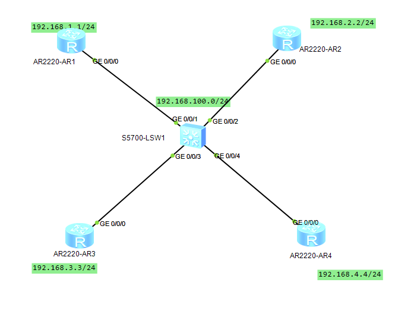
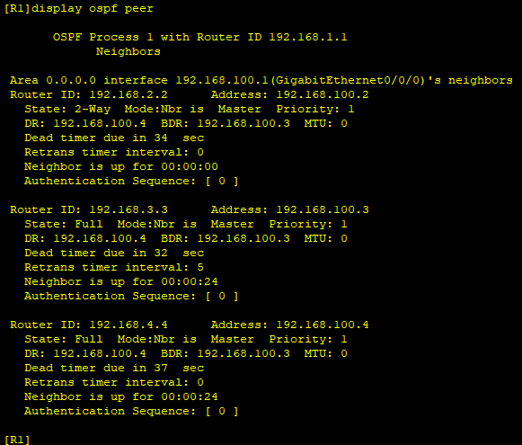
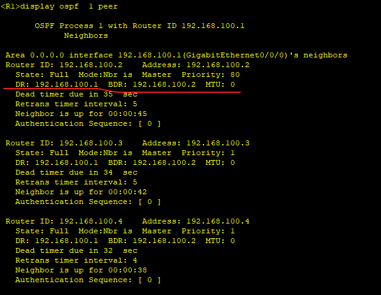
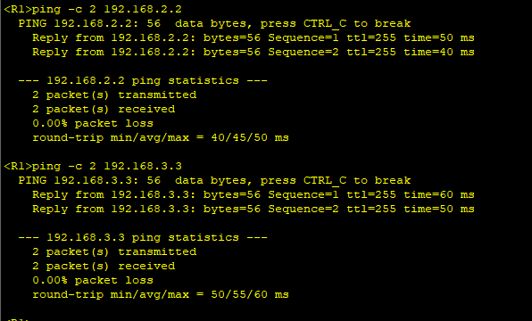

---
tags:
  - network
  - HCIA
  - DR_PRIORITY
---
实验目的:
1. 搭建一个ospf网络, 通过调整priority来指定 DR,BDR.
2. 调整cost来配置路由路径
3. 调整参考的网络带宽值


### IP & OSPF
```
R1
system-view
	sysname R1
	interface LoopBack 0
		ip address 192.168.1.1 24
	interface g0/0/0
		ip address 192.168.100.1 24
	ospf 1
		area 0 
			network 192.168.1.0 0.0.0.255
			network 192.168.100.0 0.0.0.255
R2
system-view
	sysname R2
	interface LoopBack 0
		ip address 192.168.2.2 24
	interface g0/0/0
		ip address 192.168.100.2 24
		ospf 1
		area 0 
			network 192.168.2.0 0.0.0.255
			network 192.168.100.0 0.0.0.255

R3
system-view
	sysname R3
	interface LoopBack 0
		ip address 192.168.3.3 24
	interface g0/0/0
		ip address 192.168.100.3 24
	ospf 1
		area 0 
			network 192.168.3.0 0.0.0.255
			network 192.168.100.0 0.0.0.255

R4
system-view
	sysname R4
	interface LoopBack 0
		ip address 192.168.4.4 24
	interface g0/0/0
		ip address 192.168.100.4 24
	ospf 1
		area 0 
			network 192.168.4.0 0.0.0.255
			network 192.168.100.0 0.0.0.255

```


可以看到现在的DR 为R4,  BDR 为R3.
选取OSPF DR BDR时：
1. 先比较 priority
2. route ID
3. cost比较.   cost=带宽参考值/100;  **bandwidth-reference**  设置


router ID 设置:
1. 全局设置  router id 1.1.1.1   
2. 打开ospf时设置:  ospf 1 router-id  1.1.1.1
3. 前两步没有设置的话, 会选举接口中设置IP 最大值
> 如果先是能了ospf, 后面设置了 router ID, 那么需要重启ospf 才能使之生效.  reset ospf process


### priority
现在通过调整priority来使得R1为DR,  R2为BDR
```
R1
interface g0/0/0
	ospf dr-priority 100

R2
interface g0/0/0
	ospf dr-priority 80

# 配置完成, 重启环境
```



### test



