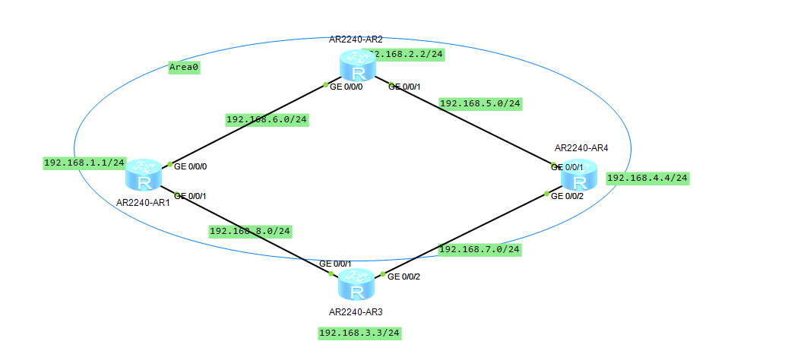
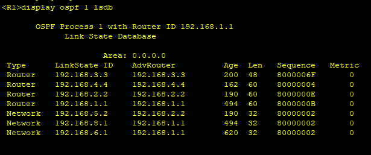
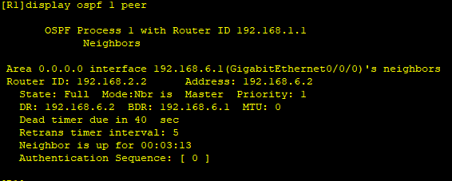
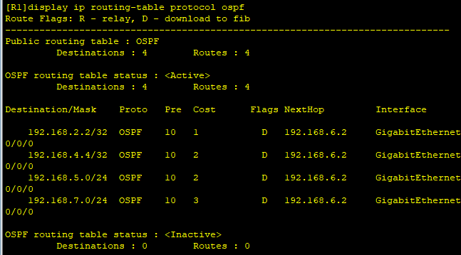
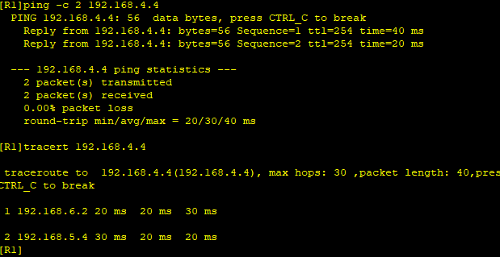

---
tags:
  - network
  - HCIA
  - OSPF
---
实验OSPF的验证功能。
1. 配置OSPF
2. 打开OSPF的验证功能， 阻隔恶意的路由信息
3. R1->R2使用simple, 其他使用MD5
4. R3 模拟hacker



### IP & OSPF
```
R1
system-view 
	sysname R1
	interface LoopBack 0
		ip address 192.168.1.1 24
	interface g0/0/0
		ip address 192.168.6.1 24
	interface g0/0/1
		ip address 192.168.8.1 24
	ospf 1 
		area 0
			network 192.168.1.0 0.0.0.255
			network 192.168.6.0 0.0.0.255
			network 192.168.8.0 0.0.0.255

R2
system-view 
	sysname R2
	interface LoopBack 0
		ip address 192.168.2.2 24
	interface g0/0/0
		ip address 192.168.6.2 24
	interface g0/0/1
		ip address 192.168.5.2 24
	ospf 1 
		area 0
			network 192.168.2.0 0.0.0.255
			network 192.168.6.0 0.0.0.255
			network 192.168.5.0 0.0.0.255

R3
system-view 
	sysname R3
	interface LoopBack 0
		ip address 192.168.3.3 24
	interface g0/0/1
		ip address 192.168.8.3 24
	interface g0/0/2
		ip address 192.168.7.3 24
	ospf 1 
		area 0
			network 192.168.3.0 0.0.0.255
			network 192.168.8.0 0.0.0.255
			network 192.168.7.0 0.0.0.255
R4
system-view 
	sysname R4
	interface LoopBack 0
		ip address 192.168.4.4 24
	interface g0/0/1
		ip address 192.168.5.4 24
	interface g0/0/2
		ip address 192.168.7.4 24
	ospf 1 
		area 0
			network 192.168.4.0 0.0.0.255
			network 192.168.5.0 0.0.0.255
			network 192.168.7.0 0.0.0.255
```

可以看到此时R1收到了来在hacker(R3)的恶意路由,  下面我们打开auth来阻止接收R3的路由.

### open auth

```
R1
interface g0/0/0
	ospf authentication-mode simple cipher huawei  # R1/2 simple校验
interface g0/0/1
	ospf authentication-mode md5 1 cipher huawei
R2
interface g0/0/0
	ospf authentication-mode simple cipher huawei
interface g0/0/1
	ospf authentication-mode md5 1 cipher huawei

R4
interface g0/0/1
	ospf authentication-mode md5 1 cipher huawei

```





可以看到此时R3的信息就已经阻止在外了。

### test



