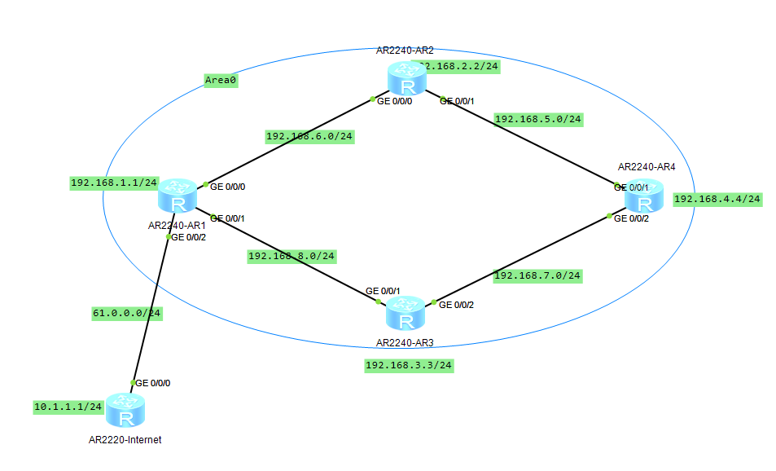
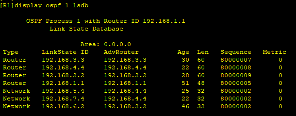
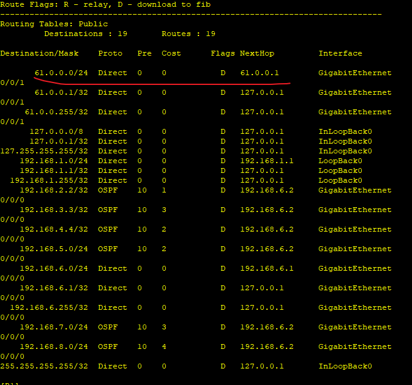
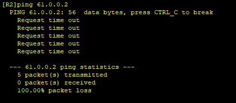
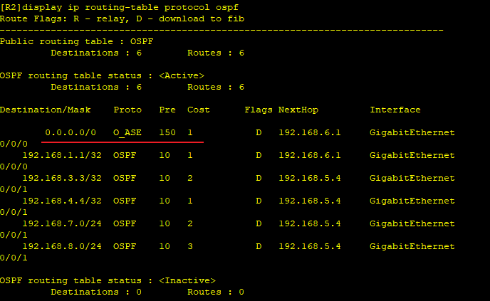
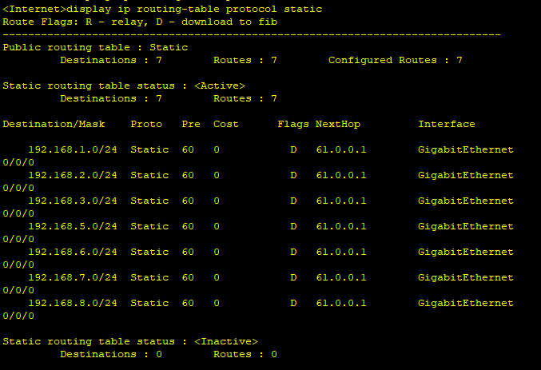
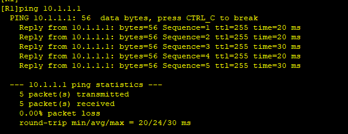
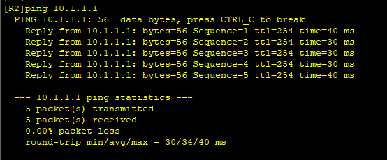
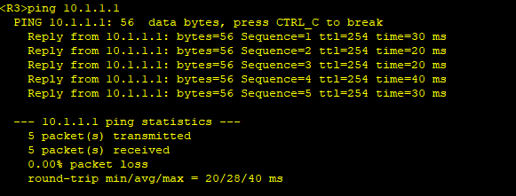
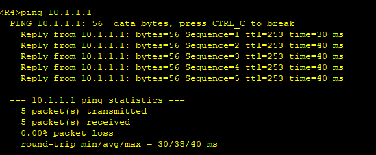

---
tags:
  - network
  - HCIA
  - OSPF
---
实验:
1. 配置area0中ospf的默认路由, 用于area0内路由访问Internet


### IP & OSPF

```
R1
system-view 
	sysname R1
	interface LoopBack 0
		ip address 192.168.1.1 24
	interface g0/0/0
		ip address 192.168.6.1 24
	interface g0/0/1
		ip address 192.168.8.1 24
	interface g0/0/2
		ip address 61.0.0.1 30
	ospf 1 
		area 0
			network 192.168.1.0 0.0.0.255
			network 192.168.6.0 0.0.0.255
			network 192.168.8.0 0.0.0.255

R2
system-view 
	sysname R2
	interface LoopBack 0
		ip address 192.168.2.2 24
	interface g0/0/0
		ip address 192.168.6.2 24
	interface g0/0/1
		ip address 192.168.5.2 24
	ospf 1 
		area 0
			network 192.168.2.0 0.0.0.255
			network 192.168.6.0 0.0.0.255
			network 192.168.5.0 0.0.0.255

R3
system-view 
	sysname R3
	interface LoopBack 0
		ip address 192.168.3.3 24
	interface g0/0/1
		ip address 192.168.8.3 24
	interface g0/0/2
		ip address 192.168.7.3 24
	ospf 1 
		area 0
			network 192.168.3.0 0.0.0.255
			network 192.168.8.0 0.0.0.255
			network 192.168.7.0 0.0.0.255
R4
system-view 
	sysname R4
	interface LoopBack 0
		ip address 192.168.4.4 24
	interface g0/0/1
		ip address 192.168.5.4 24
	interface g0/0/2
		ip address 192.168.7.4 24
	ospf 1 
		area 0
			network 192.168.4.0 0.0.0.255
			network 192.168.5.0 0.0.0.255
			network 192.168.7.0 0.0.0.255


Internet
system-view 
	sysname Internet
	interface LoopBack 0
		ip address 10.1.1.1 24
	interface g0/0/0
		ip address 61.0.0.2 30

```






可以看到area0现在是访问不到internet的。
接下来我们在R1上配置default route, 并通过ospf发布到area0中.
### defualt route
```
R1
ip route-static 0.0.0.0 0.0.0.0 GigabitEthernet0/0/2 61.0.0.2
ospf 1
	default-route-advertise  always 


Internet # 配置静态路由. 要添加Internet的返程路由
ip route-static 192.168.1.0 24 GigabitEthernet0/0/0  61.0.0.1
ip route-static 192.168.2.0 24 GigabitEthernet0/0/0  61.0.0.1
ip route-static 192.168.3.0 24 GigabitEthernet0/0/0  61.0.0.1
ip route-static 192.168.4.0 24 GigabitEthernet0/0/0  61.0.0.1
ip route-static 192.168.5.0 24 GigabitEthernet0/0/0  61.0.0.1
ip route-static 192.168.7.0 24 GigabitEthernet0/0/0  61.0.0.1
ip route-static 192.168.8.0 24 GigabitEthernet0/0/0  61.0.0.1

```





### test





