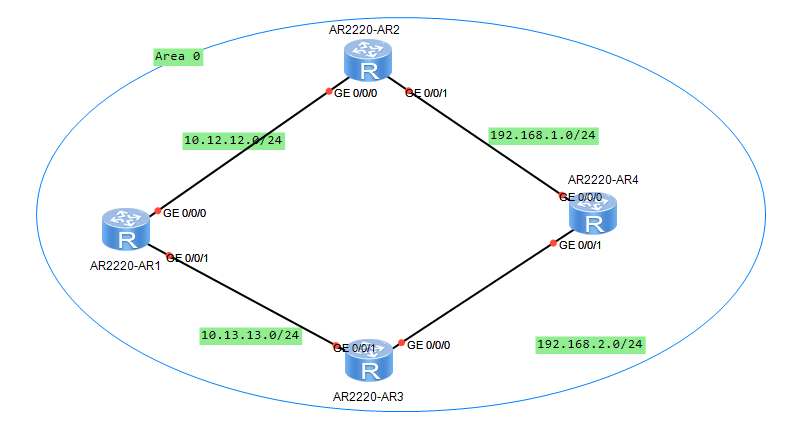
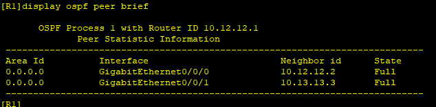
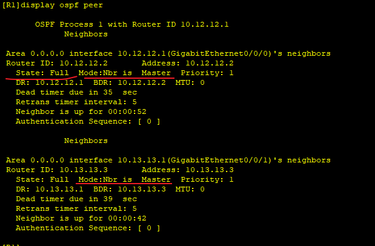
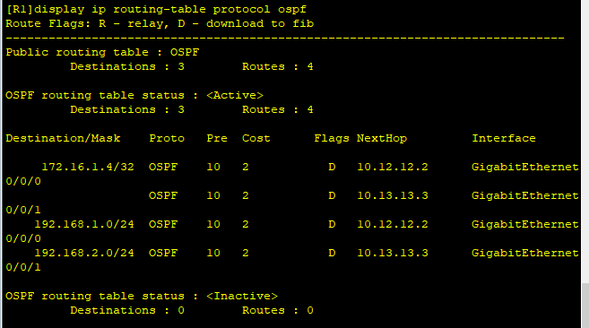
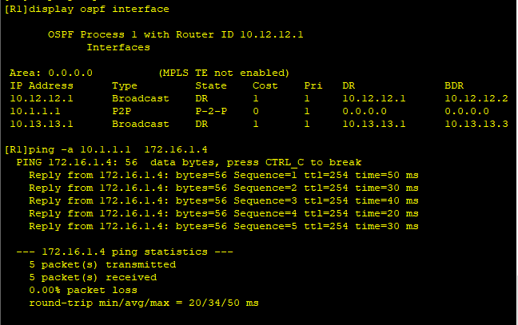

---
tags:
  - network
  - HCIA
  - OSPF
---
配置一个简单的OSPF网络, 并最终达到收敛状态.




### IP 配置
```
R1
system-view 
	sysname R1
	interface G0/0/0
		ip address 10.12.12.1 24
	interface G0/0/1
		ip address 10.13.13.1 24	
	interface LoopBack 0 
		ip address 10.1.1.1 24	

R2
system-view 
	sysname R2
	interface G0/0/0
		ip address 10.12.12.2 24
	interface G0/0/1
		ip address 192.168.1.2 24	


R3
system-view 
	sysname R3
	interface G0/0/1
		ip address 10.13.13.3 24
	interface G0/0/0
		ip address 192.168.2.3 24	

R4
system-view 
	sysname R4
	interface G0/0/1
		ip address 192.168.2.4 24
	interface G0/0/0
		ip address 192.168.1.4 24	
	interface LoopBack 0 
		ip address 172.16.1.4 24	

```


### OSPF配置
```
R1
ospf 1
	area 0
		network 10.1.1.0 0.0.0.255
		network 10.12.12.0 0.0.0.255
		network 10.13.13.0 0.0.0.255

R2
ospf 2
	area 0
		network 192.168.1.0 0.0.0.255
		network 10.12.12.0 0.0.0.255

R3
ospf 3
	area 0
		network 192.168.2.0 0.0.0.255
		network 10.13.13.0 0.0.0.255
R4
ospf 4
	area 0
		network 192.168.2.0 0.0.0.255
		network 192.168.1.0 0.0.0.255
		network 172.16.0.0 0.0.255.255
```

查看OSPF状态:




从路由表中看到,  ospf学习到了整个网络的链路.


### test




