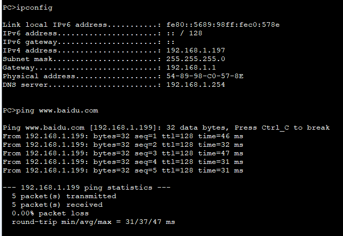

---
tags:
  - network
  - HCIA
  - DHCP
  - DNS
  - global-pool
---
实验:
1. 创建global ip pool
2. 基于global pool创建DHCP


### DHCP 
```
R1
## global ip pool 创建
ip pool dhcp_pool
	network 192.168.1.0  mask 24
	excluded-ip-address 192.168.1.200 192.168.1.254
	gateway-list 192.168.1.1
	dns-list 192.168.1.254
	lease day 0 hour 0 minute 10

## 基于global ip pool创建DHCP
interface g0/0/0
	dhcp select global 


```


### Test




