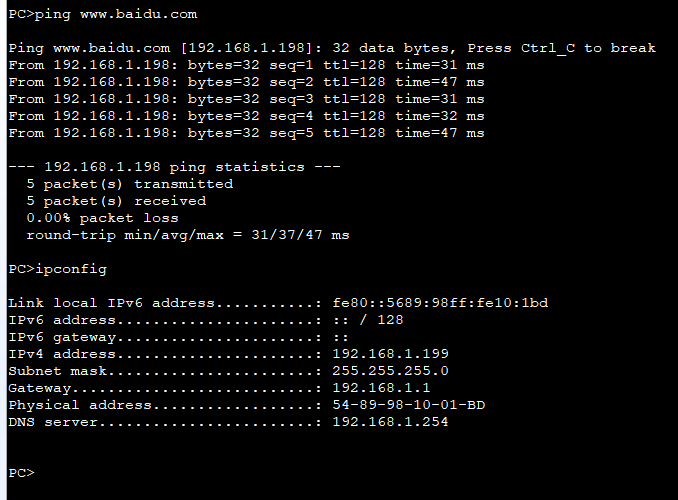
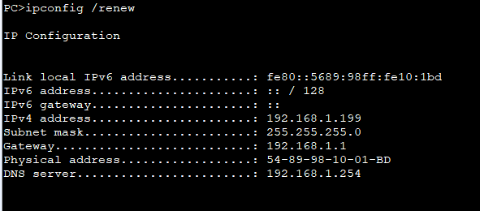
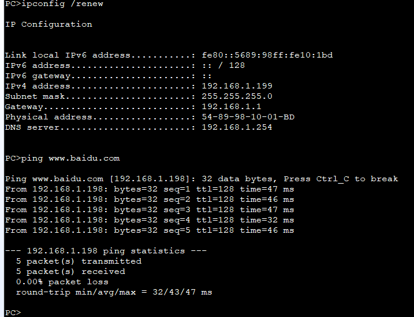

---
tags:
  - network
  - HCIA
  - DHCP
  - dhcp-relay
---
之前DHCP sever和PC是在同一个网段中,  在真实情况下,  DHCP和PC一般会在不同网段,  针对此情况我们可以使用DHCP relay来解决.
实验:
1. 搭建DHCP 服务
2. 通过dhcp relay来让PC连接到DHCP server


### IP
```
DHCP:
system-view 
	sysname DHCP
	interface g0/0/1
		ip address 192.168.2.1 24
	dhcp enable
	ip pool adpool
		network 192.168.1.0 mask 24
		dns-list 192.168.1.254
		excluded-ip-address 192.168.1.2 192.168.1.100 
		excluded-ip-address 192.168.1.200 192.168.1.254 
		lease day 0 hour 0 minute 10
		gateway-list 192.168.1.1
	interface g0/0/1
		dhcp select global 
	## 配置返程的静态路由
	ip route-static 192.168.1.0 24 g0/0/1 192.168.2.2

DHCP-delay
system-view 
	sysname DHCP_delay
	interface g0/0/1
		ip address 192.168.2.2 24
	interface g0/0/0
		ip address 192.168.1.1 24
	dhcp enable
		dhcp select relay
		dhcp relay server-ip 192.168.2.1


```


### relay
```
方案一：在接口层面配置 delay
interface GigabitEthernet0/0/0
	 ip address 192.168.1.1 255.255.255.0 
	 dhcp select relay
	 dhcp relay server-ip 192.168.2.1


方案二：全局group配置
dhcp server group dhcp_host 
	dhcp-server 192.168.2.1
interface GigabitEthernet0/0/0
	dhcp select relay 
	dhcp relay server-select dhcp_host


```
方案一:


方案二:

### test



