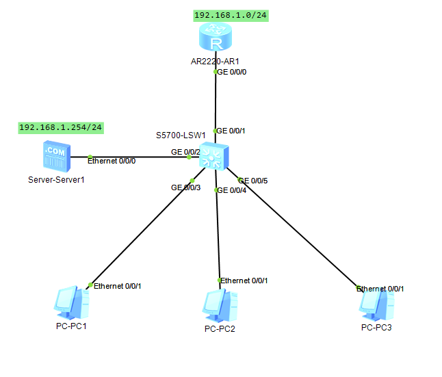
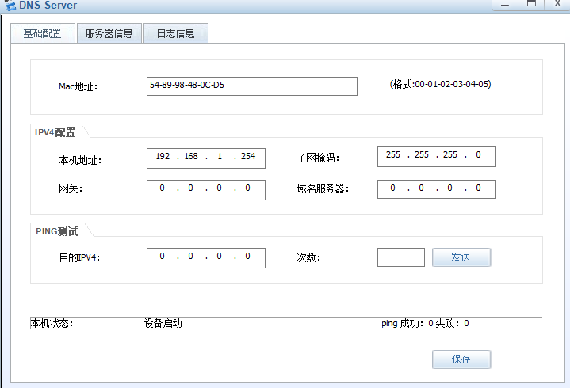
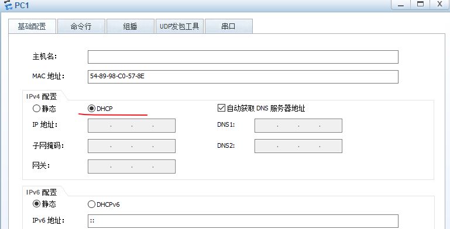
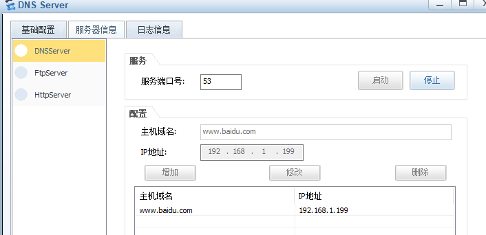
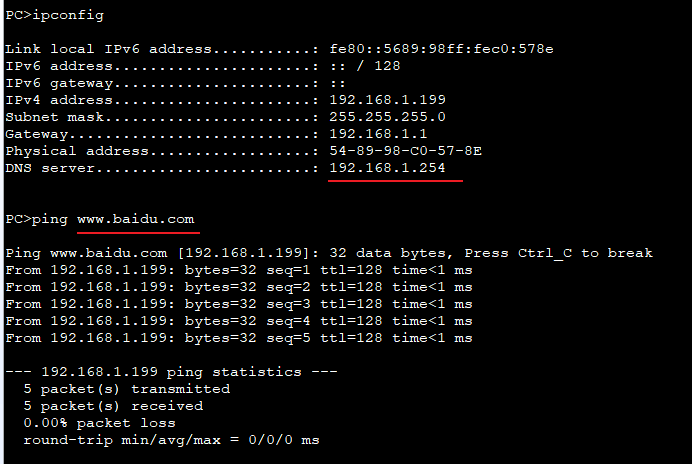

---
tags:
  - network
  - HCIA
  - DNS
  - DHCP
---
实验:
1. 配置基于接口的DHCP服务, 并让PC可以从DHCP获取IP地址
2. 配置DNS服务,  并让PC自动发现DNS服务器地址
3. 通过DNS server 解析地址成功



### IP 
```
R1(DHCP)
system-view 
	sysname DHCP_SEVER
	interface g0/0/0
		ip address 192.168.1.1 24
```

DNS server


### DHCP config
```
R1
dhcp enable
interface g0/0/0
	dhcp select interface
	dhcp server dns-list 192.168.1.254
	dhcp server excluded-ip-address 192.168.1.200 192.168.1.254
	dhcp server lease day 0 hour 0 minute 10
	dhcp server domain-name www.pc1.com


```

PC1 config:


### DNS server config
添加DNS record



### test



