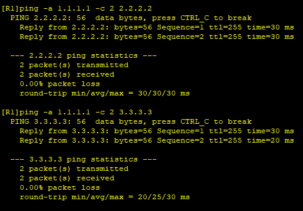
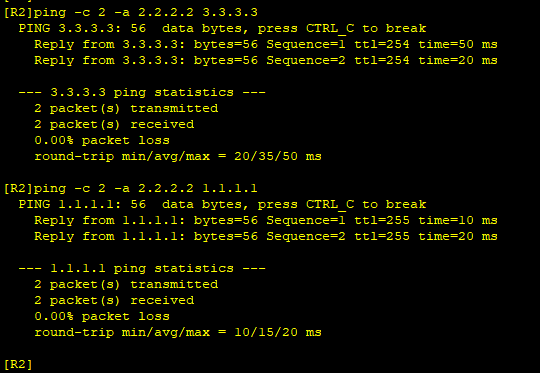

---
tags:
  - network
  - HCIA
  - frame-relay
  - RIP
---
实验:
1. 配置fr
2. 配置基于 fr的ripv2


### IP & fr
```
R1
system-view
	sysname R1
	interface LoopBack 0
		ip address 1.1.1.1 24
	interface s4/0/0
		ip address 123.0.0.1 24
		link-protocol fr
		fr inarp

R2
system-view
	sysname R2
	interface LoopBack 0
		ip address 2.2.2.2 24
	interface s4/0/0
		ip address 123.0.0.2 24
		link-protocol fr
		fr inarp
R4
system-view
	sysname R3
	interface LoopBack 0
		ip address 3.3.3.3 24
	interface s4/0/0
		ip address 123.0.0.3 24
		link-protocol fr
		fr inarp

```


### RIPv2
```
R1
rip 1
	version 2
	network 1.0.0.0
	network 123.0.0.0

R2
rip 1
	version 2
	network 2.0.0.0
	network 123.0.0.0

R3
rip 1
	version 2
	network 3.0.0.0
	network 123.0.0.0
```





