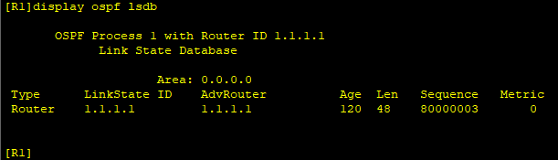
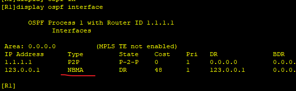
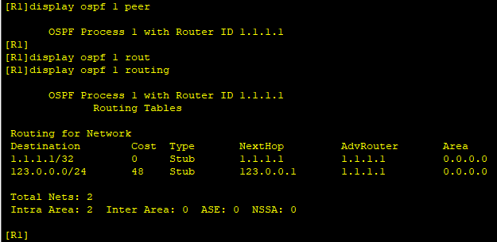
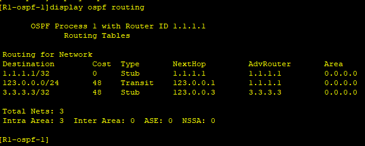
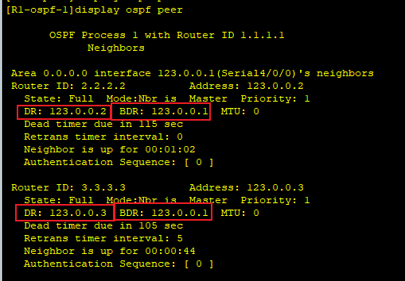
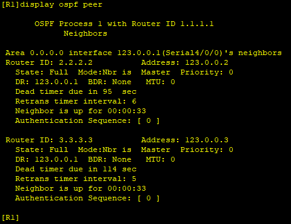
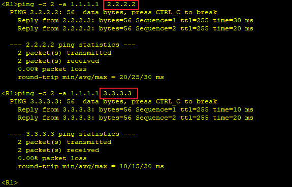
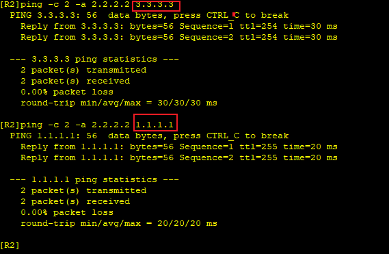

---
tags:
  - network
  - HCIA
  - frame-relay
  - OSPF
---

实验：
1. 配置fr网络
2. 配置基于fr的ospf网络


拓扑


OSPF运行在fr上的特殊性:
1. 默认OSPF把fr的接口网络类型设置为NBMA, OSPF不在NBMA网络发送组播的hello包,  因此需要手动建立邻居(通过peer创建).
2. OSPF在NBMA网络上还是要选举DR.


### IP & fr
```
R1
system-view
	sysname R1
	interface LoopBack 0
		ip address 1.1.1.1 24
	interface s4/0/0
		ip address 123.0.0.1 24
		link-protocol fr
		fr inarp 

R2
system-view
	sysname R2
	interface LoopBack 0
		ip address 2.2.2.2 24
	interface s4/0/0
		ip address 123.0.0.2 24
		link-protocol fr
		fr inarp 

R3
system-view
	sysname R3
	interface LoopBack 0
		ip address 3.3.3.3 24
	interface s4/0/0
		ip address 123.0.0.3 24
		link-protocol fr
		fr inarp

```


### OSPF
```
R1
ospf 1 
	area 0 
		network 1.1.1.0 0.0.0.255
		network 123.0.0.0 0.0.0.255

R2
ospf 1 
	area 0 
		network 2.2.2.0 0.0.0.255
		network 123.0.0.0 0.0.0.255

R3
ospf 1 
	area 0 
		network 3.3.3.0 0.0.0.255
		network 123.0.0.0 0.0.0.255

```



此时看到, 并没有R2/3的相关信息,  此时我们需要使用peer建立邻居关系。

```
R1
ospf 1
	peer 123.0.0.2
	peer 123.0.0.3

R2
ospf 1
	peer 123.0.0.1

R3
ospf 1
	peer 123.0.0.1

```




此时学习到了对端的信息. 但是此时出现另一个问题,  OSPF出现了多个DR, 因为R2 R3之间的信息并不能直接同步.  针对此网络, 我们让R1成为DR.


```
R2
interface s4/0/0
	dr-priority 0
 
R3
interface s4/0/0
	dr-priority 0
```


此时R1成为了新的DR.

```
# 最后添加R2->R3,  R3->R2 的fr映射
R2
interface s4/0/0
	fr map ip 3.3.3.3 201 broadcast

R3
interface s4/0/0
	fr map ip 2.2.2.2 301 broadcast

```


测试:






