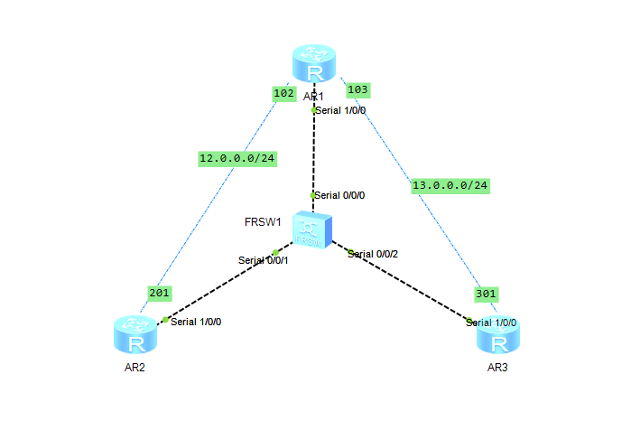
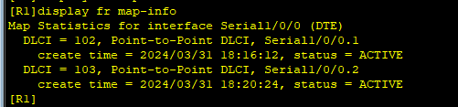
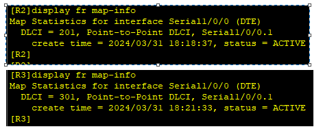
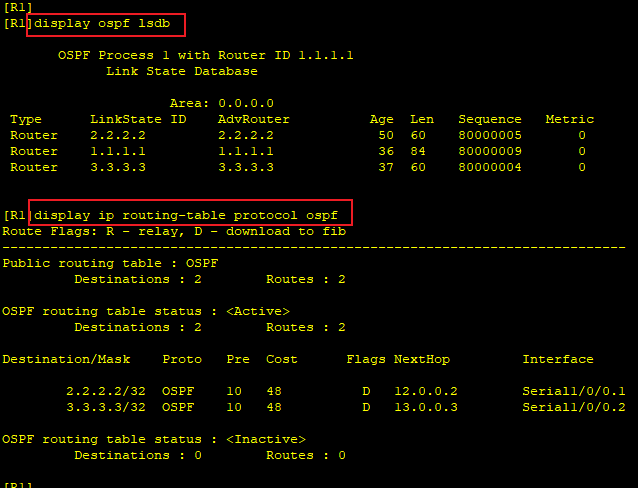
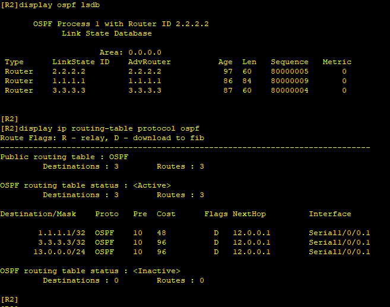
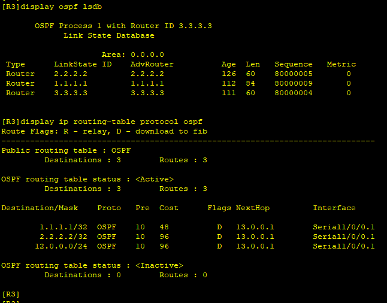
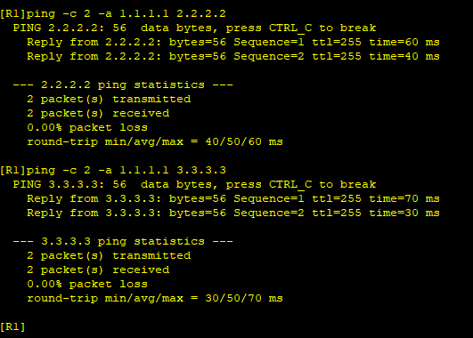
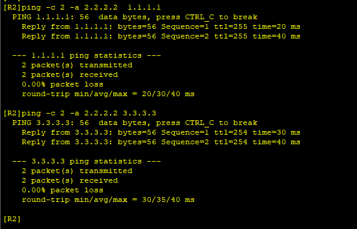
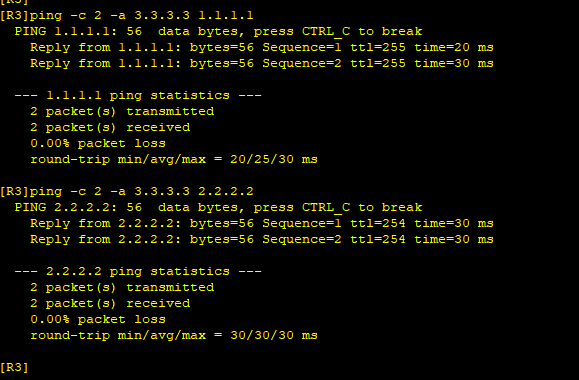

---
tags:
  - network
  - HCIA
  - frame-relay
  - sub_interface
---
实验: 
1. 使用子接口搭建fr网络
2. 在此fr网络中配置ospf

拓扑:



### IP & fr
```
R1
system-view
	sysname R1
	interface loopBack 0
		ip address 1.1.1.1 24
	interface s1/0/0
		link-protocol fr
		fr inarp
	interface s1/0/0.1  p2p  ### 子接口
		ip address 12.0.0.1 24
		fr dcle 102
	interface s1/0/0.2  p2p  ### 子接口
		ip address 13.0.0.1 24
		fr dcle 103

R2
system-view
	sysname R2
	interface loopBack 0
		ip address 2.2.2.2 24
	interface s1/0/0
		link-protocol fr
		fr inarp
	interface s1/0/0.1 p2p    ### 子接口
		ip address 12.0.0.2 24
		fr dlci 201


R3
system-view
	sysname R2
	interface loopBack 0
		ip address 3.3.3.3 24
	interface s1/0/0.1
		link-protocol fr
		fr inarp
	interface s1/0/0.1  p2p  ### 子接口
		ip address 13.0.0.3 24
		fr dlci 301

```




### ospf

```
R1
ospf 1
	area 0
		network 1.1.1.0 0.0.0.255
		network 12.0.0.0 0.0.0.255
		network 13.0.0.0 0.0.0.255
interface s1/0/0.1
	ospf network-type p2p
interface s1/0/0.2
	ospf network-type p2p

R2
ospf 1
	area 0
		network 2.2.2.0 0.0.0.255
		network 12.0.0.0 0.0.0.255
interface s1/0/0.1
	ospf network-type p2p

R3
ospf 1
	area 0
		network 3.3.3.0 0.0.0.255
		network 13.0.0.0 0.0.0.255
interface s1/0/0.1
	ospf network-type p2p
```




测试:





