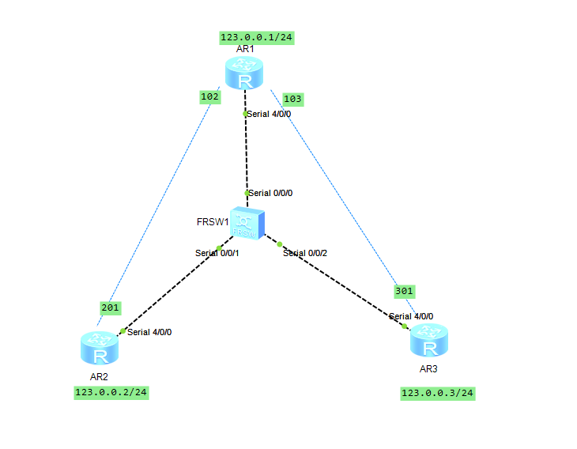
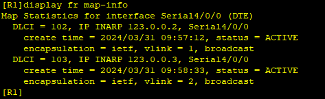
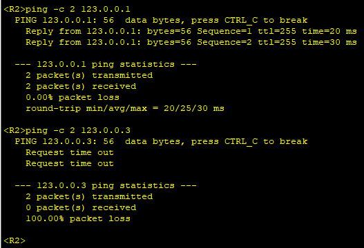
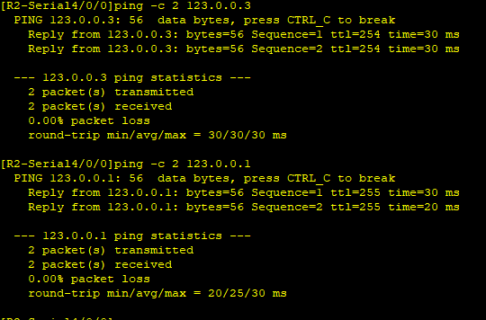
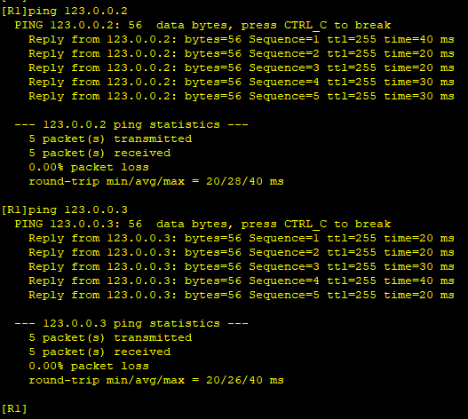
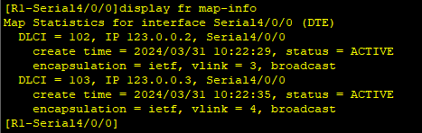
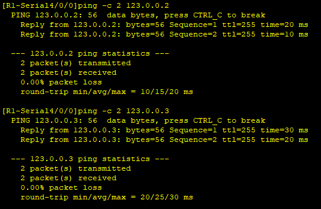
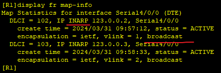

---
tags:
  - network
  - HCIA
  - frame-relay
---
实验:
1. 搭建fr网络, 并且可以互通
2. 关闭 inarp, 配置静态 fr map
3. 接释fr中的一些术语


拓扑图如下:



### IP
```
R1
system-view 
	sysname R1
	interface g4/0/0
		ip address 123.0.0.1 24
R2
system-view 
	sysname R2
	interface g4/0/0
		ip address 123.0.0.2 24

R3
system-view 
	sysname R3
	interface g4/0/0
		ip address 123.0.0.3 24

```



### frame-relay (dynamic)
使用动态inarp 解析
```
R1
system-view 
	sysname R1
	interface g4/0/0
		link-protocol fr 
		fr inarp 
R2
system-view 
	sysname R2
	interface g4/0/0
		link-protocol fr 
		fr inarp 


R3
system-view 
	sysname R3
	interface g4/0/0
		link-protocol fr 
		fr inarp 
```



可以看到此时的R2和R3通信是失败的. 对此我们可以添加手动映射, R2->R1->R3,  R3->R1->R2 来通过R1作为中转进行通信.

```
R2
interface g4/0/0
	fr map ip 123.0.0.3 201 broadcast 

R3
interface g4/0/0
	fr map ip 123.0.0.2 301 broadcast 
```


#### test



### frame-relay (static)
配置静态映射
```
R1
# 关闭inarp, 配置静态map
interface s4/0/0
	undo fr inarp 
	fr map ip 123.0.0.2 102 broadcast 
	fr map ip 123.0.0.3 103 broadcast 
R2
interface s4/0/0
	undo fr inarp 
	fr map ip 123.0.0.1 201 broadcast 
	
R3
interface s4/0/0
	undo fr inarp 
	fr map ip 123.0.0.1 301 broadcast 
```


#### test



### 关键字接释



`INARP`: 表示是通过 inarp 协议自动学习到的映射
`broadcast`: 表示此映射支持 广播包


