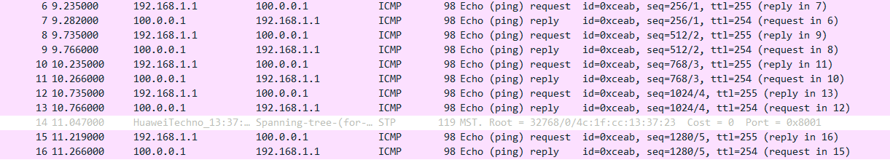

---
tags:
  - network
  - HCIA
  - NAT
  - dynamic
---
实验:
1. 搭建动态NAT来进行外网访问


拓扑


### 配置动态NAT
具体的IP 参考[[09_nat_static]]的配置。

```
R1
undo nat static global 61.0.0.3 inside 192.168.1.1 netm
ask 255.255.255.255
undo nat static global 61.0.0.4 inside 192.168.1.101 ne
tmask 255.255.255.255
undo nat static global 61.0.0.5 inside 192.168.1.102 ne
tmask 255.255.255.255

## 配置一个nat group
### 配置acl 允许那些ip 段进行外网访问
### 在interface上配置
nat address-group 0 61.0.0.10 61.0.0.200
acl 2000
	permit source 192.168.1.0 0.0.0.255
interface g0/0/1
	nat outbound 2000 address-group 0 no-pat 

```




可以看到从R3出去的packet经过NAT转换后变为了 61.0.0.11.

****


