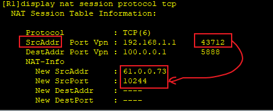
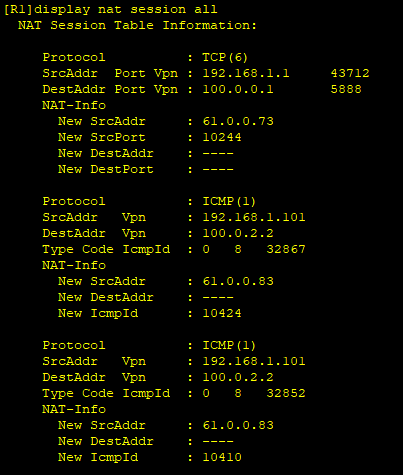
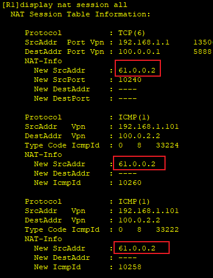

---
tags:
  - network
  - HCIA
  - NAPT
---
拓扑:


## NAPT
实验：
1. 搭建基于ip 地址和port的NAT 转换

首先基于[[09_1_NAT_dynamic]] 搭建好NAT dynamic环境.  接下来基于此配置NPAT.

```
R1
interface g0/0/1
	nat outbound 2000 address-group 0


测试:
R3 telnet R2
telnet 100.0.0.1

PC1 ping R2
ping 100.0.2.2 -t
```


可以看到 192.168.1.1:43712 --> 61.0.0.73:10244 转换.


## easy IP
对于NAPT转换, 仍然配置了一个ip pool,  但是一般公司是不会有这么多的公网IP可以使用的, 所以我们可以使用 出口路由接口上的IP地址(R1 g0/0/1上的地址).  也就是所有的内网地址都会转换为此接口上的地址, 然后端口是随机生成的.

```
R1
interface g0/0/1
	undo nat outbound 2000 address-group 0 
	nat outbound 2000
undo nat address-group 0 
```



可以看到现在所有的出口IP使用的都是R1 g0/0/1 接口的地址。


## NAT Server
使用 easy IP NAT后, 外网其实是访问不了内网内的服务的, 那么针对此情况使用使用NAT sever 来创建外网到内网的映射, 以供外网访问内网中的服务.

```
R1:
interface g0/0/1
	nat server global 61.0.0.3 inside 192.168.1.1


```

R2->R3


可以看到从61.0.0.3 的包发送到61.0.0.1 之后发送到R3.


