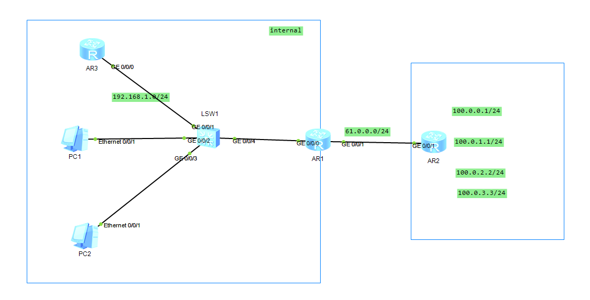
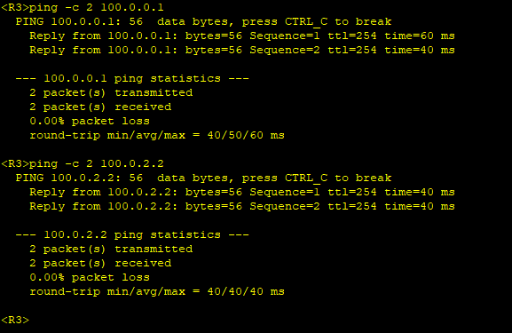
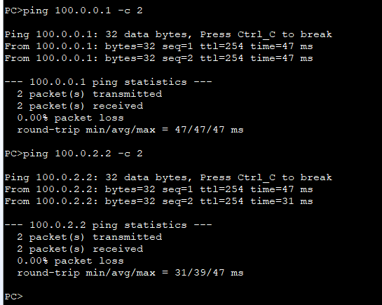

---
tags:
  - network
  - HCIA
  - NAT
---
实验:
1. 配置静态NAT转换来让内网访问外网PC


拓扑:



### IP
```
R1
system-view
	sysname R1
	interface g0/0/0
		ip address 192.168.1.254 24
	interface g0/0/1
		ip address 61.0.0.2 24

R2
system-view
	sysname R2
	interface loopback 0
		ip address 100.0.0.1 24
	interface loopback 1
		ip address 100.0.1.1 24
	interface loopback 2
		ip address 100.0.2.2 24
	interface loopback 3
		ip address 100.0.3.3 24
	interface g0/0/1
		ip address 61.0.0.1 24


R3
system-view
	sysname R3
	interface g0/0/0
		ip address 192.168.1.1 24		
ip route-static 0.0.0.0 0 GigabitEthernet0/0/0 192.168.1.254


PC1
192.168.1.101 24
gateway:192.168.1.254

PC2
192.168.1.102 24
gateway:192.168.1.254
```


### NAT

```
R1
interface g0/0/0
	nat static global 61.0.0.3 inside 192.168.1.1 
	nat static global 61.0.0.4 inside 192.168.1.101
	nat static global 61.0.0.4 inside 192.168.1.102
ip route-static 0.0.0.0 0.0.0.0 GigabitEthernet0/0/1  61.0.0.1
```

测试NAT 输出：


当R3去访问外网(R2)时,  最后的输出IP 变为了61.0.0.3.

###  test






