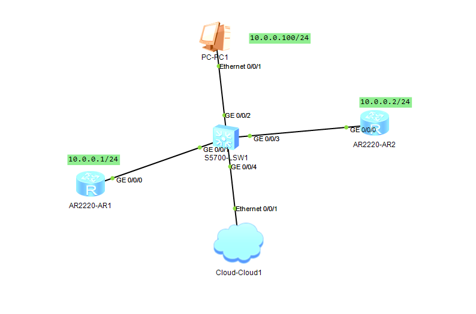
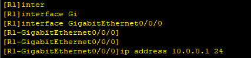
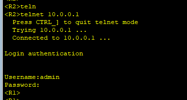
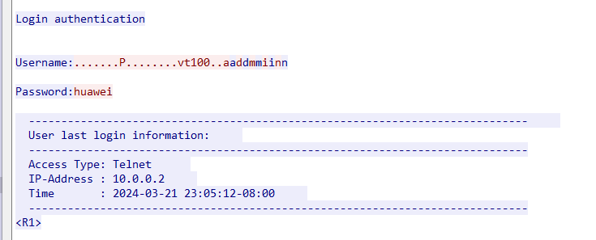
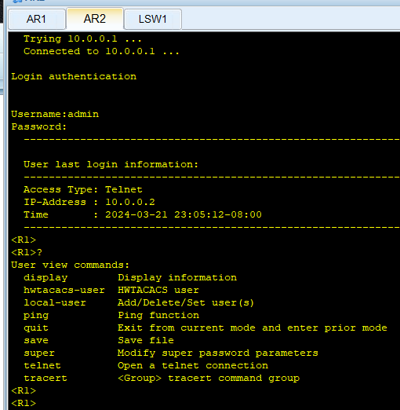
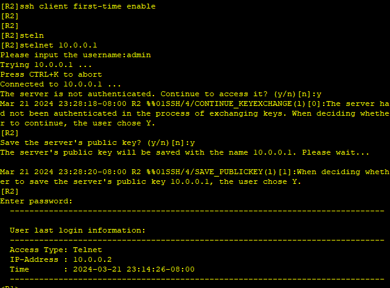

---
tags:
  - network
  - HCIA
---
实验: 
创建一个用户, 用于远程telnet路由器
1. 第一种认证: 账户密码认证
2. 第二种: 使用密钥通过ssh连接

```
private IP:
A 类 10.0.0.0  -- 10.255.255.255
B 类  172.16.0.0  -- 172.31.255.255
C 类   192.168.0.0  -- 192.168.255.255
```


```
base cmd:
system-view  :  进入系统视图
sysname  R1:    修改hostname
display version: 版本信息
display interface brief: 显示接口信息
display ip interface brief:  显示接口的IP信息
undo shutdown:  打开接口
interface GigabitEthernet0/0/0 :  进入接口视图
ip address 10.0.0.1 24 : 配置IP
display this: 显示当前的配置
display ip routing-table : 显示路由表
display current-configuration 
reboot
display saved-configuration

normal 模式：
save : 保存配置


```

视图如下：


#### 1. 配置接口IP信息
```
system-view  进入系统视图
interface GigabitEthernet0/0/0  进入端口视图
ip address 10.0.0.1 24   配置端口信息
```


#### 2. 配置console登录密码
```
user-interface console 0  : 进入console 视图
authentication-mode password : 配置校验模式为password, 并设置密码
```
 配置完成后, 再次通过console进入就需要驶入密码

#### 3. 配置vty0-4为aaa模式

```
user-interface vty 0 4 : 进入vty0-4 视图(一次配置多个vty)
authentication-mode aaa  : 配置模式为aaa
aaa  : 进入aaa视图
local-user admin password cipher huawei : 创建本地用户,密码为huawei
local-user admin service-type telnet: 配置添加的用户服务的方式
display user-interface: 显示不同登录配置的用户登录等级

```

此时就可以通过telnet进入了


不过此时抓包的话, 可以看到账户密码:


而且此时登录后, 可以发现账户其实只有几个可用的命令, 这是因为创建的账户的权限比较低


#### 03 提升创建的用户权限

```
aaa :   进入aaa 视图
local-user admin privilege level 15 : 提升权限
```

此时再次登录,  用户的权限就比较大, 可以用于配置了.

#### 04 使用stelnet登录
```
display rsa local-key-pair public: 展示本地公钥
rsa local-key-pair create: 创建密钥
user-interface vty 0 4: 进入vty视图
	authentication-mode aaa : 配置验证方式为aaa
	protocol inbound ssh: 设置进入方式为ssh

aaa  : 进入aaa视图
	local-user admin privilege level 15
	local-user admin service-type ssh

ssh user admin authentication-type password: 设置ssh用户的验证方式

display ssh user-information: 展示ssh用户

display ssh server status: ssh 方式的状态

stelnet server enable : 使能stelnet
display ssh server session: 展示当前ssh的连接session
```


```
ssh client first-time enable :打开client的stelnet
```




