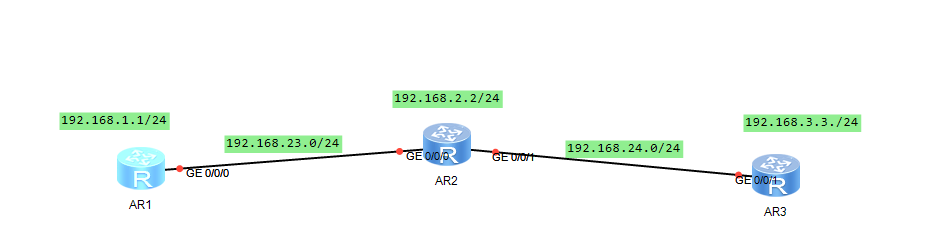
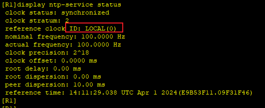
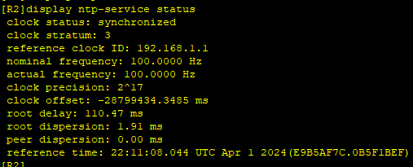
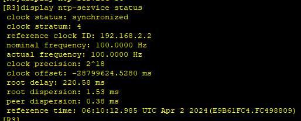

---
tags:
  - network
  - HCIA
  - NTP
---

实验：
1. 搭建局域网内的NTP 服务
2. 开启NTP的验证, 防止恶意干扰


### IP
```
R1
system-view
	sysname R1
	interface loopback 0
		ip address 192.168.1.1 24
	interface g0/0/0
		ip address 192.168.23.1 24
	ospf 1
		area 0
		network 192.168.1.0 0.0.0.255
		network 192.168.23.0 0.0.0.255

R2
system-view
	sysname R2
	interface loopback 0
		ip address 192.168.2.2 24
	interface g0/0/0
		ip address 192.168.23.2 24
	interface g0/0/1
		ip address 192.168.24.2 24
	ospf 1
		area 0
		network 192.168.2.0 0.0.0.255
		network 192.168.23.0 0.0.0.255
		network 192.168.24.0 0.0.0.255


R3
system-view
	sysname R3
	interface loopback 0
		ip address 192.168.3.3 24
	interface g0/0/1
		ip address 192.168.24.3 24
	ospf 1
		area 0
		network 192.168.3.0 0.0.0.255
		network 192.168.24.0 0.0.0.255

```


### NTP
```
R1
ntp-service enable
ntp-service refclock-master 2

R2
ntp-service enable
ntp-service unicast-server 192.168.1.1

R3  ## 配置R3 R2 为对等体, 当R1出现问题, R3 R2会同步时间
ntp-service enable
ntp-service unicast-peer 192.168.2.2
```










### NTP Auth
```
R1
ntp-service authentication enable 
ntp-service authentication-keyid 1 authentication-mode md5 huawei
ntp-service reliable authentication-keyid 1 

R2
ntp-service authentication enable 
ntp-service authentication-keyid 1 authentication-mode md5 huawei
ntp-service reliable authentication-keyid 1 


R3
ntp-service authentication enable 
ntp-service authentication-keyid 1 authentication-mode md5 huawei
ntp-service reliable authentication-keyid 1 


```


