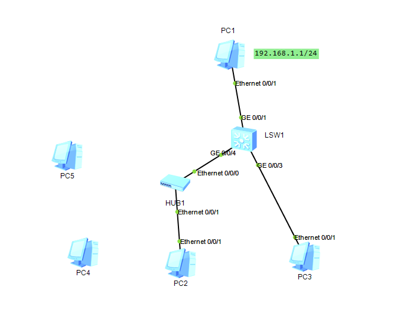
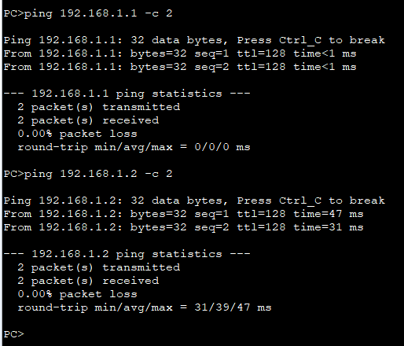
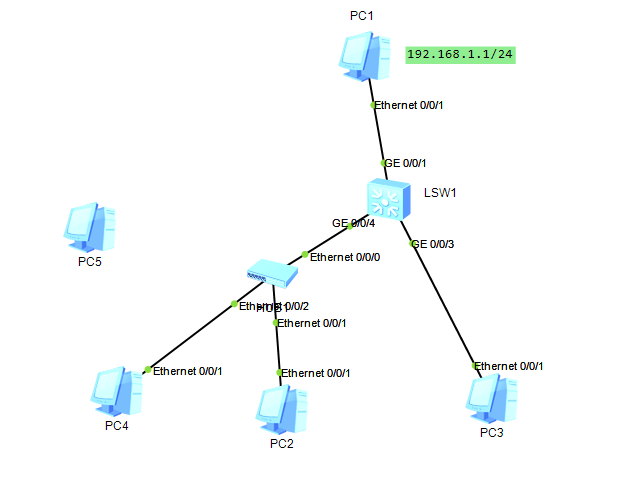
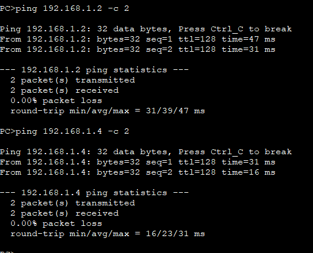
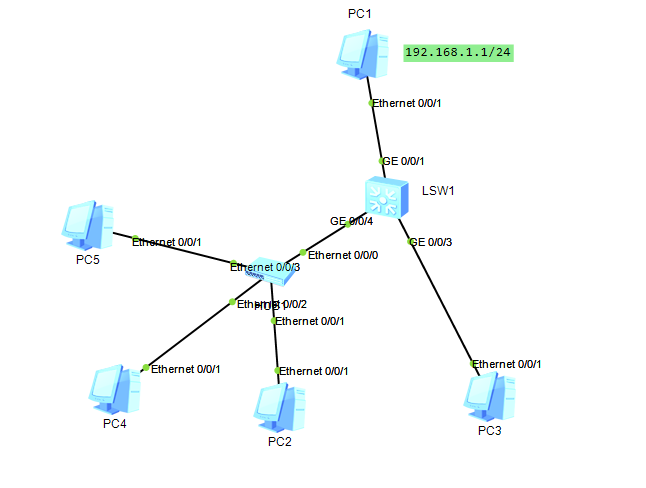
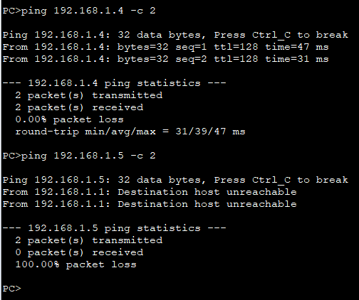
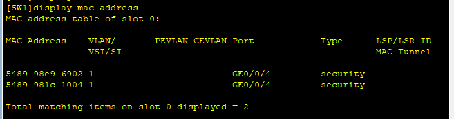
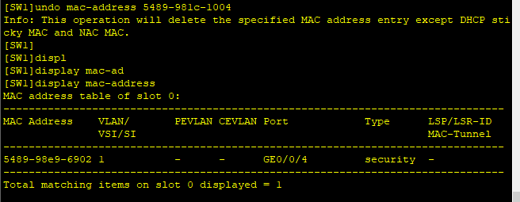
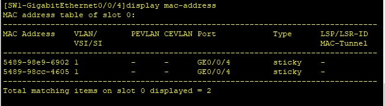
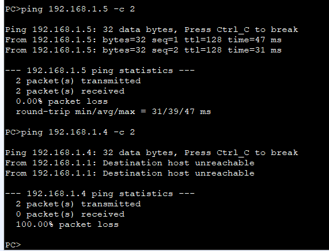

---
tags:
  - network
  - HCIA
  - switch
  - port-security
---
实验:
1. 搭建swith网络
2. 打开switch port-security 功能
3. 设置端口最大的连接数
4. 设置指定mac地址连接




### IP
```
PC1
192.168.1..1 24

PC2
192.168.1.2 24

PC3
192.168.1.3 24

PC4
192.168.1.4 24

PC5
192.168.1.5 24
```



### switch port-security
```
system-view
	sysname SW1
## 设置端口 g0/0/4 的安全
	interface g0/0/4
		port-security enable
		port-security  max-mac-num 2 # 最大链接数2
		port-security protect-action restrict  # 当超过最大连接数时, 报警. 也可以选择: shutdown  protect

```
此时分别把PC4, PC5 连接到HUB,  测试sw表现



加入PC4后,  转发可用.



虽然PC5加入到了HUB上, 但可以发现其数据并没有被转发.


### filter mac
设置mac address 过滤, 设置允许PC2/5 可以通过.
两种方法设置:
1. 动态设置, PC加入后, ping一下, sw会记录通过的mac-address, 此时可以执行
2. 手动加入
```
## 删除PC4
undo mac-address 5489-981c-1004 

## 把留下来的PC2设置为sticky (此mac是动态学习后,设置为stick)
interface g0/0/4
	port-security mac-address sticky

### 手动添加sticky 地址
port-security mac-address sticky 5489-98CC-4605 vlan 1

```
删除前:


删除后:


设置sticky后的mac table


此时再把PC5/4添加进来, 可以验证PC5可以通信,  PC4不可以.




