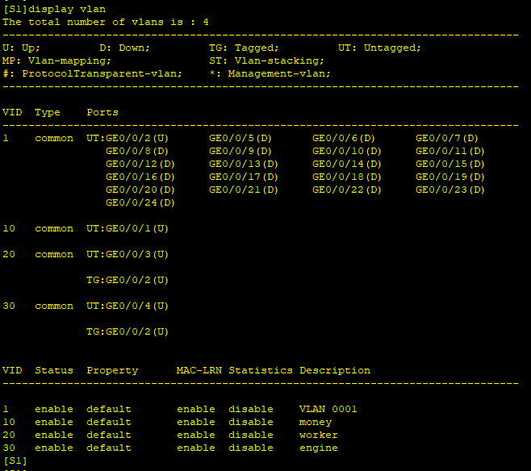
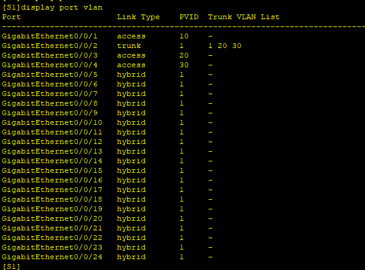
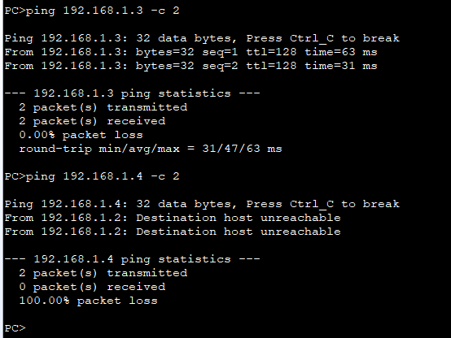

---
tags:
  - network
  - HCIA
  - Vlan
---


搭建跨switch的vlan网络.


```
PC:
192.168.1.0/24

S1
system-view
	sysname S1
	vlan batch 10 20 30
	interface g0/0/1
		port link-type access
		port default vlan 10
	interface g0/0/2
		port link-type trunk
		port trunk allow-pass vlan 20 30
		port trunk pvid vlan 1 
	interface g0/0/3
		port link-type access
		port default vlan 20
	interface g0/0/4
		port link-type access
		port default vlan 30
	


S2
system-view
	sysname S2
	vlan batch  20 30
	interface g0/0/1
		port link-type trunk
		port trunk allow-pass vlan 20 30
		port trunk pvid vlan 1 
	interface g0/0/2
		port link-type access
		port default vlan 20
	interface g0/0/3
		port link-type access
		port default vlan 30


```






此时可以看到, PC1和任何PC不能通信,  PC2/3 同属于Vlan 20, 可以通信,  PC4/5 同属于Vlan 30, 可以通信.


