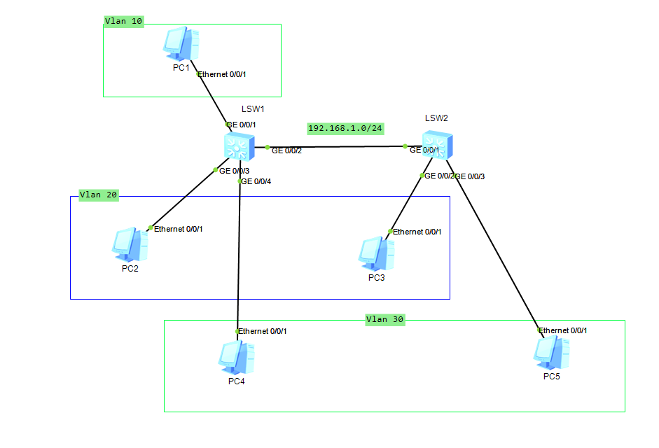
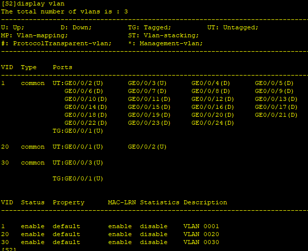
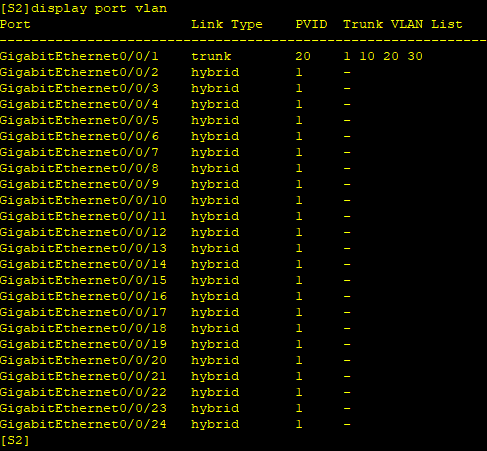
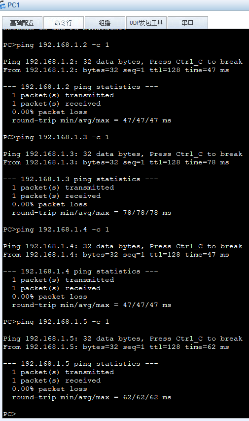

---
tags:
  - network
  - HCIA
  - Vlan
  - hybrid
---


实验:
1. 使用 hybrid搭建vlan网络.
要求:
1. PC1 可以ping通其他主机
2. PC2/3 通信
3. PC4/5 通信


### vlan
```
system-view
	sysname S1
	vlan batch 10 20 30
	interface g0/0/1
		port link-type hybrid
		port hybrid tagged vlan 10
	interface GigabitEthernet0/0/3
		port link-type hybrid
		port hybrid tagged vlan 20
		port hybrid untagged vlan 10 20 30
	interface g0/0/4
		undo port default vlan
		port link-type hybrid
		port hybrid tagged vlan 20
		port hybrid untagged vlan 10 20 30
	interface g0/0/2
		port link-type trunk 	
		port trunk allow-pass vlan 10 20 30
		port trunk pvid vlan 10

S2
system-view
	sysname S2
	interface g0/0/1
		port link-type trunk
		port trunk pvid vlan 20
		port trunk allow-pass vlan 10 20 30
	interface g0/0/2
		undo port default vlan 
		port link-type hybrid
		port hybrid tagged vlan 20
		port hybrid untagged vlan 10 20


	interface g0/0/3
		undo port default vlan 
		port hybrid untagged vlan 10 30
	
```








