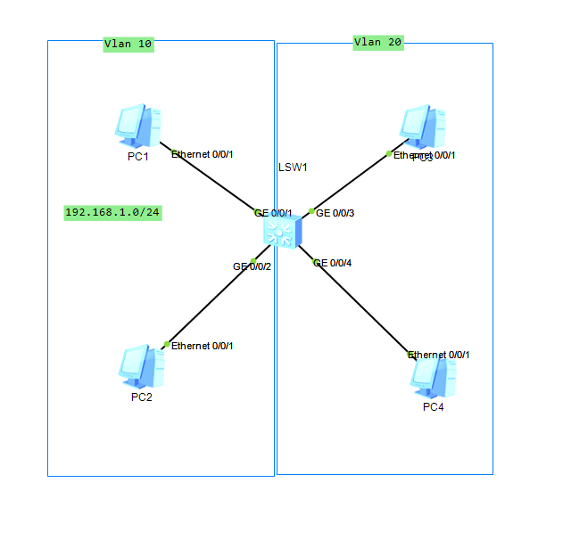
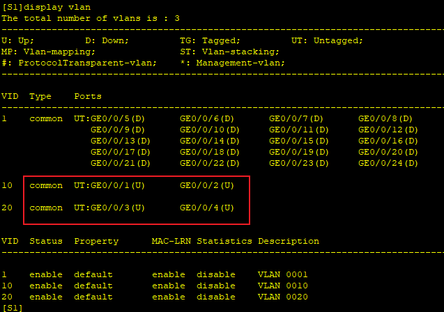
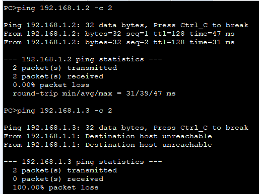
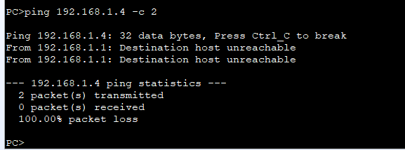

---
tags:
  - network
  - HCIA
  - Vlan
---


搭建Vlan网络, PC1/2属于Vlan 10,  PC3/4属于 Vlan 20.


### IP
```
PC1
192.168.1.1 24

PC2
192.168.1.2 24

PC3
192.168.1.3 24

PC4
192.168.1.4 24

```


### Vlan
```
S1
system-view
	sysname S1
	vlan batch 10 20
	interface g0/0/1
		port link-type access
		port default vlan 10
	interface g0/0/2
		port link-type access
		port default vlan 10
	interface g0/0/3
		port link-type access
		port default vlan 20
	interface g0/0/4
		port link-type access
		port default vlan 20
```


配置完成后, 可以看到vlan 10包括 1/2 接口,  vlan 20包括3/4接口.



可以看到PC1/2属于同一个vlan, 故可以通信.  PC1和PC3/4 属于不同vlan, 故不可以通信.


