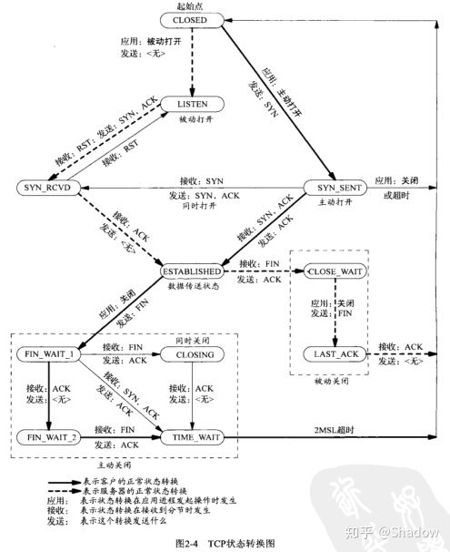
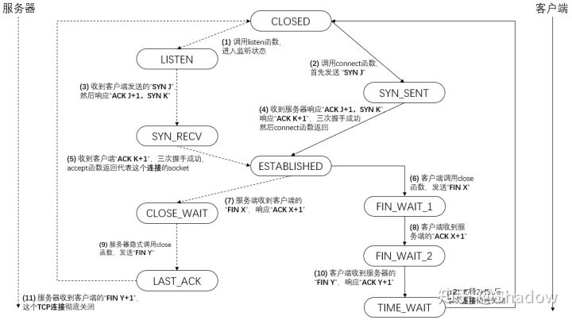
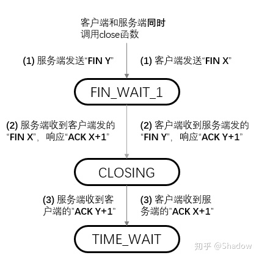
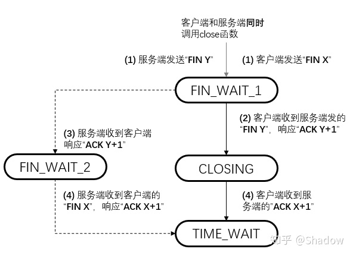
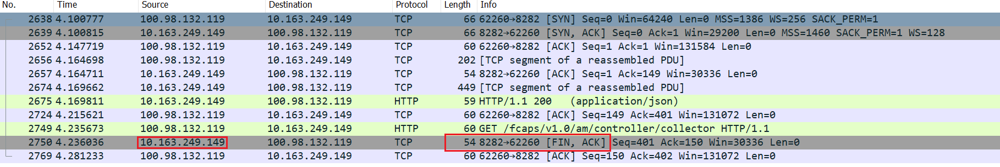

[TOC]

# 解决一次服务器上许多Close_Wait句柄

在线上发现，有许多的Close_wait线程，且都属于某个java程序，现象如下：


(分析完成后，得出的结论：dpa-00:57466 -> dpa-00:8282 可以断定应该是 57466 这个客户端占用的此链接句柄，才导致的没有释放。 如果是server端的没有释放，应该是反过来。)

本篇说一下对此情况的一个解决。

这里回顾一下tcp相关的状态转换图：



这个图呢，感觉是个组合图，拆开来看，

客户端先关闭的情况：



server端先关闭的情况：


同时关闭的情况：



同时关闭，但是客户端先接收到server发送的fin：



解决：

情况一：

由上面可见，当客户端发送了fin，但是server端只是相回复了ack，没有发送fin，那么会进close_wait，那抓个包看一下交互过程中，server有没有发送此fin：



从红线看到在一个交互过程中，最后server是有发送此fin，但是没有看到client的回复fin。那基本上可以断定应该是客户端的访问问题，看一下客户端httpClient的代码：

```java
public static CloseableHttpClient createHttpClient() {
    PoolingHttpClientConnectionManager pool = new PoolingHttpClientConnectionManager();
    pool.setMaxTotal(Config.getConfig().getHttpPoolSize());//连接池的最大连接数
    pool.setDefaultMaxPerRoute(Config.getConfig().getHttpPoolMaxPerRouteSize());
    RequestConfig requestConfig = RequestConfig.custom()
        .setConnectTimeout(Config.getConfig().getHttpConnectionTimeout())
        .setSocketTimeout(Config.getConfig().getHttpSocketTimeout()).build();
    return HttpClients.custom().setConnectionManager(pool)
        .setDefaultRequestConfig(requestConfig).build();
}
```

客户端的访问：

```java
private void reportedHeartbeatToController(String heartbeatUrl) throws Exception {
    JSONObject jsonObject = new JSONObject();
    jsonObject.put("Id", collectorId);
    CloseableHttpResponse response= HttpClientUtil.putRequest(heartbeatUrl,null,jsonObject.toString());
    if (201 == response.getStatusLine().getStatusCode()) {
         log.info("reported successfully! collectorId");
    }
}
```

```java
public static CloseableHttpResponse putRequest(String url, String token, String jsonStr) throws Exception {
    log.debug("PUT request url is {},token is {},Entity data is {}", url, token, jsonStr);
    CloseableHttpClient httpClient = HttpClientUtil.getHttpClient(url);
    HttpPut put = new HttpPut(url);
    put.setHeader("Content-Type", "application/json; charset=UTF-8");
    StringEntity entity = new StringEntity(jsonStr, Charset.forName("UTF-8"));
    entity.setContentEncoding("UTF-8");
    put.setEntity(entity);
    return doExecute(httpClient,put);
}
```

处理也是比较简单的，但是有两个问题，

1. 每次请求都会创建一个新的HttpClient，但是请求完成后，没有进行资源的释放
2. 每次创建一个HttpClient，都会创建一个新的PoolingHttpClientConnectionManager

修改后的代码：

```java
private static PoolingHttpClientConnectionManager pool = new PoolingHttpClientConnectionManager();
static{
    pool.setMaxTotal(Config.getConfig().getHttpPoolSize());
    pool.setDefaultMaxPerRoute(Config.getConfig().getHttpPoolMaxPerRouteSize());
}

public static CloseableHttpClient createHttpClient() {
    RequestConfig requestConfig = RequestConfig.custom()
        .setConnectTimeout(Config.getConfig().getHttpConnectionTimeout())
        .setSocketTimeout(Config.getConfig().getHttpSocketTimeout()).build();
    return HttpClients.custom().setConnectionManager(pool)
        .setDefaultRequestConfig(requestConfig).build();
}
```

多次请求，使用同一个pool来进行管理。

```java
private void reportedHeartbeatToController(String heartbeatUrl) throws Exception {
    JSONObject jsonObject = new JSONObject();
    jsonObject.put("Id", collectorId);
    CloseableHttpResponse response= HttpClientUtil.putRequest(heartbeatUrl,null,jsonObject.toString());
    if (201 == response.getStatusLine().getStatusCode()) {
        log.info("reported successfully! collectorId");
    }
    // 增加资源的释放
    response.close();
}
```

修改过后，重新部署，那些wait_close的socket句柄，立即就释放了。


