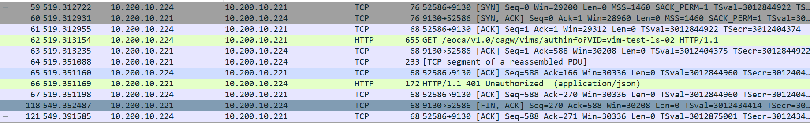

[TOC]

# close_wait再分析

经过前两篇记录的close_wait连接优化后，一段时间都运行的很好，现在又出现一个新的现象。

现象：

```shell
# 最近程序出现了针对某一个端口大量的close_wait连接,通过抓包发现此端口响应码都是401,即不成功的. 
# 设置的 maxRoute为100, 已经达到此连接数, 请求时久久没有响应, 说明不能发此请求了,因为httpClient已经达到了最大的路由数.
# 此访问后,没有进行关闭的操作.
```



问题来了:

1. 已经设置了closeExpire 并定时调用，为什么没有关闭？ 
2. 心跳线程也是这样，为什么就没有打满连接数？

在仔细查看，心跳线程的返回和此访问的返回有一个区别：

```shell
# 心跳返回结果没有响应体, 而此打满连接的访问是有响应体的.
```

对于问题1: 超时后没有进行关闭，猜测是连接根本没有释放会连接池中。

现在可以去验证一下相关的猜测。

再看一下请求的执行：

> org.apache.http.impl.execchain.MainClientExec#execute

```java
  // 真正执行 请求的地方
    @Override
    public CloseableHttpResponse execute(
            final HttpRoute route,
            final HttpRequestWrapper request,
            final HttpClientContext context,
            final HttpExecutionAware execAware) throws IOException, HttpException {
			// 省略非关键代码

            // check for entity, release connection if possible
            // 获取响应体
            final HttpEntity entity = response.getEntity();
            // 如果没有响应体,或者响应不是是 streaming,则回收连接
            if (entity == null || !entity.isStreaming()) {
                // connection not needed and (assumed to be) in re-usable state
                // 回收连接
                connHolder.releaseConnection();
                return new HttpResponseProxy(response, null);
            }
            // 返回响应
            return new HttpResponseProxy(response, connHolder);
```

这里省略了非关键代码，通过这里看到，当没有响应体时，会执行connHolder.releaseConnection()  进行一次连接的释放，而有响应体时，没有相关的释放。

通过这里的源码，就可以验证猜测了：

因为有响应体没有执行相关的连接回收操作，即此连接仍然在lease中，并没有释放回available中，所以虽然设置了关闭超时，仍然没有生效。

解决方案：

1. 显示调用close进行释放操作
2. 设置对端没有响应体。(不合理)


