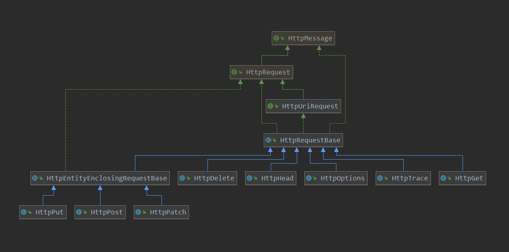

[TOC]


# httpClient请求的执行

上篇了解了httpClient创建时的操作，其中创建了很多的默认配置，也使用了设计模式实现了重试机制，backoff机制等，本篇呢，来看一下一次请求的执行。

请求执行开始:

```java
CloseableHttpResponse response = (CloseableHttpResponse) httpConfig.getClient().execute(request);
```

上篇分析到，具体执行请求的应该是InternalHttpClient，下面就继续往下看：

> org.apache.http.impl.client.CloseableHttpClient#execute(org.apache.http.client.methods.HttpUriRequest)

```java
// 请求的执行
@Override
public CloseableHttpResponse execute(
    final HttpUriRequest request) throws IOException, ClientProtocolException {
    return execute(request, (HttpContext) null);
}
```

看一下HttpUriRequest的类图:



可以看到，HttpUriRequest是各种请求的父类，所以这里参数为HttpUriRequest。

> org.apache.http.impl.client.CloseableHttpClient#execute(org.apache.http.client.methods.HttpUriRequest, org.apache.http.protocol.HttpContext)

```java
// 请求的执行
@Override
public CloseableHttpResponse execute(
    final HttpUriRequest request,
    final HttpContext context) throws IOException, ClientProtocolException {
    Args.notNull(request, "HTTP request");
    // 这里 determineTarget 得到了 host
    return doExecute(determineTarget(request), request, context);
}
// 从request中获取 target host
private static HttpHost determineTarget(final HttpUriRequest request) throws ClientProtocolException {
    // A null target may be acceptable if there is a default target.
    // Otherwise, the null target is detected in the director.
    HttpHost target = null;
    // 获取 uri
    final URI requestURI = request.getURI();
    if (requestURI.isAbsolute()) {
        // 根据uri 创建 HttpHost
        target = URIUtils.extractHost(requestURI);
        if (target == null) {
            throw new ClientProtocolException("URI does not specify a valid host name: "
                                              + requestURI);
        }
    }
    return target;
}
```

这里呢，从request中的uri中得到httpHost，来继续请求执行：

> org.apache.http.impl.client.InternalHttpClient#doExecute

这里看到，就到上篇创建的类中执行了：

```java
// 真正执行请求方法的地方
@Override
protected CloseableHttpResponse doExecute(
    final HttpHost target,  // 目标主机
    final HttpRequest request,  // 请求方法: delete  post  put
    final HttpContext context) throws IOException, ClientProtocolException {
    Args.notNull(request, "HTTP request");
    HttpExecutionAware execAware = null;
    if (request instanceof HttpExecutionAware) {
        execAware = (HttpExecutionAware) request;
    }
    try {
        final HttpRequestWrapper wrapper = HttpRequestWrapper.wrap(request, target);
        // 创建了 httpContext
        final HttpClientContext localcontext = HttpClientContext.adapt(
            context != null ? context : new BasicHttpContext());
        RequestConfig config = null;
        // 获取 配置信息
        if (request instanceof Configurable) {
            config = ((Configurable) request).getConfig();
        }
        // 如果没有进行配置,则使用默认的配置
        if (config == null) {
            final HttpParams params = request.getParams();
            if (params instanceof HttpParamsNames) {
                if (!((HttpParamsNames) params).getNames().isEmpty()) {
                    config = HttpClientParamConfig.getRequestConfig(params, this.defaultConfig);
                }
            } else {
                config = HttpClientParamConfig.getRequestConfig(params, this.defaultConfig);
            }
        }
        // 记录配置属性到 BasicHttpContext
        if (config != null) {
            localcontext.setRequestConfig(config);
        }
        // 配置默认的属性 到 BasicHttpContext
        setupContext(localcontext);
        // 得到 route host
        final HttpRoute route = determineRoute(target, wrapper, localcontext);
        // 请求执行
        return this.execChain.execute(route, wrapper, localcontext, execAware);
    } catch (final HttpException httpException) {
        throw new ClientProtocolException(httpException);
    }
}
```

这里小结一下工作:

1.  如果没有配置HttpClientContext，则创建一个默认的 BasicHttpContext
2. 获取配置的requestConfig
3. 如果没有 进行 reqestConfig的设置，则使用默认的
4. 记录requestConfig到 context中
5. 配置一个默认属性到 context中
6. 得到 route host
7. 执行

**注意：**这里注意第7步的操作，前面创建时使用了装饰者进行了各种包装，具体执行时也会从最外层装饰者开始执行，逐步执行到最终的执行器去执行请求。

这里主要看一下5-7步。

> org.apache.http.impl.client.InternalHttpClient#setupContext

```java
// 记录一些执行器到  context中
private void setupContext(final HttpClientContext context) {
    if (context.getAttribute(HttpClientContext.TARGET_AUTH_STATE) == null) {
        context.setAttribute(HttpClientContext.TARGET_AUTH_STATE, new AuthState());
    }
    if (context.getAttribute(HttpClientContext.PROXY_AUTH_STATE) == null) {
        context.setAttribute(HttpClientContext.PROXY_AUTH_STATE, new AuthState());
    }
    if (context.getAttribute(HttpClientContext.AUTHSCHEME_REGISTRY) == null) {
        context.setAttribute(HttpClientContext.AUTHSCHEME_REGISTRY, this.authSchemeRegistry);
    }
    if (context.getAttribute(HttpClientContext.COOKIESPEC_REGISTRY) == null) {
        context.setAttribute(HttpClientContext.COOKIESPEC_REGISTRY, this.cookieSpecRegistry);
    }
    if (context.getAttribute(HttpClientContext.COOKIE_STORE) == null) {
        context.setAttribute(HttpClientContext.COOKIE_STORE, this.cookieStore);
    }
    if (context.getAttribute(HttpClientContext.CREDS_PROVIDER) == null) {
        context.setAttribute(HttpClientContext.CREDS_PROVIDER, this.credentialsProvider);
    }
    if (context.getAttribute(HttpClientContext.REQUEST_CONFIG) == null) {
        context.setAttribute(HttpClientContext.REQUEST_CONFIG, this.defaultConfig);
    }
}
```

第6步，解析route信息:

> org.apache.http.impl.client.InternalHttpClient#determineRoute

```java
    // 解析 route信息
    private HttpRoute determineRoute(
            final HttpHost target,
            final HttpRequest request,
            final HttpContext context) throws HttpException {
        HttpHost host = target;
        if (host == null) {
            host = (HttpHost) request.getParams().getParameter(ClientPNames.DEFAULT_HOST);
        }
        return this.routePlanner.determineRoute(host, request, context);
    }
```

> org.apache.http.impl.conn.DefaultRoutePlanner#determineRoute

```java
// 解析route信息
@Override
public HttpRoute determineRoute(
    final HttpHost host,
    final HttpRequest request,
    final HttpContext context) throws HttpException {
    Args.notNull(request, "Request");
    if (host == null) {
        throw new ProtocolException("Target host is not specified");
    }
    // httpClient 上下文
    final HttpClientContext clientContext = HttpClientContext.adapt(context);
    // requestConfig
    final RequestConfig config = clientContext.getRequestConfig();
    // 本地地址
    final InetAddress local = config.getLocalAddress();
    // 代理
    HttpHost proxy = config.getProxy();
    if (proxy == null) {
        proxy = determineProxy(host, request, context);
    }

    final HttpHost target;
    if (host.getPort() <= 0) {
        try {
            target = new HttpHost(
                host.getHostName(),
                this.schemePortResolver.resolve(host),
                host.getSchemeName());
        } catch (final UnsupportedSchemeException ex) {
            throw new HttpException(ex.getMessage());
        }
    } else {
        target = host;
    }
    // 是否是加密的
    final boolean secure = target.getSchemeName().equalsIgnoreCase("https");
    // 创建route
    return proxy == null
        ? new HttpRoute(target, local, secure)
        : new HttpRoute(target, local, proxy, secure);
}
```

第七步，咱们看几个装饰者的实现：

> org.apache.http.impl.execchain.ServiceUnavailableRetryExec#execute

```java
  //  Service Unavailable 503 的处理
    @Override
    public CloseableHttpResponse execute(
            final HttpRoute route,
            final HttpRequestWrapper request,
            final HttpClientContext context,
            final HttpExecutionAware execAware) throws IOException, HttpException {
        // 获取各种请求头
        final Header[] origheaders = request.getAllHeaders();
        // for 循环持续进行重试
        for (int c = 1;; c++) {
            // 请求开始执行
            final CloseableHttpResponse response = this.requestExecutor.execute(
                    route, request, context, execAware);
            try {
                // 判断是否重试
                if (this.retryStrategy.retryRequest(response, c, context)
                        && RequestEntityProxy.isRepeatable(request)) {
                    // 如果进行重试,则关闭前一个 response
                    response.close();
                    // 获取两次重试间隔
                    final long nextInterval = this.retryStrategy.getRetryInterval();
                    if (nextInterval > 0) {
                        try {
                            this.log.trace("Wait for " + nextInterval);
                            // 睡眠
                            Thread.sleep(nextInterval);
                        } catch (final InterruptedException e) {
                            Thread.currentThread().interrupt();
                            throw new InterruptedIOException();
                        }
                    }
                    // 设置请求头, 再次进行访问
                    request.setHeaders(origheaders);
                } else {
                    // 返回结果
                    return response;
                }
            } catch (final RuntimeException ex) {
                response.close();
                throw ex;
            }
        }
    }
```

> org.apache.http.impl.client.DefaultServiceUnavailableRetryStrategy#retryRequest

```java
// 是否重试的判断
@Override
public boolean retryRequest(final HttpResponse response, final int executionCount, final HttpContext context) {
    // 小于最大重试次数,且 返回码为 503
    return executionCount <= maxRetries &&
        response.getStatusLine().getStatusCode() == HttpStatus.SC_SERVICE_UNAVAILABLE;
}
```

协议处理

> org.apache.http.impl.execchain.ProtocolExec#execute

```java
    // http 协议处理
    // 此处理器包含了许多的 拦截器,各个拦截器对http协议进行处理
    @Override
    public CloseableHttpResponse execute(
            final HttpRoute route,
            final HttpRequestWrapper request,
            final HttpClientContext context,
            final HttpExecutionAware execAware) throws IOException,
        HttpException {
        final HttpRequest original = request.getOriginal();
        URI uri = null;
        // 获取 uri
        if (original instanceof HttpUriRequest) {
            uri = ((HttpUriRequest) original).getURI();
        } else {
            final String uriString = original.getRequestLine().getUri();
            try {
                uri = URI.create(uriString);
            } catch (final IllegalArgumentException ex) {
                if (this.log.isDebugEnabled()) {
                    this.log.debug("Unable to parse '" + uriString + "' as a valid URI; " +
                        "request URI and Host header may be inconsistent", ex);
                }
            }

        }
        // 记录 uri
        request.setURI(uri);
        // Re-write request URI if needed
        rewriteRequestURI(request, route, context.getRequestConfig().isNormalizeUri());
        // 请求参数
        final HttpParams params = request.getParams();
        HttpHost virtualHost = (HttpHost) params.getParameter(ClientPNames.VIRTUAL_HOST);
       // 省略非关键代码

        // Run request protocol interceptors
        // 记录 targetHost  httpRoute  request到context
        context.setAttribute(HttpCoreContext.HTTP_TARGET_HOST, target);
        context.setAttribute(HttpClientContext.HTTP_ROUTE, route);
        context.setAttribute(HttpCoreContext.HTTP_REQUEST, request);
        // 对request 进行拦截
        // 调用各个 request 拦截器
        this.httpProcessor.process(request, context);
        // 请求执行
        final CloseableHttpResponse response = this.requestExecutor.execute(route, request,
            context, execAware);
        try {
            // Run response protocol interceptors
            context.setAttribute(HttpCoreContext.HTTP_RESPONSE, response);
            // 对response 执行 返回拦截器
            this.httpProcessor.process(response, context);
            return response;
        } catch (final RuntimeException ex) {
            ... // 
    }
```

重试机制：

> org.apache.http.impl.execchain.RetryExec#execute

```java
// 重试机制的 执行
@Override
public CloseableHttpResponse execute(
    final HttpRoute route,
    final HttpRequestWrapper request,
    final HttpClientContext context,
    final HttpExecutionAware execAware) throws IOException, HttpException {
    Args.notNull(route, "HTTP route");
    Args.notNull(request, "HTTP request");
    Args.notNull(context, "HTTP context");
    final Header[] origheaders = request.getAllHeaders();
    for (int execCount = 1;; execCount++) {
        try {
            // 请求开始执行
            return this.requestExecutor.execute(route, request, context, execAware);
        } catch (final IOException ex) {
            if (execAware != null && execAware.isAborted()) {
                this.log.debug("Request has been aborted");
                throw ex;
            }
            // 判断是否进行重试
            if (retryHandler.retryRequest(ex, execCount, context)) {
                if (this.log.isInfoEnabled()) {
                    this.log.info("I/O exception ("+ ex.getClass().getName() +
                                  ") caught when processing request to "
                                  + route +
                                  ": "
                                  + ex.getMessage());
                }
                if (this.log.isDebugEnabled()) {
                    this.log.debug(ex.getMessage(), ex);
                }
                if (!RequestEntityProxy.isRepeatable(request)) {
                    this.log.debug("Cannot retry non-repeatable request");
                    throw new NonRepeatableRequestException("Cannot retry request " +
                                             "with a non-repeatable request entity", ex);
                }
                // 再次设置请求头
                request.setHeaders(origheaders);
                if (this.log.isInfoEnabled()) {
                    this.log.info("Retrying request to " + route);
                }
            } else {
                // 如果不是可重试的异常,则抛出异常
                if (ex instanceof NoHttpResponseException) {
                    final NoHttpResponseException updatedex = new NoHttpResponseException(
                        route.getTargetHost().toHostString() + " failed to respond");
                    updatedex.setStackTrace(ex.getStackTrace());
                    throw updatedex;
                }
                throw ex;
            }
        }
    }
}
```

这里重试基本实现就是：捕获异常，如果是可重试的异常，则进行重试，如果不是，则抛出异常。

下面就看一些真正的请求执行把：

> org.apache.http.impl.execchain.MainClientExec#execute

```java
// 真正执行 请求的地方
@Override
public CloseableHttpResponse execute(
    final HttpRoute route,
    final HttpRequestWrapper request,
    final HttpClientContext context,
    final HttpExecutionAware execAware) throws IOException, HttpException {
    Args.notNull(route, "HTTP route");
    Args.notNull(request, "HTTP request");
    Args.notNull(context, "HTTP context");
    // 目标主机认证状态
    AuthState targetAuthState = context.getTargetAuthState();
    if (targetAuthState == null) {
        targetAuthState = new AuthState();
        context.setAttribute(HttpClientContext.TARGET_AUTH_STATE, targetAuthState);
    }
    // 代理主机的认证状态
    AuthState proxyAuthState = context.getProxyAuthState();
    if (proxyAuthState == null) {
        proxyAuthState = new AuthState();
        context.setAttribute(HttpClientContext.PROXY_AUTH_STATE, proxyAuthState);
    }
    // 对httpEntity 进行一些加强
    if (request instanceof HttpEntityEnclosingRequest) {
        RequestEntityProxy.enhance((HttpEntityEnclosingRequest) request);
    }
    // 获取 http.user-token
    Object userToken = context.getUserToken();
    // 从pool中 获取一个 连接,即socket 连接
    // 获取连接,此返回一个  future
    // --- 重点 ----  去连接池中请求一个连接
    final ConnectionRequest connRequest = connManager.requestConnection(route, userToken);
    if (execAware != null) {
        if (execAware.isAborted()) {
            connRequest.cancel();
            throw new RequestAbortedException("Request aborted");
        }
        execAware.setCancellable(connRequest);
    }
    // 获取 requestConfig
    final RequestConfig config = context.getRequestConfig();

    final HttpClientConnection managedConn;
    try {
        // 获取连接超时时间
        final int timeout = config.getConnectionRequestTimeout();
        // 真正获取连接的地方
        // 获取刚刚请求的连接
        managedConn = connRequest.get(timeout > 0 ? timeout : 0, TimeUnit.MILLISECONDS);
    } catch(final InterruptedException interrupted) {
        Thread.currentThread().interrupt();
        throw new RequestAbortedException("Request aborted", interrupted);
    } catch(final ExecutionException ex) {
        Throwable cause = ex.getCause();
        if (cause == null) {
            cause = ex;
        }
        throw new RequestAbortedException("Request execution failed", cause);
    }
    // 记录连接
    context.setAttribute(HttpCoreContext.HTTP_CONNECTION, managedConn);

    if (config.isStaleConnectionCheckEnabled()) {
        // validate connection
        // 有socket 连接了,就表示有 open了
        if (managedConn.isOpen()) {
            this.log.debug("Stale connection check");
            // 有socket连接了,就为stale,那么就关闭
            if (managedConn.isStale()) {
                this.log.debug("Stale connection detected");
                managedConn.close();
            }
        }
    }
    // 创建一个 连接 holder
    final ConnectionHolder connHolder = new ConnectionHolder(this.log, this.connManager, managedConn);
    try {
        if (execAware != null) {
            execAware.setCancellable(connHolder);
        }
        HttpResponse response;
        // 可以看到这里是一个 死循环哦, 来执行具体的请求
        // 重点 - -----------
        for (int execCount = 1;; execCount++) {
            // 执行过一次, 且request不可重复,则抛出错误
            if (execCount > 1 && !RequestEntityProxy.isRepeatable(request)) {
                throw new NonRepeatableRequestException("Cannot retry request " +
                                                        "with a non-repeatable request entity.");
            }

            if (execAware != null && execAware.isAborted()) {
                throw new RequestAbortedException("Request aborted");
            }
            // 当前没有连接,则创建连接
            if (!managedConn.isOpen()) {
                this.log.debug("Opening connection " + route);
                try {
                    // 建立一条到目的主机的 route,真正创建socket 连接
                    // ----- 重点 -------------
                    establishRoute(proxyAuthState, managedConn, route, request, context);
                } catch (final TunnelRefusedException ex) {
                    if (this.log.isDebugEnabled()) {
                        this.log.debug(ex.getMessage());
                    }
                    response = ex.getResponse();
                    // 发生异常,则退出循环
                    break;
                }
            }
            // socket timeout 进行配置
            final int timeout = config.getSocketTimeout();
            // 设置 socketTimeout时间
            if (timeout >= 0) {
                managedConn.setSocketTimeout(timeout);
            }

            if (execAware != null && execAware.isAborted()) {
                throw new RequestAbortedException("Request aborted");
            }

            if (this.log.isDebugEnabled()) {
                this.log.debug("Executing request " + request.getRequestLine());
            }
            // 如果没有 Authorization 请求头
            if (!request.containsHeader(AUTH.WWW_AUTH_RESP)) {
                if (this.log.isDebugEnabled()) {
                    this.log.debug("Target auth state: " + targetAuthState.getState());
                }
                this.authenticator.generateAuthResponse(request, targetAuthState, context);
            }
            // 没有请求Proxy-Authorization  且没 route 不是 tunnelled
            if (!request.containsHeader(AUTH.PROXY_AUTH_RESP) && !route.isTunnelled()) {
                if (this.log.isDebugEnabled()) {
                    this.log.debug("Proxy auth state: " + proxyAuthState.getState());
                }
                this.authenticator.generateAuthResponse(request, proxyAuthState, context);
            }
            // 记录 http-request到context中
            context.setAttribute(HttpCoreContext.HTTP_REQUEST, request);
            // 执行请求,并得到请求体
            // 开始执行请求
            response = requestExecutor.execute(request, managedConn, context);

            // The connection is in or can be brought to a re-usable state.
            // keepalive的策略
            if (reuseStrategy.keepAlive(response, context)) {
                // Set the idle duration of this connection
                // 获取 timeout 的值
                final long duration = keepAliveStrategy.getKeepAliveDuration(response, context);
                if (this.log.isDebugEnabled()) {
                    final String s;
                    if (duration > 0) {
                        s = "for " + duration + " " + TimeUnit.MILLISECONDS;
                    } else {
                        s = "indefinitely";
                    }
                    this.log.debug("Connection can be kept alive " + s);
                }
                // 为连接设置过期时间
                connHolder.setValidFor(duration, TimeUnit.MILLISECONDS);
                //  设置可重用的标志
                connHolder.markReusable();
            } else {
                // 否则标记为 不可重用
                connHolder.markNonReusable();
            }
            // 如果需要认真
            if (needAuthentication(
                targetAuthState, proxyAuthState, route, response, context)) {
                // Make sure the response body is fully consumed, if present
                final HttpEntity entity = response.getEntity();
                // 如果连接重用,则关闭entity流
                if (connHolder.isReusable()) {
                    // 关闭 entity对应流
                    EntityUtils.consume(entity);
                } else {
                    // 连接不可重用,则关闭连接
                    managedConn.close();
                    // 如果代理认证状态Wie success
                    if (proxyAuthState.getState() == AuthProtocolState.SUCCESS
                        && proxyAuthState.isConnectionBased()) {
                        this.log.debug("Resetting proxy auth state");
                        proxyAuthState.reset();
                    }
                    // 如果 target 认证状态为 success
                    if (targetAuthState.getState() == AuthProtocolState.SUCCESS
                        && targetAuthState.isConnectionBased()) {
                        this.log.debug("Resetting target auth state");
                        targetAuthState.reset();
                    }
                }
                // discard previous auth headers
                // 得到原来的请求
                // 移除认证的header
                final HttpRequest original = request.getOriginal();
                if (!original.containsHeader(AUTH.WWW_AUTH_RESP)) {
                    request.removeHeaders(AUTH.WWW_AUTH_RESP);
                }
                if (!original.containsHeader(AUTH.PROXY_AUTH_RESP)) {
                    request.removeHeaders(AUTH.PROXY_AUTH_RESP);
                }
            } else {
                break;
            }
        }
        // userToken的获取
        if (userToken == null) {
            userToken = userTokenHandler.getUserToken(context);
            context.setAttribute(HttpClientContext.USER_TOKEN, userToken);
        }
        // 设置 state
        // 此就是 连接的 state
        if (userToken != null) {
            connHolder.setState(userToken);
        }

        // check for entity, release connection if possible
        // 获取响应体
        final HttpEntity entity = response.getEntity();
        // 如果没有响应体,或者响应不是是 streaming,则回收连接
        if (entity == null || !entity.isStreaming()) {
            // connection not needed and (assumed to be) in re-usable state
            // 回收连接
            connHolder.releaseConnection();
            return new HttpResponseProxy(response, null);
        }
        // 返回响应
        return new HttpResponseProxy(response, connHolder);
    } catch (final HttpException ex) {
        // 中止 连接
        connHolder.abortConnection();
        throw ex;
    } ....// 省略非关键代码
    catch (final Error error) {
        connManager.shutdown();
        throw error;
    }
}
```

这个代码也很长，不过关键功能如下：

1. 从连接池中请求连接，即创建socket
2. 连接
3. 执行器请求
4. 返回响应，并回收资源

本篇先分析到这里，下面分篇讲解上面的几个功能。


