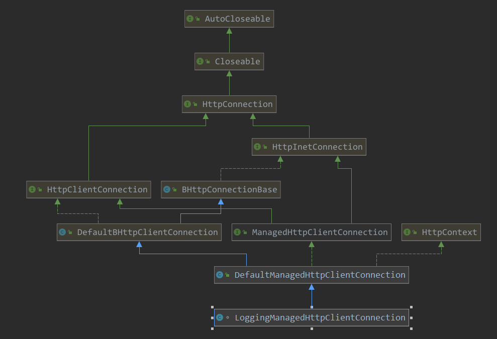
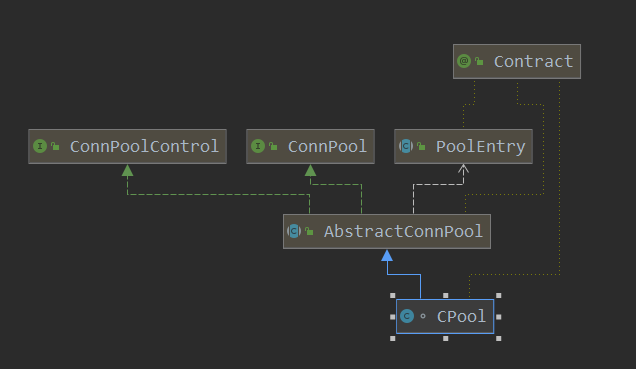
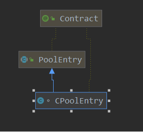

[TOC]

# httpClient请求连接的操作

上篇分析到httpClient请求的执行，其主要步骤：

1. 从连接池中请求连接，即创建socket
2. 连接
3. 执行器请求
4. 返回响应，并回收资源

本篇看一下如何从连接池中请求连接。

> org.apache.http.impl.execchain.MainClientExec#execute

```java
// --- 重点 ----  去连接池中请求一个连接
final ConnectionRequest connRequest = connManager.requestConnection(route, userToken);
```

> org.apache.http.impl.conn.PoolingHttpClientConnectionManager#requestConnection

```java
// 此state 是 http.user-token 的值
@Override
public ConnectionRequest requestConnection(
    final HttpRoute route,
    final Object state) {
    Args.notNull(route, "HTTP route");
    if (this.log.isDebugEnabled()) {
        this.log.debug("Connection request: " + format(route, state) + formatStats(route));
    }
    Asserts.check(!this.isShutDown.get(), "Connection pool shut down");
    // 如pool中租用一个 CPoolEntry,即一个连接
    // 此租用返回一个 future
    // 重点 ------
    final Future<CPoolEntry> future = this.pool.lease(route, state, null);
    // 这里重写的具体请求，都是围绕上面 future进行
    return new ConnectionRequest() {

        @Override
        public boolean cancel() {
            return future.cancel(true);
        }

        @Override
        public HttpClientConnection get(
            final long timeout,
            final TimeUnit timeUnit) throws InterruptedException, ExecutionException, ConnectionPoolTimeoutException {
            // 获取连接
            final HttpClientConnection conn = leaseConnection(future, timeout, timeUnit);
            if (conn.isOpen()) {
                final HttpHost host;
                if (route.getProxyHost() != null) {
                    host = route.getProxyHost();
                } else {
                    host = route.getTargetHost();
                }
                final SocketConfig socketConfig = resolveSocketConfig(host);
                conn.setSocketTimeout(socketConfig.getSoTimeout());
            }
            return conn;
        }
    };
}
```

> org.apache.http.pool.AbstractConnPool#lease(T, java.lang.Object, org.apache.http.concurrent.FutureCallback<E>)

```java
   // 从池中租用连接
    @Override
    public Future<E> lease(final T route, final Object state, final FutureCallback<E> callback) {
        Args.notNull(route, "Route");
        Asserts.check(!this.isShutDown, "Connection pool shut down");
        // 创建了一个 furture
        // 在future中进行具体的工作
        return new Future<E>() {
            // 是否可以取消
            private final AtomicBoolean cancelled = new AtomicBoolean(false);
            // 是否完成
            private final AtomicBoolean done = new AtomicBoolean(false);
            // 存储引用
            private final AtomicReference<E> entryRef = new AtomicReference<E>(null);
            // 取消操作
            @Override
            public boolean cancel(final boolean mayInterruptIfRunning) {
                if (done.compareAndSet(false, true)) {
                    cancelled.set(true);
                    lock.lock();
                    try {
                        condition.signalAll();
                    } finally {
                        lock.unlock();
                    }
                    if (callback != null) {
                        callback.cancelled();
                    }
                    return true;
                }
                return false;
            }

            @Override
            public boolean isCancelled() {
                return cancelled.get();
            }

            @Override
            public boolean isDone() {
                return done.get();
            }
            // 获取一个future 结果
            @Override
            public E get() throws InterruptedException, ExecutionException {
                try {
                    return get(0L, TimeUnit.MILLISECONDS);
                } catch (final TimeoutException ex) {
                    throw new ExecutionException(ex);
                }
            }
            // 相当于获取连接
            @Override
            public E get(final long timeout, final TimeUnit timeUnit) throws InterruptedException, ExecutionException, TimeoutException {
                for (;;) {
                    synchronized (this) {
                        try {
                            // 先从entryRed获取,查看是否已经有
                            final E entry = entryRef.get();
                            if (entry != null) {
                                return entry;
                            }
                            if (done.get()) {
                                throw new ExecutionException(operationAborted());
                            }
                            // 从routePool获取连接
                            // 如果没有则创建,如果达到最大值,则等待
                            final E leasedEntry = getPoolEntryBlocking(route, state, timeout, timeUnit, this);
                            if (validateAfterInactivity > 0)  {
                                if (leasedEntry.getUpdated() + validateAfterInactivity <= System.currentTimeMillis()) {
                                    if (!validate(leasedEntry)) {
                                        leasedEntry.close();
                                        release(leasedEntry, false);
                                        continue;
                                    }
                                }
                            }
                            // 记录完成
                            if (done.compareAndSet(false, true)) {
                                // 并记录 获取到的 entry
                                entryRef.set(leasedEntry);
                                done.set(true);
                                // 扩展方法
                                onLease(leasedEntry);
                                // 如果有回调方法,则调用回调方法
                                if (callback != null) {
                                    callback.completed(leasedEntry);
                                }
                                return leasedEntry;
                            } else {
                                release(leasedEntry, true);
                                throw new ExecutionException(operationAborted());
                            }
                        } catch (final IOException ex) {
                            if (done.compareAndSet(false, true)) {
                                if (callback != null) {
                                    callback.failed(ex);
                                }
                            }
                            throw new ExecutionException(ex);
                        }
                    }
                }
            }

        };
    }
```

> org.apache.http.pool.AbstractConnPool#getPoolEntryBlocking

```java
// 阻塞的方式 获取一个 entryBlocking
private E getPoolEntryBlocking(
    final T route, final Object state,
    final long timeout, final TimeUnit timeUnit,
    final Future<E> future) throws IOException, InterruptedException, ExecutionException, TimeoutException {

    Date deadline = null;
    if (timeout > 0) {
        deadline = new Date (System.currentTimeMillis() + timeUnit.toMillis(timeout));
    }
    this.lock.lock();
    try {
        // 从池中获取 RouteSpecificPool
        final RouteSpecificPool<T, C, E> pool = getPool(route);
        E entry;
        for (;;) {
            Asserts.check(!this.isShutDown, "Connection pool shut down");
            // 任务是否取消
            if (future.isCancelled()) {
                throw new ExecutionException(operationAborted());
            }
            for (;;) {
                // 从route池中获取一个 free的 entry
                // 即pool中对应的是route 池,route池中对应了具体主机的entry,entry中包装了连接
                entry = pool.getFree(state);
                // 没有,则break,进入下面进行 创建
                if (entry == null) {
                    break;
                }
                // 检测 entry是否过时
                if (entry.isExpired(System.currentTimeMillis())) {
                    entry.close();
                }
                // 检测entry 是否关闭
                // 关闭了 则移除此entry
                if (entry.isClosed()) {
                    this.available.remove(entry);
                    pool.free(entry, false);
                } else {
                    break;
                }
            }
            if (entry != null) {
                // 获取到了,则从 available中移除 entry
                this.available.remove(entry);
                // 加入到 leased
                this.leased.add(entry);
                onReuse(entry);
                return entry;
            }

            // New connection is needed
            // 每一个route的最大连接数
            final int maxPerRoute = getMax(route);
            // Shrink the pool prior to allocating a new connection
            // 查看是否 已经超过了 最大连接数
            final int excess = Math.max(0, pool.getAllocatedCount() + 1 - maxPerRoute);
            // 如果超过了最大连接数,则 关闭一些连接
            if (excess > 0) {
                // 如果超过了, 则释放一些连接
                for (int i = 0; i < excess; i++) {
                    final E lastUsed = pool.getLastUsed();
                    if (lastUsed == null) {
                        break;
                    }
                    lastUsed.close();
                    this.available.remove(lastUsed);
                    pool.remove(lastUsed);
                }
            }

            if (pool.getAllocatedCount() < maxPerRoute) {
                // 租用的个数
                final int totalUsed = this.leased.size();
                // 可用的个数
                final int freeCapacity = Math.max(this.maxTotal - totalUsed, 0);
                // 如果可用的数量大于0
                if (freeCapacity > 0) {
                    // 可用的个数
                    final int totalAvailable = this.available.size();
                    // 释放一些可用的连接
                    if (totalAvailable > freeCapacity - 1) {
                        if (!this.available.isEmpty()) {
                            // 移除上次使用的, 创建一个新的 routPool
                            final E lastUsed = this.available.removeLast();
                            lastUsed.close();
                            final RouteSpecificPool<T, C, E> otherpool = getPool(lastUsed.getRoute());
                            otherpool.remove(lastUsed);
                        }
                    }
                    // 创建连接, 创建socket 并进行了 connect
                    // ----- 重点--------
                    final C conn = this.connFactory.create(route);
                    // 记录创建的连接
                    entry = pool.add(conn);
                    // 记录此 entry
                    this.leased.add(entry);
                    // 返回创建的 entry
                    return entry;
                }
            }

            boolean success = false;
            try {
                // 记录此 没有获取到连接的 future
                pool.queue(future);
                // 记录
                this.pending.add(future);
                if (deadline != null) {
                    // 超时时间的等待
                    success = this.condition.awaitUntil(deadline);
                } else {
                    // 持续等待
                    this.condition.await();
                    success = true;
                }
                if (future.isCancelled()) {
                    throw new ExecutionException(operationAborted());
                }
            } finally {
                // In case of 'success', we were woken up by the
                // connection pool and should now have a connection
                // waiting for us, or else we're shutting down.
                // Just continue in the loop, both cases are checked.
                pool.unqueue(future);
                this.pending.remove(future);
            }
            // check for spurious wakeup vs. timeout
            if (!success && (deadline != null && deadline.getTime() <= System.currentTimeMillis())) {
                break;
            }
        }
        throw new TimeoutException("Timeout waiting for connection");
    } finally {
        this.lock.unlock();
    }
}
```

继续看如何创建的连接：

> org.apache.http.impl.conn.PoolingHttpClientConnectionManager.InternalConnectionFactory#create

```java
        // 创建连接
        @Override
        public ManagedHttpClientConnection create(final HttpRoute route) throws IOException {
            ConnectionConfig config = null;
            if (route.getProxyHost() != null) {
                config = this.configData.getConnectionConfig(route.getProxyHost());
            }
            if (config == null) {
                config = this.configData.getConnectionConfig(route.getTargetHost());
            }
            if (config == null) {
                config = this.configData.getDefaultConnectionConfig();
            }
            if (config == null) {
                config = ConnectionConfig.DEFAULT;
            }
            // 常见连接
            return this.connFactory.create(route, config);
        }
```

> org.apache.http.impl.conn.ManagedHttpClientConnectionFactory#create

```java
// 具体创建连接的地方
@Override
public ManagedHttpClientConnection create(final HttpRoute route, final ConnectionConfig config) {
    // 获取配置
    final ConnectionConfig cconfig = config != null ? config : ConnectionConfig.DEFAULT;
    // 解码器
    CharsetDecoder charDecoder = null;
    // 编码器
    CharsetEncoder charEncoder = null;
    final Charset charset = cconfig.getCharset();
    final CodingErrorAction malformedInputAction = cconfig.getMalformedInputAction() != null ?
        cconfig.getMalformedInputAction() : CodingErrorAction.REPORT;
    final CodingErrorAction unmappableInputAction = cconfig.getUnmappableInputAction() != null ?
        cconfig.getUnmappableInputAction() : CodingErrorAction.REPORT;
    // 如果有编码呢,则记录编码
    if (charset != null) {
        charDecoder = charset.newDecoder();
        charDecoder.onMalformedInput(malformedInputAction);
        charDecoder.onUnmappableCharacter(unmappableInputAction);
        charEncoder = charset.newEncoder();
        charEncoder.onMalformedInput(malformedInputAction);
        charEncoder.onUnmappableCharacter(unmappableInputAction);
    }
    final String id = "http-outgoing-" + Long.toString(COUNTER.getAndIncrement());
    // 生成一个 DefaultHttpRequestWriterFactory
    return new LoggingManagedHttpClientConnection(
        id,
        log,
        headerLog,
        wireLog,
        cconfig.getBufferSize(),
        cconfig.getFragmentSizeHint(),
        charDecoder,
        charEncoder,
        cconfig.getMessageConstraints(),
        incomingContentStrategy,
        outgoingContentStrategy,
        requestWriterFactory,
        responseParserFactory);
}
```

可以看到最终的连接是 LoggingManagedHttpClientConnection，看一下此类图：



看下此类的创建：

```java
public LoggingManagedHttpClientConnection(
    final String id,
    final Log log,
    final Log headerLog,
    final Log wireLog,
    final int bufferSize,
    final int fragmentSizeHint,
    final CharsetDecoder charDecoder,
    final CharsetEncoder charEncoder,
    final MessageConstraints constraints,
    final ContentLengthStrategy incomingContentStrategy,
    final ContentLengthStrategy outgoingContentStrategy,
    final HttpMessageWriterFactory<HttpRequest> requestWriterFactory,
    final HttpMessageParserFactory<HttpResponse> responseParserFactory) {
    super(id, bufferSize, fragmentSizeHint, charDecoder, charEncoder,
          constraints, incomingContentStrategy, outgoingContentStrategy,
          requestWriterFactory, responseParserFactory);
    // 记录 log
    this.log = log;
    // headerlog
    this.headerLog = headerLog;
    // wirelog
    this.wire = new Wire(wireLog, id);
}
```

```java
public DefaultManagedHttpClientConnection(
    final String id,
    final int bufferSize,
    final int fragmentSizeHint,
    final CharsetDecoder charDecoder,
    final CharsetEncoder charEncoder,
    final MessageConstraints constraints,
    final ContentLengthStrategy incomingContentStrategy,
    final ContentLengthStrategy outgoingContentStrategy,
    final HttpMessageWriterFactory<HttpRequest> requestWriterFactory,
    final HttpMessageParserFactory<HttpResponse> responseParserFactory) {
    super(bufferSize, fragmentSizeHint, charDecoder, charEncoder,
          constraints, incomingContentStrategy, outgoingContentStrategy,
          requestWriterFactory, responseParserFactory);
    // 记录自己的id
    this.id = id;
    // 记录属性
    this.attributes = new ConcurrentHashMap<String, Object>();
}
```

```java
    public DefaultBHttpClientConnection(
            final int bufferSize,
            final int fragmentSizeHint,
            final CharsetDecoder charDecoder,
            final CharsetEncoder charEncoder,
            final MessageConstraints constraints,
            final ContentLengthStrategy incomingContentStrategy,
            final ContentLengthStrategy outgoingContentStrategy,
            final HttpMessageWriterFactory<HttpRequest> requestWriterFactory,
            final HttpMessageParserFactory<HttpResponse> responseParserFactory) {
        super(bufferSize, fragmentSizeHint, charDecoder, charEncoder,
                constraints, incomingContentStrategy, outgoingContentStrategy);
        // 此是吧 request写入到 buffer中
        this.requestWriter = (requestWriterFactory != null ? requestWriterFactory :
            DefaultHttpRequestWriterFactory.INSTANCE).create(getSessionOutputBuffer());
        // 响应解析器
        this.responseParser = (responseParserFactory != null ? responseParserFactory :
            DefaultHttpResponseParserFactory.INSTANCE).create(getSessionInputBuffer(), constraints);
    }
```

```java
protected BHttpConnectionBase(
    final int bufferSize,
    final int fragmentSizeHint,
    final CharsetDecoder charDecoder,
    final CharsetEncoder charEncoder,
    final MessageConstraints messageConstraints,
    final ContentLengthStrategy incomingContentStrategy,
    final ContentLengthStrategy outgoingContentStrategy) {
    super();
    Args.positive(bufferSize, "Buffer size");
    // 数据监测 用途
    final HttpTransportMetricsImpl inTransportMetrics = new HttpTransportMetricsImpl();
    final HttpTransportMetricsImpl outTransportMetrics = new HttpTransportMetricsImpl();
    // 输入流时 SessionInputBufferImpl, 且可以指定编码
    this.inBuffer = new SessionInputBufferImpl(inTransportMetrics, bufferSize, -1,
                        messageConstraints != null ? messageConstraints : MessageConstraints.DEFAULT, charDecoder);
    // 输出流  都是SessionInputBufferImpl
    this.outbuffer = new SessionOutputBufferImpl(outTransportMetrics, bufferSize, fragmentSizeHint,
                                                 charEncoder);
    this.messageConstraints = messageConstraints;
    // 连接的 数据监测
    this.connMetrics = new HttpConnectionMetricsImpl(inTransportMetrics, outTransportMetrics);
    // 输入内容的策略
    this.incomingContentStrategy = incomingContentStrategy != null ? incomingContentStrategy :
    LaxContentLengthStrategy.INSTANCE;
    // 输出内容的策略
    this.outgoingContentStrategy = outgoingContentStrategy != null ? outgoingContentStrategy :
    StrictContentLengthStrategy.INSTANCE;
    // 这是一个 保存socket 连接的 引用
    this.socketHolder = new AtomicReference<Socket>();
}
```

为什么要看其构造过程呢？因为其在构造过程中创建了许多后面发送请求，接收响应的一些操作函数。

之后创建好连接到，添加到pool中，看一下：

```java
// ----- 重点--------
final C conn = this.connFactory.create(route);
// 记录创建的连接
entry = pool.add(conn);
// 记录此 entry
this.leased.add(entry);
// 返回创建的 entry
return entry;
```

> org.apache.http.pool.RouteSpecificPool#add

```java
// 添加一个 连接到此池中
public E add(final C conn) {
    final E entry = createEntry(conn);
    this.leased.add(entry);
    return entry;
}
```

```java
// 可见pool中管理的是 routePool,每个route的是可复用的
private RouteSpecificPool<T, C, E> getPool(final T route) {
    // 获取此 route 对应的 RouteSpecificPool
    RouteSpecificPool<T, C, E> pool = this.routeToPool.get(route);
    if (pool == null) {
        // 没有就创建一个,并复写了 createEntry 方法
        pool = new RouteSpecificPool<T, C, E>(route) {
            @Override
            protected E createEntry(final C conn) {
                return AbstractConnPool.this.createEntry(route, conn);
            }
        };
        // 记录
        this.routeToPool.put(route, pool);
    }
    return pool;
}
```

可以看到createEntry在创建RouteSpecificPool时就指定了。而AbstractConnPool的子类实现具体的创建过程：



可见具体的创建动作应该是 CPool了:

> org.apache.http.impl.conn.CPool#createEntry

```java
  // 创建一个 CPoolEntry
    @Override
    protected CPoolEntry createEntry(final HttpRoute route, final ManagedHttpClientConnection conn) {
        final String id = Long.toString(COUNTER.getAndIncrement());
        return new CPoolEntry(this.log, id, route, conn, this.timeToLive, this.timeUnit);
    }
```

创建了一个CPoolEntry，看一下此类图：



看一下其构建：

```java
    // 创建 CPoolEntry
    public CPoolEntry(
            final Log log,
            final String id,
            final HttpRoute route,
            final ManagedHttpClientConnection conn,
            final long timeToLive, final TimeUnit timeUnit) {
        super(id, route, conn, timeToLive, timeUnit);
        // 日志
        this.log = log;
    }
```

```java
public PoolEntry(final String id, final T route, final C conn,
                 final long timeToLive, final TimeUnit timeUnit) {
    super();
    Args.notNull(route, "Route");
    Args.notNull(conn, "Connection");
    Args.notNull(timeUnit, "Time unit");
    this.id = id;
    // route
    this.route = route;
    // 连接
    this.conn = conn;
    // 创建时间
    this.created = System.currentTimeMillis();
    // 第一个的更新时间 就是 创建的时间
    this.updated = this.created;
    // 如果设置了过期时间,则过期时间为 this.created + timeUnit.toMillis(timeToLive)
    // 否则为:  this.validityDeadline = Long.MAX_VALUE
    // 此处的ttl 就是在连接池中 设置的 ttl
    if (timeToLive > 0) {
        // deadline时间 就是 创建时间加上 ttl 时间
        final long deadline = this.created + timeUnit.toMillis(timeToLive);
        // If the above overflows then default to Long.MAX_VALUE
        // 如果dealine 时间小于0, 那么就设置  validityDeadline时间为 Long.MAX_VALUE
        this.validityDeadline = deadline > 0 ? deadline : Long.MAX_VALUE;
    } else {
        // 默认的 有效deadline 就是 Long.MAX_VALUE
        this.validityDeadline = Long.MAX_VALUE;
    }
    // 过期时间 就是 validityDeadline
    this.expiry = this.validityDeadline;
}
```

到此一个连接就创建完成了，并使用CPoolEntry封装了连接，且放入到连接池中。


