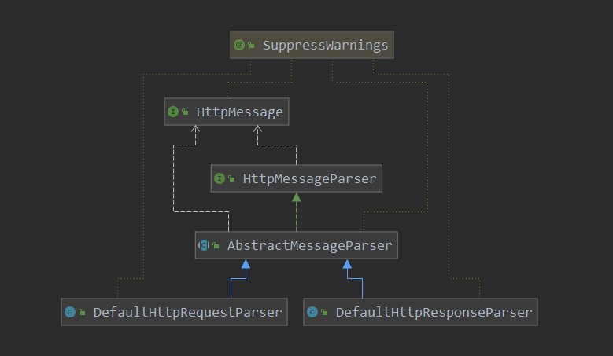
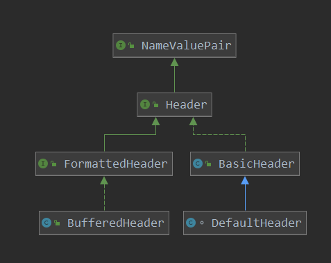

[TOC]

#  响应解析

上篇解析了一下一个请求的发送是如何进行的，那这里看一下请求发送后，对于请求是如何解析的。

```java
// 执行请求,并获取到 response
public HttpResponse execute(
    final HttpRequest request,
    final HttpClientConnection conn,
    final HttpContext context) throws IOException, HttpException {
    Args.notNull(request, "HTTP request");
    Args.notNull(conn, "Client connection");
    Args.notNull(context, "HTTP context");
    try {
        // 发送请求,并得到 响应结果
        HttpResponse response = doSendRequest(request, conn, context);
        if (response == null) {
            // 如果上面没有得到响应体,这里会在此执行  直到得到响应体
            response = doReceiveResponse(request, conn, context);
        }
        return response;
    } // 省略非关键代码
```

这里主要就是看一下doReceiveResponse 对响应的解析。

> org.apache.http.protocol.HttpRequestExecutor#doReceiveResponse

```java
// 响应的一个解析
protected HttpResponse doReceiveResponse(
    final HttpRequest request,
    final HttpClientConnection conn,
    final HttpContext context) throws HttpException, IOException {
    Args.notNull(request, "HTTP request");
    Args.notNull(conn, "Client connection");
    Args.notNull(context, "HTTP context");
    HttpResponse response = null;
    int statusCode = 0;
    // 1. 如果还没有response 或者  statusCode 小于200, 则持续读取响应
    while (response == null || statusCode < HttpStatus.SC_OK) {
        // 1.1 接收响应头
        response = conn.receiveResponseHeader();
        // 1.2 获取响应中的响应码
        statusCode = response.getStatusLine().getStatusCode();
        if (statusCode < HttpStatus.SC_CONTINUE) {
            throw new ProtocolException("Invalid response: " + response.getStatusLine());
        }
        // 1.3 查看响应中是否有响应体
        if (canResponseHaveBody(request, response)) {
            // 1.4如果有响应体,则解析响应体内容
            conn.receiveResponseEntity(response);
        }
    } // while intermediate response
    // 2. 返回接收到的响应
    return response;
}
```

上面代码也很清晰了，当然也是一个持续接收响应的过程，没有响应或者响应码为100那么就持续进行响应的读取，直到完成。大体步骤：

1. 接收响应头
2. 获取响应码
3. 查看是否有响应体，如果有则解析响应体
4. 返回响应

下面依次看一下其操作。

## 接收响应行

> org.apache.http.impl.DefaultBHttpClientConnection#receiveResponseHeader

```java
// 接收响应头
@Override
public HttpResponse receiveResponseHeader() throws HttpException, IOException {
    ensureOpen();
    // 解析请求行  和  请求头信息
    final HttpResponse response = this.responseParser.parse();
    // 扩展方法
    onResponseReceived(response);
    if (response.getStatusLine().getStatusCode() >= HttpStatus.SC_OK) {
        // 响应数 增加
        incrementResponseCount();
    }
    return response;
}
```

> org.apache.http.impl.io.AbstractMessageParser#parse

```java
// 解析响应头
@Override
public T parse() throws IOException, HttpException {
    final int st = this.state;
    switch (st) {
        case HEAD_LINE:
            try {
                // 解析请求行  得到  请求 method  uri  version
                this.message = parseHead(this.sessionBuffer);
            } catch (final ParseException px) {
                throw new ProtocolException(px.getMessage(), px);
            }
            this.state = HEADERS;
            //$FALL-THROUGH$
        case HEADERS:
            // 解析请求头  http header
            final Header[] headers = AbstractMessageParser.parseHeaders(
                this.sessionBuffer,
                this.messageConstraints.getMaxHeaderCount(),
                this.messageConstraints.getMaxLineLength(),
                this.lineParser,
                this.headerLines);
            this.message.setHeaders(headers);
            final T result = this.message;
            this.message = null;
            this.headerLines.clear();
            this.state = HEAD_LINE;
            return result;
        default:
            throw new IllegalStateException("Inconsistent parser state");
    }
}
```

解析器的类图:



响应行解析，响应行的一般格式：HTTP/1.1   201  \\r\n

> org.apache.http.impl.io.DefaultHttpResponseParser#parseHead

```java
// 解析响应行
@Override
protected HttpResponse parseHead(
    final SessionInputBuffer sessionBuffer)
    throws IOException, HttpException, ParseException {
    // 缓冲区清空
    this.lineBuf.clear();
    // 1. 先读取一行数据
    final int readLen = sessionBuffer.readLine(this.lineBuf);
    // 没有读取到,则报错
    if (readLen == -1) {
        throw new NoHttpResponseException("The target server failed to respond");
    }
    //create the status line from the status string
    // 一个解析行的 游标
    // 2. 创建一个游标 记录 行解析
    final ParserCursor cursor = new ParserCursor(0, this.lineBuf.length());
    // 响应行 一般格式为  HTTP/1.1  201 \r\n
    // 3. 解析响应 行
    final StatusLine statusline = lineParser.parseStatusLine(this.lineBuf, cursor);
    // 4. 创建 response 并返回
    return this.responseFactory.newHttpResponse(statusline, null);
}
```

步骤主要如下：

1. 首先从输入流中读取一行数据
2. 创建一个游标，记录数据的解析位置
3. 解析响应行
4. 创建response 并返回


第一步: 从输入流中读取一行

> org.apache.http.impl.io.SessionInputBufferImpl#readLine(org.apache.http.util.CharArrayBuffer)

```java
// 从输入流中读取数据
// charbuffer 存储读取到的数据
@Override
public int readLine(final CharArrayBuffer charbuffer) throws IOException {
    Args.notNull(charbuffer, "Char array buffer");
    // 获取最大的行长度, 默认的是-1
    final int maxLineLen = this.constraints.getMaxLineLength();
    int noRead = 0;
    boolean retry = true;
    // 此处的 while(retry) 即 读取一行的数据,即读取到 HTTP.LF 表示读取到一行
    // 死循环,持续从  输入流中进行数据的读取
    while (retry) {
        // attempt to find end of line (LF)
        int pos = -1;
        // 查看是否读取到了一行
        for (int i = this.bufferPos; i < this.bufferLen; i++) {
            if (this.buffer[i] == HTTP.LF) {
                // 此pos记录 读取到的数据中  LF的位置,即pos到bufferLen 之间的就是一行的数据
                pos = i;
                break;
            }
        }
        // 查看当前读取到的长度  是否大于了一行最大长度
        if (maxLineLen > 0) {
            final int currentLen = this.lineBuffer.length()
                + (pos >= 0 ? pos : this.bufferLen) - this.bufferPos;
            if (currentLen >= maxLineLen) {
                throw new MessageConstraintException("Maximum line length limit exceeded");
            }
        }
        // this.buffer 是缓存从inputStream中读取的数据
        // this.lineBuffer 数缓存一行的数据,数据来源于 this.buffer
        if (pos != -1) {
            // end of line found.
            // pos不为-1,但是lineBuffer为空 说明读取到了一行
            if (this.lineBuffer.isEmpty()) {
                // the entire line is preset in the read buffer
                // 把读取到的 一行数据 追加到  read buffer中
                // pos不等于-1,表示已经读取到了 HTTP.LF,即读取到了一行数据到 buffer中
                // lineFromReadBuffer 就是直接把buffer中pos到 bufferLen之间的一行数据进行读取并处理
                return lineFromReadBuffer(charbuffer, pos);
            }
            retry = false;
            final int len = pos + 1 - this.bufferPos;
            this.lineBuffer.append(this.buffer, this.bufferPos, len);
            this.bufferPos = pos + 1;
        } else {
            // end of line not found
            // 是否读取到了数据
            if (hasBufferedData()) {
                // buffer中的有效数据
                final int len = this.bufferLen - this.bufferPos;
                // 把buffer中的数据 放入到 lineBuffer中
                this.lineBuffer.append(this.buffer, this.bufferPos, len);
                this.bufferPos = this.bufferLen;
            }
            // 从输入流中读取数据
            noRead = fillBuffer();
            // 如果没有读到数据,则设置 retry为false; 即退出循环,不再进行数据的读取
            if (noRead == -1) {
                retry = false;
            }
        }
    }
    if (noRead == -1 && this.lineBuffer.isEmpty()) {
        // indicate the end of stream
        return -1;
    }
    return lineFromLineBuffer(charbuffer);
}

```

这里主要看一些数据的读取，和数据的format。这里注意一下，当读取到 LF 即  \r 符号时，就认为读取到了一行。

> org.apache.http.impl.io.SessionInputBufferImpl#fillBuffer

```java
// 填充buffer,即从 输入流中读取数据
public int fillBuffer() throws IOException {
    // compact the buffer if necessary
    // 如果后缓存数据,则compact buffer
    if (this.bufferPos > 0) {
        final int len = this.bufferLen - this.bufferPos;
        if (len > 0) {
            System.arraycopy(this.buffer, this.bufferPos, this.buffer, 0, len);
        }
        this.bufferPos = 0;
        this.bufferLen = len;
    }
    final int readLen;
    final int off = this.bufferLen;
    final int len = this.buffer.length - off;
    // 从输入流中读取数据到 buffer中
    readLen = streamRead(this.buffer, off, len);
    if (readLen == -1) {
        return -1;
    }
    this.bufferLen = off + readLen;
    this.metrics.incrementBytesTransferred(readLen);
    // 返回读取的数据
    return readLen;
}
```

> org.apache.http.impl.io.SessionInputBufferImpl#lineFromReadBuffer

```java
// 从输入缓存区中读取 一行数据
// bufferPos 到  bufferLen 之间的数据 就是一行的数据
private int lineFromReadBuffer(final CharArrayBuffer charbuffer, final int position)
    throws IOException {
    int pos = position;
    // buffer的当前位置
    final int off = this.bufferPos;
    int len;
    this.bufferPos = pos + 1;
    // 去除 CR 符号; 即\n
    // 当读取到 \r 时就认为是一行数据了
    if (pos > off && this.buffer[pos - 1] == HTTP.CR) {
        // skip CR if found
        pos--;
    }
    len = pos - off;
    // 如果没有解码器,则直接追加数据
    if (this.decoder == null) {
        charbuffer.append(this.buffer, off, len);
    } else {
        // 如果有解码器,则解码后,再追加
        final ByteBuffer bbuf =  ByteBuffer.wrap(this.buffer, off, len);
        len = appendDecoded(charbuffer, bbuf);
    }
    // 返回一样的长度
    return len;
}
```

第二步： 创建游标

```java
public ParserCursor(final int lowerBound, final int upperBound) {
    super();
    if (lowerBound < 0) {
        throw new IndexOutOfBoundsException("Lower bound cannot be negative");
    }
    if (lowerBound > upperBound) {
        throw new IndexOutOfBoundsException("Lower bound cannot be greater then upper bound");
    }
    // 开始位置
    this.lowerBound = lowerBound;
    // 最后位置
    this.upperBound = upperBound;
    // 当前位置
    this.pos = lowerBound;
}
```

第三步：解析响应行

> org.apache.http.message.BasicLineParser#parseStatusLine(org.apache.http.util.CharArrayBuffer, org.apache.http.message.ParserCursor)

```java
// 解析 响应码 的行
@Override
public StatusLine parseStatusLine(final CharArrayBuffer buffer,
                                  final ParserCursor cursor) throws ParseException {
    Args.notNull(buffer, "Char array buffer");
    Args.notNull(cursor, "Parser cursor");
    // 获取 第一个位置
    final int indexFrom = cursor.getPos();
    // 最后一个位置
    final int indexTo = cursor.getUpperBound();

    try {
        // handle the HTTP-Version
        // 解析协议 版本
        // 响应行格式一般为:  HTTP/1.1 201 \r\n
        // 此处主要是解析  1.1 这个值
        final ProtocolVersion ver = parseProtocolVersion(buffer, cursor);

        // handle the Status-Code
        // 跳过空格
        skipWhitespace(buffer, cursor);
        int i = cursor.getPos();
        // 获取下一个空格的位置,即 \r\n 前的空格
        int blank = buffer.indexOf(' ', i, indexTo);
        if (blank < 0) {
            blank = indexTo;
        }
        final int statusCode;
        // 获取 响应码
        final String s = buffer.substringTrimmed(i, blank);
        // 判断响应码 是否都是 数字
        for (int j = 0; j < s.length(); j++) {
            if (!Character.isDigit(s.charAt(j))) {
                throw new ParseException(
                    "Status line contains invalid status code: "
                    + buffer.substring(indexFrom, indexTo));
            }
        }
        try {
            // 解析响应码
            statusCode = Integer.parseInt(s);
        } catch (final NumberFormatException e) {
            throw new ParseException(
                "Status line contains invalid status code: "
                + buffer.substring(indexFrom, indexTo));
        }
        //handle the Reason-Phrase
        i = blank;
        final String reasonPhrase;
        // 后面还有信息的话, 也同样获取到,作为 reason
        if (i < indexTo) {
            reasonPhrase = buffer.substringTrimmed(i, indexTo);
        } else {
            reasonPhrase = "";
        }
        return createStatusLine(ver, statusCode, reasonPhrase);

    } catch (final IndexOutOfBoundsException e) {
        throw new ParseException("Invalid status line: " +
                                 buffer.substring(indexFrom, indexTo));
    }
} // parseStatusLine
```


第四步：创建response 并返回

> org.apache.http.impl.DefaultHttpResponseFactory#newHttpResponse

```java
    // 创建 response
    @Override
    public HttpResponse newHttpResponse(
            final StatusLine statusline,
            final HttpContext context) {
        Args.notNull(statusline, "Status line");
        // 创建一个 baseResponse
        return new BasicHttpResponse(statusline, this.reasonCatalog, determineLocale(context));
    }
```

```java
// 创建
public BasicHttpResponse(final StatusLine statusline,
                         final ReasonPhraseCatalog catalog,
                         final Locale locale) {
    super();
    // 响应行
    this.statusline = Args.notNull(statusline, "Status line");
    // 版本
    this.ver = statusline.getProtocolVersion();
    // 响应阿莫
    this.code = statusline.getStatusCode();
    // 响应  reason
    this.reasonPhrase = statusline.getReasonPhrase();
    // 分类
    this.reasonCatalog = catalog;
    this.locale = locale;
}
```

到这里响应行的解析，就完成了。

## 响应头解析

> org.apache.http.impl.io.AbstractMessageParser#parseHeaders

```java
// 解析响应头
public static Header[] parseHeaders(
    final SessionInputBuffer inBuffer,
    final int maxHeaderCount,
    final int maxLineLen,
    final LineParser parser,
    final List<CharArrayBuffer> headerLines) throws HttpException, IOException {
    Args.notNull(inBuffer, "Session input buffer");
    Args.notNull(parser, "Line parser");
    Args.notNull(headerLines, "Header line list");

    CharArrayBuffer current = null;
    CharArrayBuffer previous = null;
    // 死循环  持续读取数据
    for (;;) {
        if (current == null) {
            current = new CharArrayBuffer(64);
        } else {
            current.clear();
        }
        // 1. 从输入流中 读取行
        // ---- 重点 --------
        final int readLen = inBuffer.readLine(current);
        if (readLen == -1 || current.length() < 1) {
            break;
        }
        // Parse the header name and value
        // Check for folded headers first
        // Detect LWS-char see HTTP/1.0 or HTTP/1.1 Section 2.2
        // discussion on folded headers

        /// ???????  没太明白
        if ((current.charAt(0) == ' ' || current.charAt(0) == '\t') && previous != null) {
            // we have continuation folded header
            // so append value
            int i = 0;
            while (i < current.length()) {
                final char ch = current.charAt(i);
                if (ch != ' ' && ch != '\t') {
                    break;
                }
                i++;
            }
            if (maxLineLen > 0
                && previous.length() + 1 + current.length() - i > maxLineLen) {
                throw new MessageConstraintException("Maximum line length limit exceeded");
            }
            previous.append(' ');
            previous.append(current, i, current.length() - i);
        } else {
            // 记录读取到的一行数据
            headerLines.add(current);
            previous = current;
            current = null;
        }
        if (maxHeaderCount > 0 && headerLines.size() >= maxHeaderCount) {
            throw new MessageConstraintException("Maximum header count exceeded");
        }
    }
    final Header[] headers = new Header[headerLines.size()];
    for (int i = 0; i < headerLines.size(); i++) {
        final CharArrayBuffer buffer = headerLines.get(i);
        try {
            // 2. 解析响应头
            headers[i] = parser.parseHeader(buffer);
        } catch (final ParseException ex) {
            throw new ProtocolException(ex.getMessage());
        }
    }
    return headers;
}
```

这里主要还是从输入流中读取一行数据，之后就开始解析响应头信息。

> org.apache.http.message.BasicLineParser#parseHeader(org.apache.http.util.CharArrayBuffer)

```java
// 解析响应头
@Override
public Header parseHeader(final CharArrayBuffer buffer)
    throws ParseException {

    // the actual parser code is in the constructor of BufferedHeader
    // 解析buffer中的响应头
    return new BufferedHeader(buffer);
}
```

```java
// 解析响应头
public BufferedHeader(final CharArrayBuffer buffer)
    throws ParseException {

    super();
    Args.notNull(buffer, "Char array buffer");
    // 获取 : 符号的位置,此符号前为name  符号后为 value
    final int colon = buffer.indexOf(':');
    if (colon == -1) {
        throw new ParseException
            ("Invalid header: " + buffer.toString());
    }
    final String s = buffer.substringTrimmed(0, colon);
    if (s.isEmpty()) {
        throw new ParseException
            ("Invalid header: " + buffer.toString());
    }
    // 记录此buffer
    this.buffer = buffer;
    // 记录名字
    this.name = s;
    // 记录value的位置
    this.valuePos = colon + 1;
}
```

这里看一下记录header的类图:



到这里响应行和响应头就解析完了，之后返回响应就可以了。


