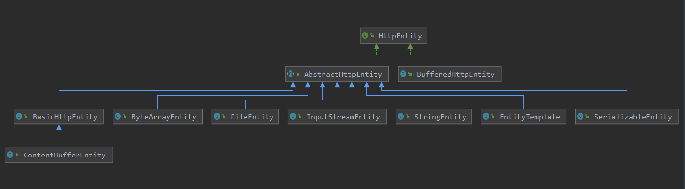

[TOC]

#  hh

这里说一下httpClient中的entity的使用，以及了解其实现的原理； 先来看一下其类图：



可以看到entity还是比较多的，这里列举一个使用实例，从实例开始进行解析。

```java
public static Map<String,String>  httpPutMethodWithStatusCode(HttpConfig httpConfig){
    logger.debug("httpclient put method start,the url is{}",httpConfig.getUrl());
    CloseableHttpResponse response = null;
    HttpPut request = (HttpPut) getRequest(httpConfig.getUrl(),httpConfig.getMethods());
    Map<String,String> result = new HashMap<>(2);
    Integer statusCode = null;
    String entityString = "";
    try {
        configRequest(request,httpConfig);
        configParamEntity(request,httpConfig);
        response = (CloseableHttpResponse) httpConfig.getClient().execute(request);
        statusCode = response.getStatusLine().getStatusCode();
        logger.info("httpPutMethodWithStatusCode statusCode is {}",statusCode);
        if (200 != statusCode && 201 != statusCode) {
            entityString = convertResponseToString(response);
        }
        result.put("code",statusCode.toString());
        result.put("message",entityString);
        if (logger.isDebugEnabled()){
            logger.debug("httpPutMethodWithStatusCode response:{}",result.toString());
        }
        return result;
    } catch (Exception e) {
        logger.error("Httpclient httpPutMethodWithStatusCode error,the url is{},the error msg is{}",
                     httpConfig.getUrl(),e.getMessage());
        if (null != statusCode){
            result.put("code",statusCode.toString());
        }else{
            result.put("code","500");
        }
        if (!"".equals(entityString)){
            result.put("message", entityString);
        }else {
            result.put("message", e.getMessage());
        }
        return result;
    }finally {
        close((CloseableHttpClient) httpConfig.getClient(),response);
    }
}
```

```java
public static void configParamEntity(HttpRequestBase request,HttpConfig httpConfig) throws UnsupportedEncodingException {
    Map<String, String> paramMap = httpConfig.getParamMap();
    StringEntity entity = null;
    if (paramMap != null && paramMap.size() > 0) {
        entity = new StringEntity(JSONUtil.beanToJson(paramMap), Charset.forName("UTF-8"));
        entity.setContentEncoding("UTF-8");
    }else{
        entity = new StringEntity(httpConfig.getBeanParam(), Charset.forName("UTF-8"));
        entity.setContentEncoding("UTF-8");
    }
    if (request instanceof HttpDeleteWithEntity){
        HttpDeleteWithEntity httpDelete = (HttpDeleteWithEntity) request;
        httpDelete.setEntity(entity);
        return;
    }
    if (request instanceof HttpPost){
        HttpPost httpPost = (HttpPost) request;
        httpPost.setEntity(entity);
        return;
    }
    if (request instanceof HttpPut){
        HttpPut httpPut = (HttpPut) request;
        httpPut.setEntity(entity);
        return;
    }
}
```

这里看到，当是post，put，patch请求时，且其有请求参数时，就使用到了HttpEntity，这里就以StringEntity为例，看一下其功能如何实现。

```java
// 构造函数
// string为要传递的参数
// charset为 编码格式
// 创建了默认的content-type为 text/plain
public StringEntity(final String string, final Charset charset) {
    this(string, ContentType.create(ContentType.TEXT_PLAIN.getMimeType(), charset));
}
```

创建Context-Type 请求头

```java
// 创建一个 请求头 Content-type
public static ContentType create(final String mimeType, final Charset charset) {
    final String normalizedMimeType = Args.notBlank(mimeType, "MIME type").toLowerCase(Locale.ROOT);
    Args.check(valid(normalizedMimeType), "MIME type may not contain reserved characters");
    return new ContentType(normalizedMimeType, charset);
}


// content-type 请求头
ContentType(
    final String mimeType,
    final Charset charset) {
    // minmeType
    this.mimeType = mimeType;
    // 编码
    this.charset = charset;
    // 参数
    this.params = null;
}
```

```java
// 记录 entity的 字节内容
protected final byte[] content;

public StringEntity(final String string, final ContentType contentType) throws UnsupportedCharsetException {
    super();
    Args.notNull(string, "Source string");
    // 获取编码
    Charset charset = contentType != null ? contentType.getCharset() : null;
    if (charset == null) {
        // 可见默认编码为 ISO-8859-1
        charset = HTTP.DEF_CONTENT_CHARSET;
    }
    // 使用指定的编码格式 得到  内容
    this.content = string.getBytes(charset);
    if (contentType != null) {
        setContentType(contentType.toString());
    }
}
```

> org.apache.http.entity.AbstractHttpEntity#setContentType(java.lang.String)

```java
// 记录一个请求头
public void setContentType(final String ctString) {
    Header h = null;
    if (ctString != null) {
        h = new BasicHeader(HTTP.CONTENT_TYPE, ctString);
    }
    setContentType(h);
}
```

> org.apache.http.entity.AbstractHttpEntity#setContentType(org.apache.http.Header)

```java
// 记录 Content-Type 请求头
public void setContentType(final Header contentType) {
    this.contentType = contentType;
}
```

回顾一下前面发送entity的操作:

```java
// 发送请求体
@Override
public void sendRequestEntity(final HttpEntityEnclosingRequest request)
    throws HttpException, IOException {
    Args.notNull(request, "HTTP request");
    // 保证流已经打开, 并进行了绑定
    ensureOpen();
    // 获取请求体
    final HttpEntity entity = request.getEntity();
    if (entity == null) {
        return;
    }
    // 这里相当于 获取到了 输出流
    final OutputStream outStream = prepareOutput(request);
    // 把entity 数据写入到  outStream中
    // 此处的outStream 就是输出流
    entity.writeTo(outStream);
    outStream.close();
}
```

看到send entity是调用entity的writeTo方法，来吧数据写出：

> org.apache.http.entity.StringEntity#writeTo

```java
// 把内容写入到输出流中
@Override
public void writeTo(final OutputStream outStream) throws IOException {
    Args.notNull(outStream, "Output stream");
    outStream.write(this.content);
    outStream.flush();
}
```

这里是吧entity的中的content内容写出到输出流中，前面已经进行了编码，这里就是输出了。


