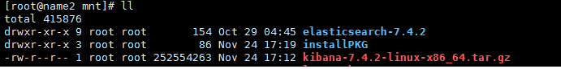
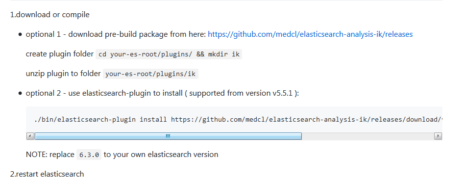
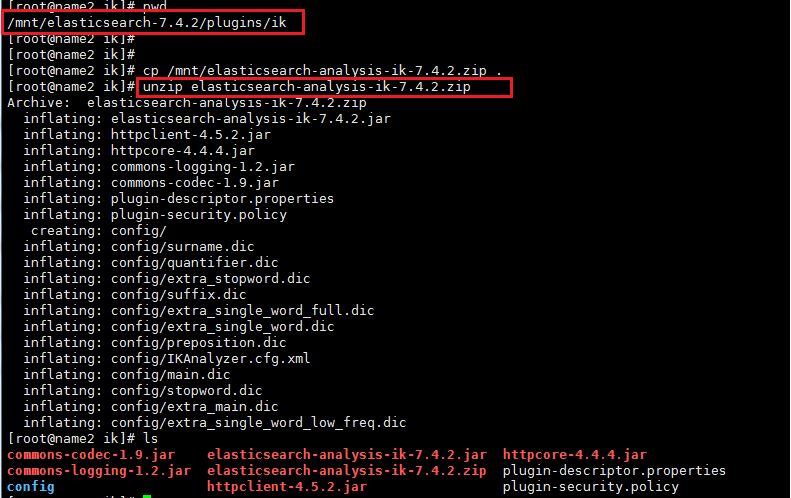

[TOC]

# ElasticSearch Install

## 1.下载安装包



## 2.配置java环境

```shell
## 此使用的是centos7自带的openjdk
[root@name2 java-1.8.0-openjdk-1.8.0.232.b09-0.el7_7.x86_64]# echo $JAVA_HOME
/usr/lib/jvm/java-1.8.0-openjdk-1.8.0.232.b09-0.el7_7.x86_64

```


## 3. 添加用户以及用户组

```shell
## 添加用户组
# groupadd -r elasticsearch

##添加用户并指定用户组
# useradd -g elasticsearch elastic

## 修改软件所属
# chown -R  elastic:elasticsearch  elasticsearch-7.4.2/
```

## 4.切换用户进行启动

```shell
## 切换用户
# su elastic

## 启动
[elastic@name2 mnt]$ elasticsearch-7.4.2/bin/elasticsearch
```


## 5.验证

```shell
[root@name2 ~]# curl localhost:9200
{
  "name" : "name2",
  "cluster_name" : "elasticsearch",
  "cluster_uuid" : "FtdhzbV1Sk-43of65cD_7Q",
  "version" : {
    "number" : "7.4.2",
    "build_flavor" : "default",
    "build_type" : "tar",
    "build_hash" : "2f90bbf7b93631e52bafb59b3b049cb44ec25e96",
    "build_date" : "2019-10-28T20:40:44.881551Z",
    "build_snapshot" : false,
    "lucene_version" : "8.2.0",
    "minimum_wire_compatibility_version" : "6.8.0",
    "minimum_index_compatibility_version" : "6.0.0-beta1"
  },
  "tagline" : "You Know, for Search"
}

此输出就说明启动成功
```


## 6. 安装IK分词器

### 6.1 安装方式查看



### 6.2 这里使用第二种方式，故下载安装包


### 6.3 解压

1.在plugins创建ik目录

```shell
[root@name2 plugins]# pwd
/mnt/elasticsearch-7.4.2/plugins
[root@name2 plugins]# mkdir ik
```

2.把安装包解压进入

```shell
unzip elasticsearch-analysis-ik-7.4.2.zip
```



3.重新启动es

```shell

```


4.在IK安装目录下的config中可以对IK分词器进行配置，配置文件为IKAnalyzer.cfg.xml