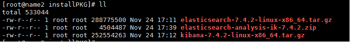
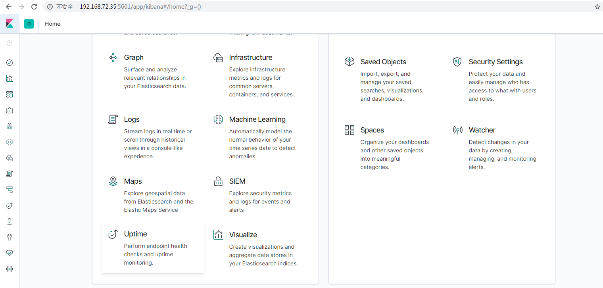

[TOC]

# Kibana Install

## 1.下载kibana包



## 2.配置

```shell
# 设置端口
server.port: 5601
# 设置ip
server.host: "localhost"
# 设置elasticsearch实例的url
elasticsearch.hosts: ["http://localhost:9200"]


```


## 3.启动

```shell
## 使用root启动时 需要添加 allow-root参数
$ kibana-7.4.2-linux-x86_64/bin/kibana --allow-root

## 当然了也可以换其他用户启动，建议是不要使用root启动
```

## 4.在浏览器打开

```shell
http://host:5601
```

