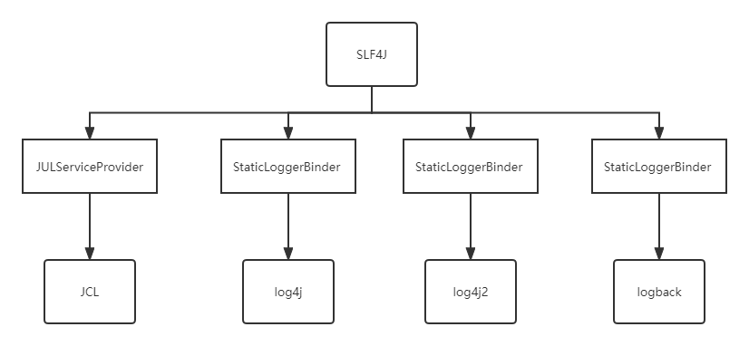

# SLF4J 的日志绑定功能实现

前面我们了解了一下SLF4J的大体功能， 本篇我们来看一下SLF4J的日志绑定功能是如何实现的。

## 环境搭建

### 添加依赖

```java
        <dependency>
            <groupId>org.slf4j</groupId>
            <artifactId>slf4j-api</artifactId>
            <version>2.0.0</version>
        </dependency>

        <dependency>
            <groupId>org.slf4j</groupId>
            <artifactId>slf4j-jdk14</artifactId>
            <version>2.0.0</version>
            <scope>test</scope>
        </dependency>


        <dependency>
            <groupId>junit</groupId>
            <artifactId>junit</artifactId>
            <version>4.12</version>
        </dependency>
```

这里我们使用JUL(java util logging)来解析。

###  测试文件

```java
// use slf4j api
@Test
public void testQuick(){
    Logger logger = LoggerFactory.getLogger(JUCDemo1.class);

    logger.error("error msg");
    logger.warn("warn msg");
    logger.info("info msg");
    logger.debug("debug msg");
}
```


按照上面两步搭建好环境后，我们开始浏览源码。

## 日志绑定

我们首先从获取logger作为入口进行查看：

```java
// org.slf4j.LoggerFactory#getLogger(java.lang.Class<?>)
public static Logger getLogger(Class<?> clazz) {
 // 开始获取logger对应，继续往下看
    Logger logger = getLogger(clazz.getName());
    ......
    return logger;
}
```


```java
// org.slf4j.LoggerFactory#getLogger(java.lang.String)
public static Logger getLogger(String name) {
    // 这里获取对应的工厂类，来使用工厂类上次LOGGER。 简单说，不同的实现对应不同的日志框架
    ILoggerFactory iLoggerFactory = getILoggerFactory();
    return iLoggerFactory.getLogger(name);
}

// org.slf4j.LoggerFactory#getILoggerFactory
public static ILoggerFactory getILoggerFactory() {
    return getProvider().getLoggerFactory();
}

// org.slf4j.LoggerFactory#getProvider
static SLF4JServiceProvider getProvider() {
    if (INITIALIZATION_STATE == 0) {
        Class var0 = LoggerFactory.class;
        synchronized(LoggerFactory.class) {
            if (INITIALIZATION_STATE == 0) {
                INITIALIZATION_STATE = 1;
                // 这里进行provider的初始化
                // Provider简单说就是上面工厂类的提供者, 根据不同的日志框架提供不同的工厂类
                performInitialization();
            }
        }
    }
    .....
}

// org.slf4j.LoggerFactory#performInitialization
private static final void performInitialization() {
    bind(); // bind函数,就是会从多个provider中选取一个(当pom文件中包含多个日志框架依赖,如 即包含log4j又包含logback)
    if (INITIALIZATION_STATE == 3) {
        versionSanityCheck();
    }
}
```

日志provider的绑定，绑定了不同的provider即代表 绑定了一个对应的日志框架

```java
//org.slf4j.LoggerFactory#bind
private static final void bind() {
    try {
        // 查看对应的provider
        List<SLF4JServiceProvider> providersList = findServiceProviders();
        // 当同时存在多个日志框架时, 打印warnning日志(想必大家一定看到过这种日志)
        reportMultipleBindingAmbiguity(providersList);
        if (providersList != null && !providersList.isEmpty()) {
            // 如果包含了多个日志框架时呢, 这里就会选第一个
            // 虽然每次都是选举第一个,但是每次解析时有一定随机性, List的第一个元素有可能会改变
            // 所以选取的日志框架,每次可能不相同.
            PROVIDER = (SLF4JServiceProvider)providersList.get(0);
            // provider进行初始化
            PROVIDER.initialize();
            INITIALIZATION_STATE = 3;
            reportActualBinding(providersList);
        } else {
            // 如果没有在pom中添加对应的日志框架, 或者添加了错误的依赖
            // 就会打印这里的错误信息
            INITIALIZATION_STATE = 4;
            Util.report("No SLF4J providers were found.");
            Util.report("Defaulting to no-operation (NOP) logger implementation");
            Util.report("See http://www.slf4j.org/codes.html#noProviders for further details.");
            Set<URL> staticLoggerBinderPathSet = findPossibleStaticLoggerBinderPathSet();
            reportIgnoredStaticLoggerBinders(staticLoggerBinderPathSet);
        }

        postBindCleanUp();
    } catch (Exception var2) {
        failedBinding(var2);
        throw new IllegalStateException("Unexpected initialization failure", var2);
    }
}

```

加载对应的provider

```java
//org.slf4j.LoggerFactory#findServiceProviders
private static List<SLF4JServiceProvider> findServiceProviders() {
    // 加载对应的provider
    ServiceLoader<SLF4JServiceProvider> serviceLoader = ServiceLoader.load(SLF4JServiceProvider.class);
    List<SLF4JServiceProvider> providerList = new ArrayList();
    Iterator var2 = serviceLoader.iterator();

    while(var2.hasNext()) {
        SLF4JServiceProvider provider = (SLF4JServiceProvider)var2.next();
        providerList.add(provider);
    }

    return providerList;
}
```


图一就是JCL的的日志provider。

图二是一个静态的Binder类，对于log4j，log4j2和logback其实都是使用这个类。这个类的位置在这三个日志框架中实现(个人认为实现这个类也是为了方便和SLF4J的对接)，后面会介绍。

好的，到这里我们就已经找到了JCL 的provider，并且加载到了JVM中，下面我们看一下JCL Provider这个类的一些初始化操作：

```java
//org.slf4j.jul.JULServiceProvider#initialize
// 初始化也是很清晰了，创建了三个类
public void initialize() {
    this.loggerFactory = new JDK14LoggerFactory();
    this.markerFactory = new BasicMarkerFactory();
    this.mdcAdapter = new BasicMDCAdapter();
}

```

对应的类都已经就绪了，那么下面我们就看一下从JDK14LoggerFactory中是如何来获取到logger对象的。


```java
// org.slf4j.jul.JDK14LoggerFactory#getLogger

ConcurrentMap<String, Logger> loggerMap = new ConcurrentHashMap();
public Logger getLogger(String name) {
    if (name.equalsIgnoreCase("ROOT")) {
        name = JUL_ROOT_LOGGER_NAME;
    }
	// 先从map中获取name对应的logger对象
    Logger slf4jLogger = (Logger)this.loggerMap.get(name);
    // 如果map中已经有了对应的logger对象,那么就可以直接返回,无需再创建新的
    if (slf4jLogger != null) {
        return slf4jLogger;
    } else {
        // map中没有name对应的logger对象
        // 那么就只好创建一个新的logger对象, 并放入到 map中
        java.util.logging.Logger julLogger = java.util.logging.Logger.getLogger(name);
        Logger newInstance = new JDK14LoggerAdapter(julLogger);
        Logger oldInstance = (Logger)this.loggerMap.putIfAbsent(name, newInstance);
        return (Logger)(oldInstance == null ? newInstance : oldInstance);
    }
}
```

那这里就分析完了，通过前面的分析，我们就了解到SLF4J为其他的日志框架提供了不同的Provider， 通过Provider能生成不同的工厂类，工厂类调用具体的日志框架的实现来生成logger对象。




