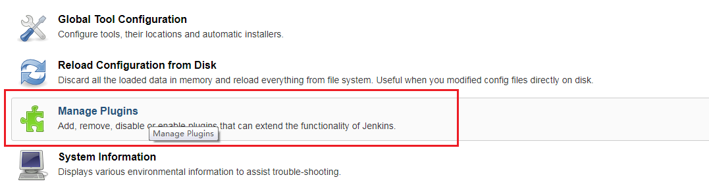
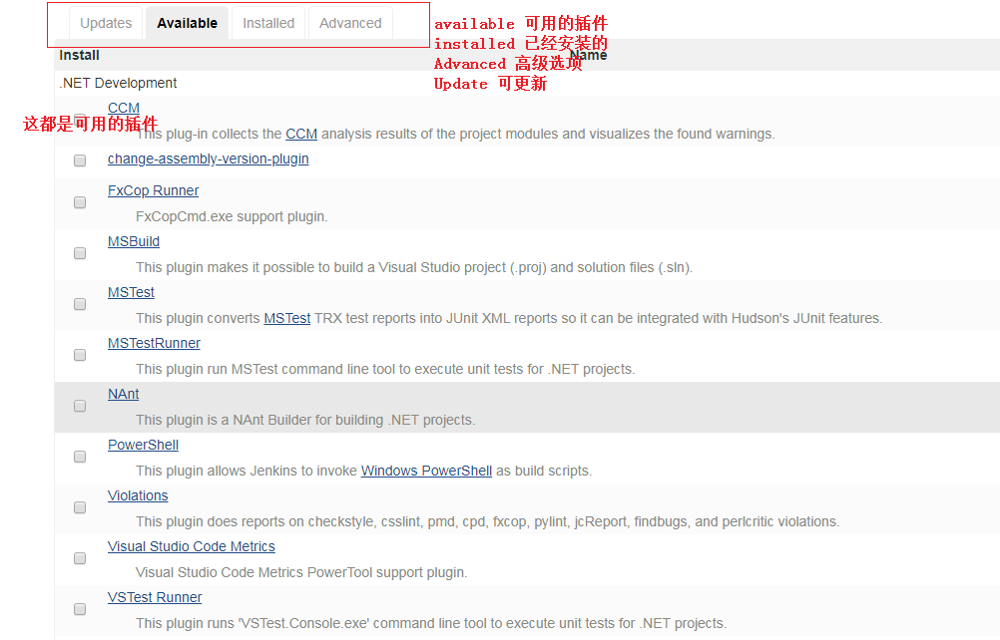
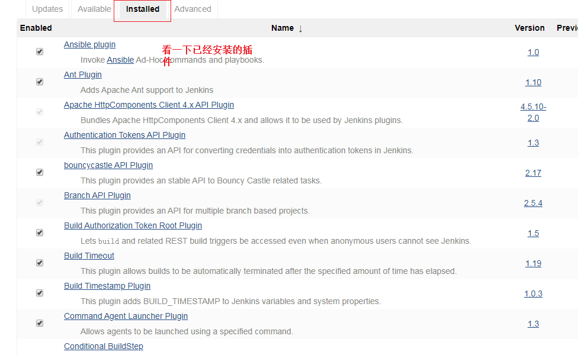
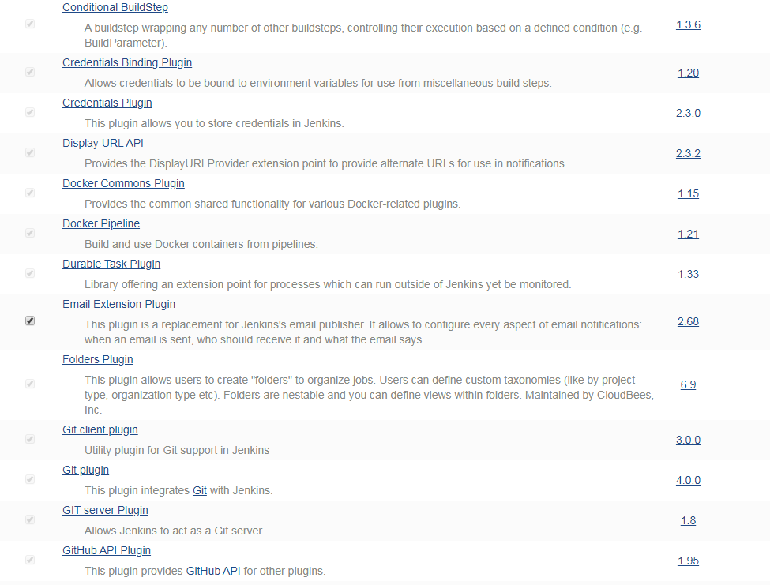
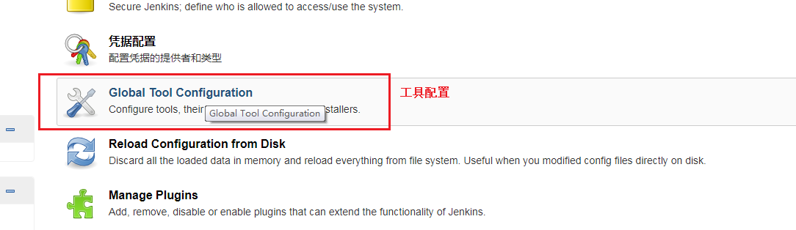
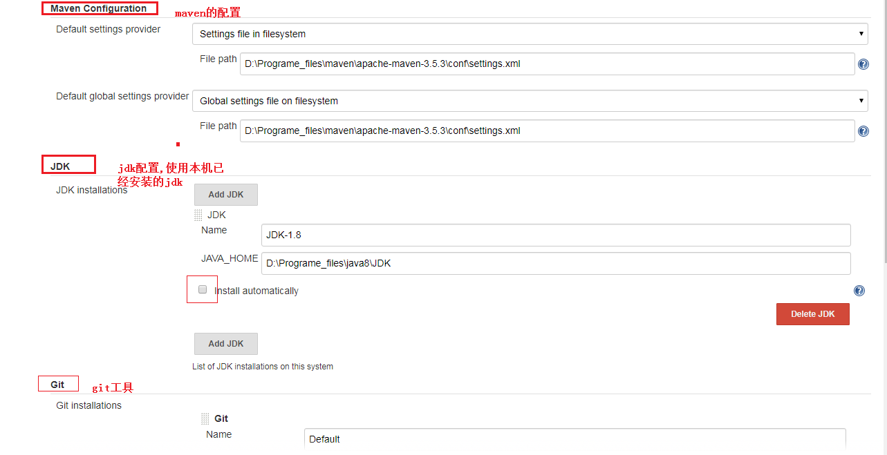
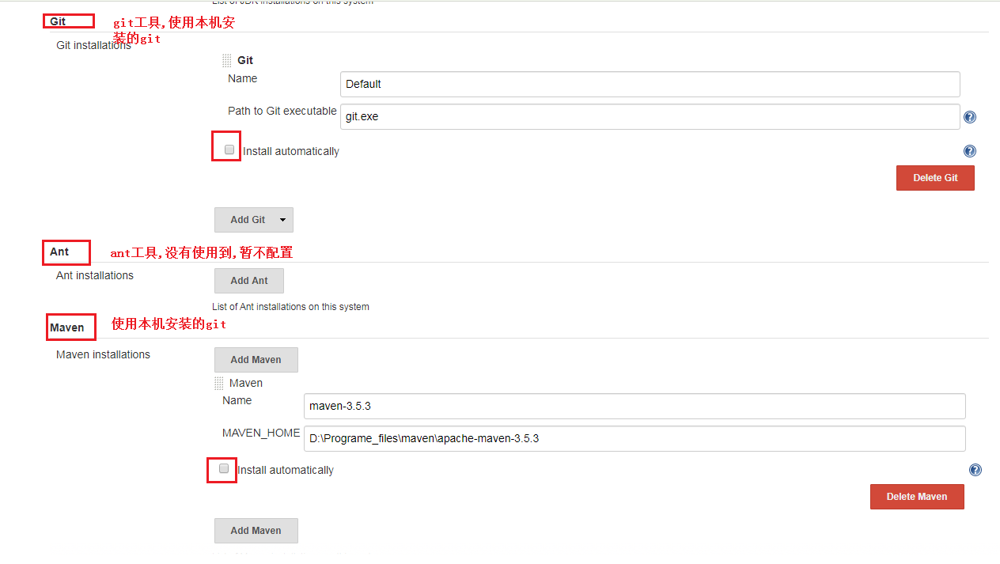
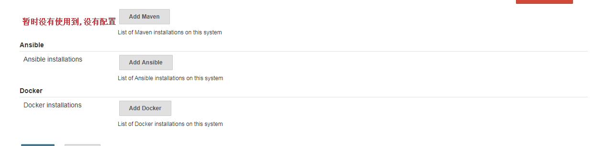

[TOC]


# Jenkins 系列一

## 1.windows 启动jenkins

在官网下载jar包，就可以直接使用 java -jar 启动了。jdk需要安装1.8以上。

```shell
## 启动命令
java -jar jenkins.war  --httpPort=10000

--httpPort 指定启动的端口
```


## 2.修改jenkins启动家目录

设置一个环境变量指定jenkins的家目录:

```shell
JENKINS_HOME=d:/jenkins
```

## 3.插件安装

总体来说插件安装也是比较简单的，选中你要安装的插件，然后单击install就ok了。这个有个前提就是网络要正常连接。









## 4.配置

目前只是使用到了mavne，git，jdk等工具，故配置时先只是配置这几种工具。主要就是配置使用本机已经安装好的软件，不需要再重新去下载，maven还需要配置上本机的仓库位置。










基本配置到这里就先到这里，咱们接下来部署一个项目看一下。


