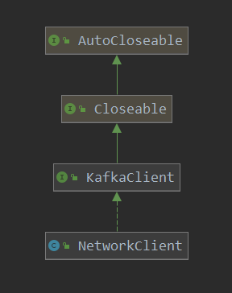
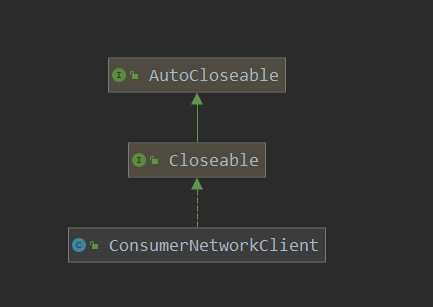

[TOC]

# consumer 网络IO实现(1)

本篇看一下kafka-client客户端的发送体系实现，本次分析的版本为2.2.0。kafka-client使用java的Nio来实现的读写，不过其也进行了一些封装，此次分析有两个目标：

1. 了解其原理（读源码一般都是这样吧）
2. 借鉴其Nio的使用经验，后续可以应用在自己项目中

本篇呢以一个kafka消费的demo作为开始:

```java
public static Properties initConfig(){
    Properties prop = new Properties();

    prop.put(ConsumerConfig.KEY_DESERIALIZER_CLASS_CONFIG, StringDeserializer.class.getName());
    prop.put(ConsumerConfig.VALUE_DESERIALIZER_CLASS_CONFIG,StringDeserializer.class.getName());

    prop.put(ConsumerConfig.BOOTSTRAP_SERVERS_CONFIG,brokerList);
    prop.put(ConsumerConfig.GROUP_ID_CONFIG,groupId);
    prop.put(ConsumerConfig.CLIENT_ID_CONFIG,"demo-client-id");

    prop.put(ConsumerConfig.INTERCEPTOR_CLASSES_CONFIG,"");
    return prop;
}

public static void main(String[] args) {
    Properties properties = initConfig();
    // 创建客户端
    KafkaConsumer<String, String> consumer = new KafkaConsumer<>(properties);
    // 订阅一个主题
    consumer.subscribe(Arrays.asList(topic));
    // 订阅topic的0分区
    // consumer.assign(Arrays.asList(new TopicPartition(topic,0)));

    while (running){
        // 之后就可以开始消费数据了
        ConsumerRecords<String, String> records = consumer.poll(Duration.ofMillis(1000));
        // 对获取到的records进行处理
    }
}
```

demo没有什么难度，kakfa客户端端使用起来也没有什么难度，一般情况下越简单，封装的越好，那就更加值得借鉴了。

先看一下kafkaConsumer的构建把：

```java
// 构造函数
public KafkaConsumer(Properties properties) {
    this(properties, null, null);
}
```

```java
// 构造函数
public KafkaConsumer(Properties properties,
                     Deserializer<K> keyDeserializer,
                     Deserializer<V> valueDeserializer) {
    // 此处创建了一个 ConsumerConfig
    this(new ConsumerConfig(ConsumerConfig.addDeserializerToConfig(properties, keyDeserializer, valueDeserializer)),keyDeserializer, valueDeserializer);
}
```

```java
// 创建 kafkaConsumer
@SuppressWarnings("unchecked")
private KafkaConsumer(ConsumerConfig config, Deserializer<K> keyDeserializer, Deserializer<V> valueDeserializer) {
    try {
        // 获取 clientId
        String clientId = config.getString(ConsumerConfig.CLIENT_ID_CONFIG);
        // 设置一个默认的 clientId
        if (clientId.isEmpty())
            clientId = "consumer-" + CONSUMER_CLIENT_ID_SEQUENCE.getAndIncrement();
        this.clientId = clientId;
        // 获取 groupId
        this.groupId = config.getString(ConsumerConfig.GROUP_ID_CONFIG);
        LogContext logContext = new LogContext("[Consumer clientId=" + clientId + ", groupId=" + groupId + "] ");
        this.log = logContext.logger(getClass());
        // 是否允许自动提交 offset
        boolean enableAutoCommit = config.getBoolean(ConsumerConfig.ENABLE_AUTO_COMMIT_CONFIG);
        if (groupId == null) { // overwrite in case of default group id where the config is not explicitly provided
            if (!config.originals().containsKey(ConsumerConfig.ENABLE_AUTO_COMMIT_CONFIG))
                enableAutoCommit = false;
            else if (enableAutoCommit)
                throw new InvalidConfigurationException(ConsumerConfig.ENABLE_AUTO_COMMIT_CONFIG + " cannot be set to true when default group id (null) is used.");
        } else if (groupId.isEmpty())
            log.warn("Support for using the empty group id by consumers is deprecated and will be removed in the next major release.");

        log.debug("Initializing the Kafka consumer");
        // request 超时时间
        this.requestTimeoutMs = config.getInt(ConsumerConfig.REQUEST_TIMEOUT_MS_CONFIG);
        // 默认的 APi 超时时间
        this.defaultApiTimeoutMs = config.getInt(ConsumerConfig.DEFAULT_API_TIMEOUT_MS_CONFIG);
        // 当前系统时间
        this.time = Time.SYSTEM;
        //
        Map<String, String> metricsTags = Collections.singletonMap("client-id", clientId);
        MetricConfig metricConfig = new MetricConfig().samples(config.getInt(ConsumerConfig.METRICS_NUM_SAMPLES_CONFIG))
            .timeWindow(config.getLong(ConsumerConfig.METRICS_SAMPLE_WINDOW_MS_CONFIG), TimeUnit.MILLISECONDS).recordLevel(Sensor.RecordingLevel.forName(config.getString(ConsumerConfig.METRICS_RECORDING_LEVEL_CONFIG))).tags(metricsTags);
        List<MetricsReporter> reporters = config.getConfiguredInstances(ConsumerConfig.METRIC_REPORTER_CLASSES_CONFIG,MetricsReporter.class, Collections.singletonMap(ConsumerConfig.CLIENT_ID_CONFIG, clientId));
        reporters.add(new JmxReporter(JMX_PREFIX));
        this.metrics = new Metrics(metricConfig, reporters, time);
        // 重试的的间隔
        this.retryBackoffMs = config.getLong(ConsumerConfig.RETRY_BACKOFF_MS_CONFIG);

        // load interceptors and make sure they get clientId
        Map<String, Object> userProvidedConfigs = config.originals();
        userProvidedConfigs.put(ConsumerConfig.CLIENT_ID_CONFIG, clientId);
        // 拦截器
        List<ConsumerInterceptor<K, V>> interceptorList = (List) (new ConsumerConfig(userProvidedConfigs, false)).getConfiguredInstances(ConsumerConfig.INTERCEPTOR_CLASSES_CONFIG,
                                                                                                                                         ConsumerInterceptor.class);
        // 拦截器
        this.interceptors = new ConsumerInterceptors<>(interceptorList);
        // 反序列化 方式
        if (keyDeserializer == null) {
            this.keyDeserializer = config.getConfiguredInstance(ConsumerConfig.KEY_DESERIALIZER_CLASS_CONFIG, Deserializer.class);
            this.keyDeserializer.configure(config.originals(), true);
        } else {
            config.ignore(ConsumerConfig.KEY_DESERIALIZER_CLASS_CONFIG);
            this.keyDeserializer = keyDeserializer;
        }
        if (valueDeserializer == null) {
            this.valueDeserializer = config.getConfiguredInstance(ConsumerConfig.VALUE_DESERIALIZER_CLASS_CONFIG, Deserializer.class);
            this.valueDeserializer.configure(config.originals(), false);
        } else {
            config.ignore(ConsumerConfig.VALUE_DESERIALIZER_CLASS_CONFIG);
            this.valueDeserializer = valueDeserializer;
        }
        ClusterResourceListeners clusterResourceListeners = configureClusterResourceListeners(keyDeserializer, valueDeserializer, reporters, interceptorList);
        this.metadata = new Metadata(retryBackoffMs, config.getLong(ConsumerConfig.METADATA_MAX_AGE_CONFIG),
                                     true, false, clusterResourceListeners);
        // 解析  broker 地址
        List<InetSocketAddress> addresses = ClientUtils.parseAndValidateAddresses(
            config.getList(ConsumerConfig.BOOTSTRAP_SERVERS_CONFIG), config.getString(ConsumerConfig.CLIENT_DNS_LOOKUP_CONFIG));
        // 缓存的集群信息
        // 可见此处的 metadata 源数据,指的是 集群的信息
        this.metadata.bootstrap(addresses, time.milliseconds());
        String metricGrpPrefix = "consumer";
        // 消费者的  监控信息
        ConsumerMetrics metricsRegistry = new ConsumerMetrics(metricsTags.keySet(), "consumer");
        // 根据不同的 协议 ,创建不同的channel
        ChannelBuilder channelBuilder = ClientUtils.createChannelBuilder(config, time);
        // 隔离级别
        IsolationLevel isolationLevel = IsolationLevel.valueOf(
            config.getString(ConsumerConfig.ISOLATION_LEVEL_CONFIG).toUpperCase(Locale.ROOT));
        Sensor throttleTimeSensor = Fetcher.throttleTimeSensor(metrics, metricsRegistry.fetcherMetrics);
        // consumer coordinator 和 consumer group 之间的 心跳间隔
        int heartbeatIntervalMs = config.getInt(ConsumerConfig.HEARTBEAT_INTERVAL_MS_CONFIG);
        // 创建 客户端
        // -- 此是操作真正 network IO的类
        NetworkClient netClient = new NetworkClient(
            // 创建 selector
            new Selector(config.getLong(ConsumerConfig.CONNECTIONS_MAX_IDLE_MS_CONFIG), metrics, time, metricGrpPrefix, channelBuilder, logContext),
            this.metadata,
            clientId,
            100, // a fixed large enough value will suffice for max in-flight requests
            config.getLong(ConsumerConfig.RECONNECT_BACKOFF_MS_CONFIG),
            config.getLong(ConsumerConfig.RECONNECT_BACKOFF_MAX_MS_CONFIG),
            config.getInt(ConsumerConfig.SEND_BUFFER_CONFIG),
            config.getInt(ConsumerConfig.RECEIVE_BUFFER_CONFIG),
            config.getInt(ConsumerConfig.REQUEST_TIMEOUT_MS_CONFIG),
            ClientDnsLookup.forConfig(config.getString(ConsumerConfig.CLIENT_DNS_LOOKUP_CONFIG)),
            time,
            true,
            new ApiVersions(),
            throttleTimeSensor,
            logContext);
        // 进一步的封装
        this.client = new ConsumerNetworkClient(
            logContext,
            netClient,
            metadata,
            time,
            retryBackoffMs,
            config.getInt(ConsumerConfig.REQUEST_TIMEOUT_MS_CONFIG),
            heartbeatIntervalMs); //Will avoid blocking an extended period of time to prevent heartbeat thread starvation
        // offset的 重置 策略
        OffsetResetStrategy offsetResetStrategy = OffsetResetStrategy.valueOf(config.getString(ConsumerConfig.AUTO_OFFSET_RESET_CONFIG).toUpperCase(Locale.ROOT));
        // 订阅状态
        this.subscriptions = new SubscriptionState(offsetResetStrategy);
        // partition 分配的方法类
        this.assignors = config.getConfiguredInstances(
            ConsumerConfig.PARTITION_ASSIGNMENT_STRATEGY_CONFIG,
            PartitionAssignor.class);
        // max poll interval
        int maxPollIntervalMs = config.getInt(ConsumerConfig.MAX_POLL_INTERVAL_MS_CONFIG);
        // session 超时时间
        int sessionTimeoutMs = config.getInt(ConsumerConfig.SESSION_TIMEOUT_MS_CONFIG);
        // no coordinator will be constructed for the default (null) group id
        // 创建一个 coordinator  consumer 协调员
        // 协调器
        this.coordinator = groupId == null ? null :
        new ConsumerCoordinator(logContext,
                                this.client,
                                groupId,
                                maxPollIntervalMs,
                                sessionTimeoutMs,
                                new Heartbeat(time, sessionTimeoutMs, heartbeatIntervalMs, maxPollIntervalMs, retryBackoffMs),
                                assignors,
                                this.metadata,
                                this.subscriptions,
                                metrics,
                                metricGrpPrefix,
                                this.time,
                                retryBackoffMs,
                                enableAutoCommit,
                                config.getInt(ConsumerConfig.AUTO_COMMIT_INTERVAL_MS_CONFIG),
                                this.interceptors,
                                config.getBoolean(ConsumerConfig.EXCLUDE_INTERNAL_TOPICS_CONFIG),
                                config.getBoolean(ConsumerConfig.LEAVE_GROUP_ON_CLOSE_CONFIG));
        // fetcher 拉取
        this.fetcher = new Fetcher<>(
            logContext,
            this.client,
            config.getInt(ConsumerConfig.FETCH_MIN_BYTES_CONFIG),
            config.getInt(ConsumerConfig.FETCH_MAX_BYTES_CONFIG),
            config.getInt(ConsumerConfig.FETCH_MAX_WAIT_MS_CONFIG),
            config.getInt(ConsumerConfig.MAX_PARTITION_FETCH_BYTES_CONFIG),
            config.getInt(ConsumerConfig.MAX_POLL_RECORDS_CONFIG),
            config.getBoolean(ConsumerConfig.CHECK_CRCS_CONFIG),
            this.keyDeserializer,
            this.valueDeserializer,
            this.metadata,
            this.subscriptions,
            metrics,
            metricsRegistry.fetcherMetrics,
            this.time,
            this.retryBackoffMs,
            this.requestTimeoutMs,
            isolationLevel);

        config.logUnused();
        AppInfoParser.registerAppInfo(JMX_PREFIX, clientId, metrics);
        log.debug("Kafka consumer initialized");
    } catch (Throwable t) {
        // call close methods if internal objects are already constructed; this is to prevent resource leak. see KAFKA-2121
        close(0, true);
        // now propagate the exception
        throw new KafkaException("Failed to construct kafka consumer", t);
    }
}
```

这是一个重类哈，前面是分析配置的信息，这里不细说，其中创建了比较重要的几个类：

1.  NetworkClient	主要是操作 networkIO 的
2.  ConsumerNetworkClient  对NetworkClient 的进一步分装
3.  ConsumerCoordinator   协调器
4.  Fetcher   拉取消息相关的

这里分析kafkaClient的Nio实现，主要是前两个类。

这里再看一下这两个类的类图：





下面直接看一下poll函数，是如何拉取数据的，这里肯定回收设计到network io的操作：

> org.apache.kafka.clients.consumer.KafkaConsumer#poll(java.time.Duration)

```java
// 超时拉取消息
@Override
public ConsumerRecords<K, V> poll(final Duration timeout) {
    // 使用 timer来作为 判断超期的一个 手段
    return poll(time.timer(timeout), true);
}
```

```java
    // 拉取数据
    private ConsumerRecords<K, V> poll(final Timer timer, final boolean includeMetadataInTimeout) {
        // 必须是单线程
        acquireAndEnsureOpen();
        try {
            // 没有订阅信息,报错
            if (this.subscriptions.hasNoSubscriptionOrUserAssignment()) {
throw new IllegalStateException("Consumer is not subscribed to any topics or assigned any partitions");
            }
            // poll for new data until the timeout expires
            do {
                client.maybeTriggerWakeup();
                // 是否需要更新 metadata
                if (includeMetadataInTimeout) {
                    // 如果需要,则更新一下 metadata
                    if (!updateAssignmentMetadataIfNeeded(timer)) {
                        // 没有更新成功,则返回一个空 列表
                        return ConsumerRecords.empty();
                    }
                } else {
                    while (!updateAssignmentMetadataIfNeeded(time.timer(Long.MAX_VALUE))) {
                        log.warn("Still waiting for metadata");
                    }
                }
                // 拉取数据
                // -- 重点 ---
                final Map<TopicPartition, List<ConsumerRecord<K, V>>> records = pollForFetches(timer);
                if (!records.isEmpty()) {
                  // before returning the fetched records, we can send off the next round of fetches
                 // and avoid block waiting for their responses to enable pipelining while the user
                 // is handling the fetched records.
              // NOTE: since the consumed position has already been updated, we must not allow
             // wakeups or any other errors to be triggered prior to returning the fetched records.
                    if (fetcher.sendFetches() > 0 || client.hasPendingRequests()) {
                        // 再次发送一个 poll 请求
                        // 此操作相当于是 进行了一次数据发送, 并且是立即的 没有什么等待时间
                        client.pollNoWakeup();
                    }
                    // 先使用拦截器 处理一下,之后再返回拉取到的数据
                    return this.interceptors.onConsume(new ConsumerRecords<>(records));
                }
                // timer 没有过期,则持续执行
            } while (timer.notExpired());
            return ConsumerRecords.empty();
        } finally {
            release();
        }
    }
```

这里小结一下:

1. 判断是否需要metadata更新，需要则进行更新
2. 使用fetcher去拉取数据
3. **拉取完数据后，再次发送一次拉取数据，并执行了一次io，此操作就是为了下次poll时，可以直接读取数据，不需要等待**
4. 对拉取的数据先调用拦截器进行处理一下，之后直接返回

直接看数据拉取操作：

> org.apache.kafka.clients.consumer.KafkaConsumer#pollForFetches

```java
// 拉取 record
private Map<TopicPartition, List<ConsumerRecord<K, V>>> pollForFetches(Timer timer) {
    long pollTimeout = coordinator == null ? timer.remainingMs() :
    Math.min(coordinator.timeToNextPoll(timer.currentTimeMs()), timer.remainingMs());

    // if data is available already, return it immediately
    // 如果现在已经有数据了, 那么直接返回
    final Map<TopicPartition, List<ConsumerRecord<K, V>>> records = fetcher.fetchedRecords();
    if (!records.isEmpty()) {
        return records;
    }
    // send any new fetches (won't resend pending fetches)
    // --- 重点 ----
    // 发送 fetch 的请求
    fetcher.sendFetches();

    // We do not want to be stuck blocking in poll if we are missing some positions
    // since the offset lookup may be backing off after a failure
    // NOTE: the use of cachedSubscriptionHashAllFetchPositions means we MUST call
    // updateAssignmentMetadataIfNeeded before this method.
    if (!cachedSubscriptionHashAllFetchPositions && pollTimeout > retryBackoffMs) {
        pollTimeout = retryBackoffMs;
    }
    Timer pollTimer = time.timer(pollTimeout);
    client.poll(pollTimer, () -> {
        // since a fetch might be completed by the background thread, we need this poll condition
        // to ensure that we do not block unnecessarily in poll()
        return !fetcher.hasCompletedFetches();
    });
    // 更新timer的时间, timer主要是用来判断是否超时的
    timer.update(pollTimer.currentTimeMs());

    // after the long poll, we should check whether the group needs to rebalance
    // prior to returning data so that the group can stabilize faster
    if (coordinator != null && coordinator.rejoinNeededOrPending()) {
        return Collections.emptyMap();
    }
	// 返回fetch到的数据
    return fetcher.fetchedRecords();
}
```

这里也比较清楚了，大体步骤如下：

1. 如果fetcher中已经有数据了，则直接把数据返回
2. 没有数据，则发送一次请求数据的request
3. 调用client.poll()  对 network IO 进行处理

看一下请求的发送:

> 

```java
    // 发送拉取数据的请求到node
    public synchronized int sendFetches() {
        // 准备  request
        Map<Node, FetchSessionHandler.FetchRequestData> fetchRequestMap = prepareFetchRequests();
        for (Map.Entry<Node, FetchSessionHandler.FetchRequestData> entry : fetchRequestMap.entrySet()) {
            // 要发送的目标
            final Node fetchTarget = entry.getKey();
            final FetchSessionHandler.FetchRequestData data = entry.getValue();
            // 创建 request
            final FetchRequest.Builder request = FetchRequest.Builder
                    .forConsumer(this.maxWaitMs, this.minBytes, data.toSend())
                    .isolationLevel(isolationLevel)
                    .setMaxBytes(this.maxBytes)
                    .metadata(data.metadata())
                    .toForget(data.toForget());
            if (log.isDebugEnabled()) {
log.debug("Sending {} {} to broker {}", isolationLevel, data.toString(), fetchTarget);
            }
            // 发送 request 到 fetchTarget
            // 并添加了一个 回调函数,处理发送成功 和 失败的情况
            client.send(fetchTarget, request)
                    .addListener(new RequestFutureListener<ClientResponse>() {
                        @Override
                        public void onSuccess(ClientResponse resp) {
                            synchronized (Fetcher.this) {
                                @SuppressWarnings("unchecked")
                                FetchResponse<Records> response = (FetchResponse<Records>) resp.responseBody();
                                FetchSessionHandler handler = sessionHandler(fetchTarget.id());
                                if (handler == null) {
                                    log.error("Unable to find FetchSessionHandler for node {}. Ignoring fetch response.",
                                            fetchTarget.id());
                                    return;
                                }
                                if (!handler.handleResponse(response)) {
                                    return;
                                }

                                Set<TopicPartition> partitions = new HashSet<>(response.responseData().keySet());
                                FetchResponseMetricAggregator metricAggregator = new FetchResponseMetricAggregator(sensors, partitions);

                                for (Map.Entry<TopicPartition, FetchResponse.PartitionData<Records>> entry : response.responseData().entrySet()) {
                                    TopicPartition partition = entry.getKey();
                                    long fetchOffset = data.sessionPartitions().get(partition).fetchOffset;
                                    FetchResponse.PartitionData<Records> fetchData = entry.getValue();

                                    log.debug("Fetch {} at offset {} for partition {} returned fetch data {}",
                                            isolationLevel, fetchOffset, partition, fetchData);
                                    // 记录fetch到的数据
                                    completedFetches.add(new CompletedFetch(partition, fetchOffset, fetchData, metricAggregator,
                                            resp.requestHeader().apiVersion()));
                                }

                                sensors.fetchLatency.record(resp.requestLatencyMs());
                            }
                        }

                        @Override
                        public void onFailure(RuntimeException e) {
                            synchronized (Fetcher.this) {
                                FetchSessionHandler handler = sessionHandler(fetchTarget.id());
                                if (handler != null) {
                                    handler.handleError(e);
                                }
                            }
                        }
                    });
        }
        return fetchRequestMap.size();
    }
```

这里的步骤大体如下：

1. 创建FetchRequest builder，之后调用client进行发送
2. 为每个请求注册了回调函数，用于处理返回结果，成功则记录，失败也会进行一些处理

> org.apache.kafka.clients.consumer.internals.ConsumerNetworkClient#send(org.apache.kafka.common.Node, org.apache.kafka.common.requests.AbstractRequest.Builder<?>)

```java
// 发送请求到 node
public RequestFuture<ClientResponse> send(Node node, AbstractRequest.Builder<?> requestBuilder) {
    // 发送请求
    // requestTimeoutMs 表示请求的超时时间
    return send(node, requestBuilder, requestTimeoutMs);
}
```

> org.apache.kafka.clients.consumer.internals.ConsumerNetworkClient#send(org.apache.kafka.common.Node, org.apache.kafka.common.requests.AbstractRequest.Builder<?>, int)

```java
// 发送请求
public RequestFuture<ClientResponse> send(Node node,
                                          AbstractRequest.Builder<?> requestBuilder,
                                          int requestTimeoutMs) {
    // 当前时间
    long now = time.milliseconds();
    RequestFutureCompletionHandler completionHandler = new RequestFutureCompletionHandler();
    // 创建一个 ClientRequest
    ClientRequest clientRequest = client.newClientRequest(node.idString(), requestBuilder, now, true,
                                                          requestTimeoutMs, completionHandler);
    // 记录到 unsent 容器中
    // 就是此 node 对应了一个 等待发送的 请求
    unsent.put(node, clientRequest);

    // wakeup the client in case it is blocking in poll so that we can send the queued request
    // 唤醒 client, 让其进行处理
    // 最后仍然唤醒的是 nioselect
    client.wakeup();
    return completionHandler.future;
}
```

```java
private final UnsentRequests unsent = new UnsentRequests();


// 记录每一个node 对应的要 发送的  请求
private final ConcurrentMap<Node, ConcurrentLinkedQueue<ClientRequest>> unsent;

// 记录 request到 node对应的容器
public void put(Node node, ClientRequest request) {
    // the lock protects the put from a concurrent removal of the queue for the node
    synchronized (unsent) {
        ConcurrentLinkedQueue<ClientRequest> requests = unsent.get(node);
        if (requests == null) {
            requests = new ConcurrentLinkedQueue<>();
            unsent.put(node, requests);
        }
        requests.add(request);
    }
}
```

到这里看到，发送的请求只是记录到了一个容器中，并且此容器中维护了每一个node对应的请求，由此可知请求，并没有真正发送出去。

到这里就知道了操作fetcher.sendFetches() 其实就是缓存了request，并没有发送，但是下面会调用一个client.poll() 操作，此操作会真正进行network io 操作。

> org.apache.kafka.clients.consumer.internals.ConsumerNetworkClient#poll(org.apache.kafka.common.utils.Timer, org.apache.kafka.clients.consumer.internals.ConsumerNetworkClient.PollCondition)

```java
// network io 的真正操作
public void poll(Timer timer, PollCondition pollCondition) {
    poll(timer, pollCondition, false);
}
```

> org.apache.kafka.clients.consumer.internals.ConsumerNetworkClient#poll(org.apache.kafka.common.utils.Timer, org.apache.kafka.clients.consumer.internals.ConsumerNetworkClient.PollCondition, boolean)

```java
// poll一次,查看是否有network IO 操作,如果有则进行
// 也就是进行一次 数据发送 和 接收操作
public void poll(Timer timer, PollCondition pollCondition, boolean disableWakeup) {
    // there may be handlers which need to be invoked if we woke up the previous call to poll
    firePendingCompletedRequests();
    lock.lock();
    try {
        // Handle async disconnects prior to attempting any sends
        // 优先处理那些等待 断开连接的操作
        handlePendingDisconnects();
        // send all the requests we can send now
        // --- 重点 ---
        // 发送那些等待发送的请求
        long pollDelayMs = trySend(timer.currentTimeMs());

        // check whether the poll is still needed by the caller. Note that if the expected completion
        // condition becomes satisfied after the call to shouldBlock() (because of a fired completion
        // handler), the client will be woken up.
        if (pendingCompletion.isEmpty() && (pollCondition == null || pollCondition.shouldBlock())) {
            // if there are no requests in flight, do not block longer than the retry backoff
            long pollTimeout = Math.min(timer.remainingMs(), pollDelayMs);
            if (client.inFlightRequestCount() == 0)
                pollTimeout = Math.min(pollTimeout, retryBackoffMs);
            client.poll(pollTimeout, timer.currentTimeMs());
        } else {
            // 主要就是在这里 进行一些 network IO 的操作
            // 真正进行 network IO 操作的地方
            client.poll(0, timer.currentTimeMs());
        }
        // timer 时间更新
        timer.update();
        // handle any disconnects by failing the active requests. note that disconnects must
        // be checked immediately following poll since any subsequent call to client.ready()
        // will reset the disconnect status
        checkDisconnects(timer.currentTimeMs());
        if (!disableWakeup) {
            // trigger wakeups after checking for disconnects so that the callbacks will be ready
            // to be fired on the next call to poll()
            maybeTriggerWakeup();
        }
        // throw InterruptException if this thread is interrupted
        maybeThrowInterruptException();

        // try again to send requests since buffer space may have been
        // cleared or a connect finished in the poll
        trySend(timer.currentTimeMs());

        // fail requests that couldn't be sent if they have expired
        failExpiredRequests(timer.currentTimeMs());

        // clean unsent requests collection to keep the map from growing indefinitely
        unsent.clean();
    } finally {
        lock.unlock();
    }
    // called without the lock to avoid deadlock potential if handlers need to acquire locks
    firePendingCompletedRequests();
}
```

这里涉及到的io操作：

1. 先尝试发送那些等待发送的消息
2. 进行Nio的读写操作

> org.apache.kafka.clients.consumer.internals.ConsumerNetworkClient#trySend

```java
// 尝试发送那些 等待发送的请求
private long trySend(long now) {
    long pollDelayMs = maxPollTimeoutMs;
    // send any requests that can be sent now
    // 遍历 所有 有请求等待发送的 node
    for (Node node : unsent.nodes()) {
        // 获取到 此 node 对应的要发送的请求
        Iterator<ClientRequest> iterator = unsent.requestIterator(node);
        if (iterator.hasNext())
            pollDelayMs = Math.min(pollDelayMs, client.pollDelayMs(node, now));
        // 遍历等待的请求
        while (iterator.hasNext()) {
            ClientRequest request = iterator.next();
            // ready 意思 是否和 node建立好了连接,没有建立好连接,则尝试建立一个连接
            // -- 重点 --
            if (client.ready(node, now)) {
                // 发送请求
                client.send(request, now);
                iterator.remove();
            }
        }
    }
    return pollDelayMs;
}
```

限于篇幅，另起一篇。


