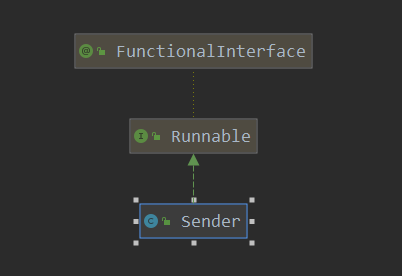

[TOC]

# producer

前面分析到producer -> send 把数据追加到了Accumulator中，本节主要看一下sender实现的真实的网络IO操作。



直接看起run方法:

> org.apache.kafka.clients.producer.internals.Sender#run

```java
// sender 线程主要的工作
public void run() {
    log.debug("Starting Kafka producer I/O thread.");

    // main loop, runs until close is called
    while (running) {
        try {
            runOnce();
        } catch (Exception e) {
            log.error("Uncaught error in kafka producer I/O thread: ", e);
        }
    }

    log.debug("Beginning shutdown of Kafka producer I/O thread, sending remaining records.");

    // okay we stopped accepting requests but there may still be
    // requests in the accumulator or waiting for acknowledgment,
    // wait until these are completed.
    // 如果不是强制关闭的,如果关闭后还有数据没有发送的
    // 则继续发送完数据
 while (!forceClose && (this.accumulator.hasUndrained() || this.client.inFlightRequestCount() > 0)) {
        try {
            runOnce();
        } catch (Exception e) {
            log.error("Uncaught error in kafka producer I/O thread: ", e);
        }
    }
    // 如果设置了强制关闭呢, 就直接把数据舍弃掉了
    if (forceClose) {
        // We need to fail all the incomplete batches and wake up the threads waiting on
        // the futures.
        log.debug("Aborting incomplete batches due to forced shutdown");
        this.accumulator.abortIncompleteBatches();
    }
    try {
        // networkClient 的关闭
        this.client.close();
    } catch (Exception e) {
        log.error("Failed to close network client", e);
    }

    log.debug("Shutdown of Kafka producer I/O thread has completed.");
}
```

这里调用runOnce函数实现了主要业务，可见runOnce实现了主要业务：

1. 正常运行时，没有进行关闭操作，调用runOnce 来实现具体业务
2. 当调用了关闭后，如果不是强制关闭&& 还有数据，那么把剩下数据发送完后再关闭
3. 如果是强制关闭，那么舍弃未发送数据
4. 关闭networkClient

看一下runOnce的实现：

> org.apache.kafka.clients.producer.internals.Sender#runOnce

```java
// main loop 的业务实现
void runOnce() {
    // 如果有事务管理,则进行一写事务的相关处理
    if (transactionManager != null) {
        try {
            if (transactionManager.shouldResetProducerStateAfterResolvingSequences())
          // Check if the previous run expired batches which requires a reset of the producer state.
                transactionManager.resetProducerId();

            if (!transactionManager.isTransactional()) {
                // this is an idempotent producer, so make sure we have a producer id
                maybeWaitForProducerId();
            } else if (transactionManager.hasUnresolvedSequences() && !transactionManager.hasFatalError()) {
                transactionManager.transitionToFatalError(
                    new KafkaException("The client hasn't received acknowledgment for " +
                                       "some previously sent messages and can no longer retry them. It isn't safe to continue."));
            } else if (transactionManager.hasInFlightTransactionalRequest() || maybeSendTransactionalRequest()) {
// as long as there are outstanding transactional requests, we simply wait for them to return
                client.poll(retryBackoffMs, time.milliseconds());
                return;
            }
            // do not continue sending if the transaction manager is in a failed state or if there
            // is no producer id (for the idempotent case).
            if (transactionManager.hasFatalError() || !transactionManager.hasProducerId()) {
                RuntimeException lastError = transactionManager.lastError();
                if (lastError != null)
                    maybeAbortBatches(lastError);
                client.poll(retryBackoffMs, time.milliseconds());
                return;
            } else if (transactionManager.hasAbortableError()) {
                accumulator.abortUndrainedBatches(transactionManager.lastError());
            }
        } catch (AuthenticationException e) {
            // This is already logged as error, but propagated here to perform any clean ups.
            log.trace("Authentication exception while processing transactional request: {}", e);
            transactionManager.authenticationFailed(e);
        }
    }
    // 获取当前时间
    long currentTimeMs = time.milliseconds();
    // phase-1  数据发送
    // -- 重点 ---
    // 这里其实也就是把 此 produceRequest 设置到 kafakChannel中 send字段
    // 并没有真正进行发送
    long pollTimeout = sendProducerData(currentTimeMs);
    // 进行网路IO的操作,数据真正发送出去的地方
    // -- 重点 ---
    client.poll(pollTimeout, currentTimeMs);
}
```

事务相关的此处先不表，注释也比较清楚了，发送分为两个阶段：

1. 把produceBatch 数据设置到 kafakChannel中的send
2. 执行真正的网络IO操作

这里的第二步和consumer中的发送是一样操作，就不展开解释了，主要看一下第一步，即把数据设置发哦kafakChannel的send操作。

> org.apache.kafka.clients.producer.internals.Sender#sendProducerData

```java
// 发送 producer数据的 phase-1
private long sendProducerData(long now) {
    // 1. 获取缓存的 集群信息
    Cluster cluster = metadata.fetch();
    // get the list of partitions with data ready to send
    //2. 得到 accumator中各个node 待发送的数据
    RecordAccumulator.ReadyCheckResult result = this.accumulator.ready(cluster, now);

    // if there are any partitions whose leaders are not known yet, force metadata update
    // 3.如果有未知的 topics  则记录下来
    if (!result.unknownLeaderTopics.isEmpty()) {
        // The set of topics with unknown leader contains topics with leader election pending as well as
        // topics which may have expired. Add the topic again to metadata to ensure it is included
        // and request metadata update, since there are messages to send to the topic.
        for (String topic : result.unknownLeaderTopics)
            this.metadata.add(topic);

        log.debug("Requesting metadata update due to unknown leader topics from the batched records: {}",
                  result.unknownLeaderTopics);
        // 3.1 设置更新 metadata
        this.metadata.requestUpdate();
    }

    // remove any nodes we aren't ready to send to
    // 4. 得到 准备发送数据 的node的迭代器
    Iterator<Node> iter = result.readyNodes.iterator();
    long notReadyTimeout = Long.MAX_VALUE;
    while (iter.hasNext()) {
        Node node = iter.next();
        //5. 检查是否和 node 机器建立了连接
        // 如果还没有建立连接, 就建立连接
        // 连接建立失败,则删除此node
        if (!this.client.ready(node, now)) {
            iter.remove();
            notReadyTimeout = Math.min(notReadyTimeout, this.client.pollDelayMs(node, now));
        }
    }

    // create produce requests
    // key为nodeId, value为要发送的数据
    // 6.这里就是 得到了 每个node 要发送的数据
    Map<Integer, List<ProducerBatch>> batches = this.accumulator.drain(cluster, result.readyNodes, this.maxRequestSize, now);
    // 7.记录数据到 inflight 中, 即正在发送
    // 这里就得到了 每一个分区要发送的数据
    addToInflightBatches(batches);
    // 如果需要保证顺序,则 此处会 mute掉 要发送数据的 分区
    if (guaranteeMessageOrder) {
        // Mute all the partitions drained
        for (List<ProducerBatch> batchList : batches.values()) {
            for (ProducerBatch batch : batchList)
                this.accumulator.mutePartition(batch.topicPartition);
        }
    }
    // 更新下次 超时的时间
    accumulator.resetNextBatchExpiryTime();
    // 得到已经过期 还没有发送的数据
    List<ProducerBatch> expiredInflightBatches = getExpiredInflightBatches(now);
    // 得到 Accumulator中的过期的  数据
    List<ProducerBatch> expiredBatches = this.accumulator.expiredBatches(now);
    // 记录下总的过期数据
    expiredBatches.addAll(expiredInflightBatches);

    // Reset the producer id if an expired batch has previously been sent to the broker. Also update the metrics
    // for expired batches. see the documentation of @TransactionState.resetProducerId to understand why
    // we need to reset the producer id here.
    if (!expiredBatches.isEmpty())
        log.trace("Expired {} batches in accumulator", expiredBatches.size());
    for (ProducerBatch expiredBatch : expiredBatches) {
        String errorMessage = "Expiring " + expiredBatch.recordCount + " record(s) for " + expiredBatch.topicPartition
            + ":" + (now - expiredBatch.createdMs) + " ms has passed since batch creation";
        failBatch(expiredBatch, -1, NO_TIMESTAMP, new TimeoutException(errorMessage), false);
        if (transactionManager != null && expiredBatch.inRetry()) {
            // This ensures that no new batches are drained until the current in flight batches are fully resolved.
            transactionManager.markSequenceUnresolved(expiredBatch.topicPartition);
        }
    }
    // 监测数据
    sensors.updateProduceRequestMetrics(batches);

    // If we have any nodes that are ready to send + have sendable data, poll with 0 timeout so this can immediately
    // loop and try sending more data. Otherwise, the timeout will be the smaller value between next batch expiry
    // time, and the delay time for checking data availability. Note that the nodes may have data that isn't yet
    // sendable due to lingering, backing off, etc. This specifically does not include nodes with sendable data
    // that aren't ready to send since they would cause busy looping.
    long pollTimeout = Math.min(result.nextReadyCheckDelayMs, notReadyTimeout);
    pollTimeout = Math.min(pollTimeout, this.accumulator.nextExpiryTimeMs() - now);
    pollTimeout = Math.max(pollTimeout, 0);
    if (!result.readyNodes.isEmpty()) {
        log.trace("Nodes with data ready to send: {}", result.readyNodes);
        // if some partitions are already ready to be sent, the select time would be 0;
        // otherwise if some partition already has some data accumulated but not ready yet,
        // the select time will be the time difference between now and its linger expiry time;
        // otherwise the select time will be the time difference between now and the metadata expiry time;
        pollTimeout = 0;
    }
    // 发送 producerRequest
    //8. 这里其实也就是把 此 produceRequest 设置到 kafakChannel中 send字段
    // 并没有真正进行发送
    sendProduceRequests(batches, now);
    return pollTimeout;
}
```

这里小结一下,操作步骤大体如下:

1. 获取缓存的集群信息
2. 从Accumulator中得到各个node
3. 如果有未知leader的topic，则把此topic添加到meta中，并设置更新meta
4. 得到准备发送数据的各个node的迭代器，遍历各个node，判断其是否已经准备好发送数据(连接建立好)，如果没有建立连接，则先建立连接
5. 从Accumulator中得到各个node待发送的数据
6. 把各个记录设置到 inflight中
7. 得到Accumulator 以及 inflight中过期的数据，过期数据 从 inflight中移除
8. 把 要发送的数据设置到 kafkaChannel中的send字段

## 从Accumulator中得到各个node

> org.apache.kafka.clients.producer.internals.RecordAccumulator#ready

```java
// 得到那些 等待发送的 数据
public ReadyCheckResult ready(Cluster cluster, long nowMs) {
    // ready 的node
    Set<Node> readyNodes = new HashSet<>();
    long nextReadyCheckDelayMs = Long.MAX_VALUE;
    Set<String> unknownLeaderTopics = new HashSet<>();
    // 查看 是否有在等待 内存分配的
    boolean exhausted = this.free.queued() > 0;
    // 遍历各个 topicPartition 要发送的数据
    for (Map.Entry<TopicPartition, Deque<ProducerBatch>> entry : this.batches.entrySet()) {
        // topicPartition
        TopicPartition part = entry.getKey();
        // 对应的要发送的数据
        Deque<ProducerBatch> deque = entry.getValue();
        // 获取此 partition的 leader
        Node leader = cluster.leaderFor(part);
        synchronized (deque) {
            // 如果 此分区的 leader 不可知,则记录下此topic
            if (leader == null && !deque.isEmpty()) {
                // This is a partition for which leader is not known, but messages are available to send.
                // Note that entries are currently not removed from batches when deque is empty.
                unknownLeaderTopics.add(part.topic());
            } else if (!readyNodes.contains(leader) && !isMuted(part, nowMs)) {
                ProducerBatch batch = deque.peekFirst();
                if (batch != null) {
                    // 此 batch 对应的已经等待的时间
                    long waitedTimeMs = batch.waitedTimeMs(nowMs);
                    // 是否需要 backoff
                    boolean backingOff = batch.attempts() > 0 && waitedTimeMs < retryBackoffMs;
                    long timeToWaitMs = backingOff ? retryBackoffMs : lingerMs;
                    // 是否 不为空
                    boolean full = deque.size() > 1 || batch.isFull();
                    // 是否 过期
                    boolean expired = waitedTimeMs >= timeToWaitMs;
                    // 下面条件为 或, 有一个 就会进行发送
                    // 1. 有数据
                    // 2. 有过期的数据
                    // 3. 有等待 分配内存的 线程
                    // 4. 准备关闭
                    // 5. flush 操作
                    boolean sendable = full || expired || exhausted || closed || flushInProgress();
                    if (sendable && !backingOff) {
                        readyNodes.add(leader);
                    } else {
                        long timeLeftMs = Math.max(timeToWaitMs - waitedTimeMs, 0);
                        // Note that this results in a conservative estimate since an un-sendable partition may have
                        // a leader that will later be found to have sendable data. However, this is good enough
                        // since we'll just wake up and then sleep again for the remaining time.
                        // 下次 准备 检查的时间
                        nextReadyCheckDelayMs = Math.min(timeLeftMs, nextReadyCheckDelayMs);
                    }
                }
            }
        }
    }
    // 返回结果
    return new ReadyCheckResult(readyNodes, nextReadyCheckDelayMs, unknownLeaderTopics);
}
```


## 判断node是否准备好发送

> org.apache.kafka.clients.NetworkClient#ready

```java
// 检测 network client是否ready, 如果已经建立了连接,则返回true
// 没有建立连接,则建立一个连接
@Override
public boolean ready(Node node, long now) {
    if (node.isEmpty())
        throw new IllegalArgumentException("Cannot connect to empty node " + node);
    // 检测连接是否ready
    if (isReady(node, now))
        return true;
    // initiateConnect 建立一个连接
    if (connectionStates.canConnect(node.idString(), now))
        // if we are interested in sending to a node and we don't have a connection to it, initiate one
        initiateConnect(node, now);

    return false;
}
```


## 获取要发送的数据

> org.apache.kafka.clients.producer.internals.RecordAccumulator#drain

```java
public Map<Integer, List<ProducerBatch>> drain(Cluster cluster, Set<Node> nodes, int maxSize, long now) {
    if (nodes.isEmpty())
        return Collections.emptyMap();
    // 记录 nodeId 和 要发送的数据
    Map<Integer, List<ProducerBatch>> batches = new HashMap<>();
    // 遍历所有的node  得到其准备发送的数据
    for (Node node : nodes) {
        // 从Accumulator中 得到 此node要发送的数据
        List<ProducerBatch> ready = drainBatchesForOneNode(cluster, node, maxSize, now);
        batches.put(node.id(), ready);
    }
    return batches;
}
```

> org.apache.kafka.clients.producer.internals.RecordAccumulator#drainBatchesForOneNode

```java
   private List<ProducerBatch> drainBatchesForOneNode(Cluster cluster, Node node, int maxSize, long now) {
        int size = 0;
        List<PartitionInfo> parts = cluster.partitionsForNode(node.id());
        List<ProducerBatch> ready = new ArrayList<>();
        /* to make starvation less likely this loop doesn't start at 0 */
        int start = drainIndex = drainIndex % parts.size();
        do {
            PartitionInfo part = parts.get(drainIndex);
            TopicPartition tp = new TopicPartition(part.topic(), part.partition());
            this.drainIndex = (this.drainIndex + 1) % parts.size();

            // Only proceed if the partition has no in-flight batches.
            if (isMuted(tp, now))
                continue;
            // 获取此 topicPartition 对应的等待发送的数据
            Deque<ProducerBatch> deque = getDeque(tp);
            // 如果 此 topicPartition 没有要发送的数据,直接进行下一个
            if (deque == null)
                continue;

            synchronized (deque) {
                // invariant: !isMuted(tp,now) && deque != null
                // 查看第一个 元素
                ProducerBatch first = deque.peekFirst();
                // 没有元素,则继续
                if (first == null)
                    continue;

                // first != null
                boolean backoff = first.attempts() > 0 && first.waitedTimeMs(now) < retryBackoffMs;
                // Only drain the batch if it is not during backoff period.
                if (backoff)
                    continue;
                // 如果已经得到了足够的数据,在这里就跳出循环了
                if (size + first.estimatedSizeInBytes() > maxSize && !ready.isEmpty()) {

                    break;
                } else {
                    if (shouldStopDrainBatchesForPartition(first, tp))
                        break;
                    boolean isTransactional = transactionManager != null ? transactionManager.isTransactional() : false;
                    // producerID 和 epoch
                    ProducerIdAndEpoch producerIdAndEpoch =
                        transactionManager != null ? transactionManager.producerIdAndEpoch() : null;
                    // 得到dequeue 中的 第一个 ProducerBatch
                    ProducerBatch batch = deque.pollFirst();
                    // 事务相关 -- 先不表
                    /// 省略 非关键
                    // ------ 重点操作 ---------
                    // 关闭batch
                    batch.close();
                    // 记录下 此 batch 的大小
                    size += batch.records().sizeInBytes();
                    // 记录此 batch 为等待发送的batch
                    ready.add(batch);
                    // 更新producerBatch 的 drainedMs 时间
                    batch.drained(now);
                }
            }
        } while (start != drainIndex);
        // 返回得到的数据
        return ready;
    }
```


## 把数据记录到 inflight

> org.apache.kafka.clients.producer.internals.Sender#addToInflightBatches

```java
// 记录 每个正在发送的数据到 inflight
public void addToInflightBatches(Map<Integer, List<ProducerBatch>> batches) {
    for (List<ProducerBatch> batchList : batches.values()) {
        // 真实记录数据
        addToInflightBatches(batchList);
    }
}
```

> org.apache.kafka.clients.producer.internals.Sender#addToInflightBatches

```java
// 可以看到这里,每一个分区对应一个容器,容器中记录了要发送到此分区的数据
private void addToInflightBatches(List<ProducerBatch> batches) {
    for (ProducerBatch batch : batches) {
        // 得到分区对应的容器
        List<ProducerBatch> inflightBatchList = inFlightBatches.get(batch.topicPartition);
        // 没有容器,则创建一个
        if (inflightBatchList == null) {
            inflightBatchList = new ArrayList<>();
            inFlightBatches.put(batch.topicPartition, inflightBatchList);
        }
        // 添加数据
        inflightBatchList.add(batch);
    }
}
```


## 把数据设置到kafkaChannel中

> org.apache.kafka.clients.producer.internals.Sender#sendProduceRequests

```java
// 发送 produceRequest 请求
private void sendProduceRequests(Map<Integer, List<ProducerBatch>> collated, long now) {
    for (Map.Entry<Integer, List<ProducerBatch>> entry : collated.entrySet())
        // 发送 produceRequest
        // 这里其实也就是把 此 produceRequest 设置到 kafakChannel中 send字段
        // 并没有真正进行发送
        sendProduceRequest(now, entry.getKey(), acks, requestTimeoutMs, entry.getValue());
}
```

> org.apache.kafka.clients.producer.internals.Sender#sendProduceRequest

```java
// 创建 produceRequest请求
private void sendProduceRequest(long now, int destination, short acks, int timeout, List<ProducerBatch> batches) {
    if (batches.isEmpty())
        return;

    Map<TopicPartition, MemoryRecords> produceRecordsByPartition = new HashMap<>(batches.size());
    final Map<TopicPartition, ProducerBatch> recordsByPartition = new HashMap<>(batches.size());

    // find the minimum magic version used when creating the record sets
    byte minUsedMagic = apiVersions.maxUsableProduceMagic();
    for (ProducerBatch batch : batches) {
        if (batch.magic() < minUsedMagic)
            minUsedMagic = batch.magic();
    }

    for (ProducerBatch batch : batches) {
        TopicPartition tp = batch.topicPartition;
        MemoryRecords records = batch.records();
        if (!records.hasMatchingMagic(minUsedMagic))
            records = batch.records().downConvert(minUsedMagic, 0, time).records();
        produceRecordsByPartition.put(tp, records);
        recordsByPartition.put(tp, batch);
    }

    String transactionalId = null;
    if (transactionManager != null && transactionManager.isTransactional()) {
        transactionalId = transactionManager.transactionalId();
    }
    ProduceRequest.Builder requestBuilder = ProduceRequest.Builder.forMagic(minUsedMagic, acks, timeout,produceRecordsByPartition, transactionalId);
    RequestCompletionHandler callback = new RequestCompletionHandler() {
        public void onComplete(ClientResponse response) {
            handleProduceResponse(response, recordsByPartition, time.milliseconds());
        }
    };
    // nodeid
    String nodeId = Integer.toString(destination);
    // 创建 clientRequest
    ClientRequest clientRequest = client.newClientRequest(nodeId, requestBuilder, now, acks != 0,
                                                          requestTimeoutMs, callback);
    // 发送请求
    // 这里其实也就是把 此 produceRequest 设置到 kafakChannel中 send字段
    // 并没有真正进行发送
    client.send(clientRequest, now);
    log.trace("Sent produce request to {}: {}", nodeId, requestBuilder);
}
```

> org.apache.kafka.clients.NetworkClient#send

```java
    // 发送请求
    @Override
    public void send(ClientRequest request, long now) {
        doSend(request, false, now);
    }
```

```java
    // 发送请求
    private void doSend(ClientRequest clientRequest, boolean isInternalRequest, long now) {
        ensureActive();
        // 获取请求对应的 nodeId,即dest 地址
        String nodeId = clientRequest.destination();
        if (!isInternalRequest) {
            if (!canSendRequest(nodeId, now))
                throw new IllegalStateException("Attempt to send a request to node " + nodeId + " which is not ready.");
        }
        AbstractRequest.Builder<?> builder = clientRequest.requestBuilder();
        try {
            // 创建 version 版本
            NodeApiVersions versionInfo = apiVersions.get(nodeId);
            short version;
            if (versionInfo == null) {
                version = builder.latestAllowedVersion();
                if (discoverBrokerVersions && log.isTraceEnabled())
                    log.trace("No version information found when sending {} with correlation id {} to node {}. " +"Assuming version {}.", clientRequest.apiKey(), clientRequest.correlationId(), nodeId, version);
            } else {
                version = versionInfo.latestUsableVersion(clientRequest.apiKey(), builder.oldestAllowedVersion(),builder.latestAllowedVersion());
            // 发送请求
            // ---- 重点 ---
            doSend(clientRequest, isInternalRequest, now, builder.build(version));
        } catch (UnsupportedVersionException unsupportedVersionException) {
           //.....
        }
    }
```

> org.apache.kafka.clients.NetworkClient#doSend

```java
// 发送器请求
private void doSend(ClientRequest clientRequest, boolean isInternalRequest, long now, AbstractRequest request) {
    // 请求的 dest
    String destination = clientRequest.destination();
    // 请求的 header
    RequestHeader header = clientRequest.makeHeader(request.version());
    if (log.isDebugEnabled()) {
        int latestClientVersion = clientRequest.apiKey().latestVersion();
        if (header.apiVersion() == latestClientVersion) {
            log.trace("Sending {} {} with correlation id {} to node {}", clientRequest.apiKey(), request,clientRequest.correlationId(), destination);
        } else {
            log.debug("Using older server API v{} to send {} {} with correlation id {} to node {}",
                      header.apiVersion(), clientRequest.apiKey(), request, clientRequest.correlationId(), destination);
        }
    }
    // 把request 转换为send 对象,并把 header序列化
    Send send = request.toSend(destination, header);
    //
    InFlightRequest inFlightRequest = new InFlightRequest(
        clientRequest,
        header,
        isInternalRequest,
        request,
        send,
        now);
    // 把要发送的请求 记录到 inFlightRequests
    this.inFlightRequests.add(inFlightRequest);
    // 发送请求
    selector.send(send);
}
```

> org.apache.kafka.common.network.Selector#send

```java
    // 请求发送
    public void send(Send send) {
        // 获取目的地址
        String connectionId = send.destination();
        // 获取目的地址对应的 channel
        KafkaChannel channel = openOrClosingChannelOrFail(connectionId);
        // 如果此channel  正在关闭中,则 把此请求记录到 failedSends
        if (closingChannels.containsKey(connectionId)) {
            // ensure notification via `disconnected`, leave channel in the state in which closing was triggered
            this.failedSends.add(connectionId);
        } else {
            try {
                // 设置send 到kafakChannel中
                channel.setSend(send);
            } catch (Exception e) {
                // 出现异常,则更新 kafkaChannel 装填为 FAILED_SEND
              //// ....
                }
            }
        }
    }
```

> org.apache.kafka.common.network.KafkaChannel#setSend

```java
// 记录下要发送的数据
public void setSend(Send send) {
    if (this.send != null)
        throw new IllegalStateException("Attempt to begin a send operation with prior send operation still in progress, connection id is " + id);
    // 记录要发送的数据
    this.send = send;
    this.transportLayer.addInterestOps(SelectionKey.OP_WRITE);
}
```

到这里 runOnce -> sendProducerData 函数就执行完了， 把数据设置到了对应的 kafkaChannel上，设置完成后sendProducerData 的工作就算是完成了。

只有调用 networkClient -> poll 进行真正的网络IO，此处和consumer中的一样，就不展开了。


