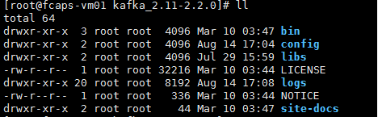
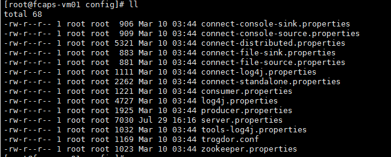
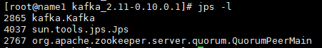

[TOC]

# kafka集群模式安装

## 1.环境准备

1. kafka依赖于zookeeper、JDK，所以安装前需要先把这两个软件安装好。
2. 下载好kafka的安装包
3. 设置好JDK的环境变量
4. 免密设置

下载好安装包后，解压准备进行安装:

```shell
tar -xzvf kafka_2.11-2.2.0.tgz
```

## 2.配置文件配置

解压完成后，可以看到如下的目录：



进入config目录，可以看到好多的配置文件(如下所示)，不过这里咱们只需要配置server.properties文件。



打开server.properties:(下面打开方式，只供参考)

```shell
vi server.properties   | vim server.properties | emacs server.properties
```

需要修改的配置项如下：

```shell
# 原来的
broker.id=0
log.dirs=/tmp/kafka-logs
zookeeper.connect=localhost:2181


# 修改后的
broker.id=0     ## 集群模式下，此id必须是唯一的，彼此互不相同
## 这里是示例，安装时需要修改为实际机器的ip地址
advertised.listeners=PLAINTEXT://192.168.88.122:9092 
## 日志目录根据实际路径进行修改
log.dirs=/tmp/kafka-logs
## 这里是使用的zookeeper地址，需要按照实际线上的zookeeper的ip进行配置
zookeeper.connect=192.168.88.122:2181,192.168.88.123:2181,192.168.88.124:2181  
```

安装集群时，把此处配置好的kafka分发到其他机器上，**注意**一定要修改配置中的bbroker.id，以及advertised.listeners中的ip地址，不然会导致错误。

## ３.启动并测试

安装完成后，就可以把服务启动起来。如果启动没有错误呢，当然需要进行一些测试，以保证软件的正常服务；如果出错了，那再重新检查一下配置是否正确。

这里测试就简单进行一下topic的创建，数据的发送，以及数据的接收。

```shell
## 服务启动
bin/kafka-server-start.sh config/server.properties &

## 查看kafka启动的服务
jps -l

## 创建topic
bin/kafka-topics.sh --create --zookeeper 192.168.72.18:2181 --replication-factor 1 --partitions 1 --topic test
	参数:
		create		表示创建topic操作
		zookeeper	使用的zookeeper的地址
		replication-factor	复制因子(也就是一个分区几个备份)
		partitions	分区个数
		topic		topic的名称
	
## 发送消息
bin/kafka-console-producer.sh --broker-list 192.168.72.18:9092 --topic test
	参数：
		broker-list	启动的kafka的一个实例的地址
		topic		topic名称
## 接收消息
bin/kafka-console-consumer.sh --zookeeper 192.168.72.18:2181 --topic test --from-beginning
	参数：
		zookeeper	使用的zookeeper地址
		topic		topic地址
		from-beginning	从开始位置消费
```

kafka服务启动查看：



如果发送消息，接收消息没问题，那证明目前服务是可用的。

当前配置都是kafka默认的配置，只是保证了服务的可用性，后期可以根据线上数据大小，宽带占用等具体情况进行参数调优。