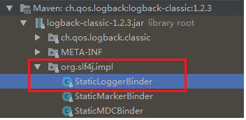

# logback初始化

兵马未动，日志先行。以前项目都是使用log4j，现在发现项目都使用logback，之前对于日志也没有进行过相关分析，大概了解slf4j-api是一个日志的标准接口文件，log4j和logbak是具体的实现类。在实际使用中都是使用slf4j-api的接口文件就好。今天就来分析一下slf4j和logback到底是如何连接到一起。

就从熟悉的获取log进行入手：

slf4j接口:

```java
private static Logger logger = LoggerFactory.getLogger("accessLogger");
```

```java
public static Logger getLogger(String name) {
    // 获取具体的日志工程
    ILoggerFactory iLoggerFactory = getILoggerFactory();
    // 获取日志
    return iLoggerFactory.getLogger(name);
}
```

```java
public static ILoggerFactory getILoggerFactory() {
    if (INITIALIZATION_STATE == UNINITIALIZED) { // 表示没有初始化过
        synchronized (LoggerFactory.class) {
            if (INITIALIZATION_STATE == UNINITIALIZED) {
                // 设置为正在初始化
                INITIALIZATION_STATE = ONGOING_INITIALIZATION;
                // 初始化
                performInitialization();
            }
        }
    }
    switch (INITIALIZATION_STATE) { // 根据不同的状态进行操作
        case SUCCESSFUL_INITIALIZATION:
            return StaticLoggerBinder.getSingleton().getLoggerFactory();
        case NOP_FALLBACK_INITIALIZATION:
            return NOP_FALLBACK_FACTORY;
        case FAILED_INITIALIZATION:
            throw new IllegalStateException(UNSUCCESSFUL_INIT_MSG);
        case ONGOING_INITIALIZATION:
            // support re-entrant behavior.
            // See also http://jira.qos.ch/browse/SLF4J-97
            return SUBST_FACTORY;
    }
    throw new IllegalStateException("Unreachable code");
}
```

看一下具体的初始化函数:

```java
private final static void performInitialization() {
    // 这里调用了一个绑定函数. 可见应该是把找到slf4j的具体实现类
    bind();
    if (INITIALIZATION_STATE == SUCCESSFUL_INITIALIZATION) {
        versionSanityCheck();
    }
}
```

```java
private final static void bind() {
    try {
        Set<URL> staticLoggerBinderPathSet = null;
        // skip check under android, see also
        // http://jira.qos.ch/browse/SLF4J-328
        if (!isAndroid()) { // 不是安卓
            // 查找具体的实现类
            staticLoggerBinderPathSet = findPossibleStaticLoggerBinderPathSet();
            // 如果找到多个实现类呢,就通报一下,也就是控制台打印
            reportMultipleBindingAmbiguity(staticLoggerBinderPathSet);
        }
        // the next line does the binding
        // 这里就是具体的实现类初始化
        // 也就是logback要开始初始化操作了
        StaticLoggerBinder.getSingleton();
        // 更新状态
        INITIALIZATION_STATE = SUCCESSFUL_INITIALIZATION;
        // 报告一下,找到的实现类
        reportActualBinding(staticLoggerBinderPathSet);
        fixSubstituteLoggers();
        // 事件函数触发
        replayEvents();
        // release all resources in SUBST_FACTORY
        SUBST_FACTORY.clear();
    } catch (NoClassDefFoundError ncde) {
        String msg = ncde.getMessage();
        if (messageContainsOrgSlf4jImplStaticLoggerBinder(msg)) {
            INITIALIZATION_STATE = NOP_FALLBACK_INITIALIZATION;
            Util.report("Failed to load class \"org.slf4j.impl.StaticLoggerBinder\".");
            Util.report("Defaulting to no-operation (NOP) logger implementation");
            Util.report("See " + NO_STATICLOGGERBINDER_URL + " for further details.");
        } else {
            failedBinding(ncde);
            throw ncde;
        }
    } catch (java.lang.NoSuchMethodError nsme) {
        String msg = nsme.getMessage();
        if (msg != null && msg.contains("org.slf4j.impl.StaticLoggerBinder.getSingleton()")) {
            INITIALIZATION_STATE = FAILED_INITIALIZATION;
            Util.report("slf4j-api 1.6.x (or later) is incompatible with this binding.");
            Util.report("Your binding is version 1.5.5 or earlier.");
            Util.report("Upgrade your binding to version 1.6.x.");
        }
        throw nsme;
    } catch (Exception e) {
        failedBinding(e);
        throw new IllegalStateException("Unexpected initialization failure", e);
    }
}
```

具体的查找函数:

```java
// 绑定的class的路径
private static String STATIC_LOGGER_BINDER_PATH = "org/slf4j/impl/StaticLoggerBinder.class";

static Set<URL> findPossibleStaticLoggerBinderPathSet() {
    // use Set instead of list in order to deal with bug #138
    // LinkedHashSet appropriate here because it preserves insertion order
    // during iteration
    Set<URL> staticLoggerBinderPathSet = new LinkedHashSet<URL>();
    try {
        // 获取加载器
        ClassLoader loggerFactoryClassLoader = LoggerFactory.class.getClassLoader();
        Enumeration<URL> paths;
        if (loggerFactoryClassLoader == null) {
            // 系统加载器
            paths = ClassLoader.getSystemResources(STATIC_LOGGER_BINDER_PATH);
        } else {
            // 使用本类加载器加载
            paths = loggerFactoryClassLoader.getResources(STATIC_LOGGER_BINDER_PATH);
        }
        // 把找到的类添加到集合中
        while (paths.hasMoreElements()) {
            URL path = paths.nextElement();
            staticLoggerBinderPathSet.add(path);
        }
    } catch (IOException ioe) {
        Util.report("Error getting resources from path", ioe);
    }
    return staticLoggerBinderPathSet;
}
```

系统加载器:

```java
// 在深入往下看,就是类加载器相关知识了,本地重点不是这个,就不往下看了
public static Enumeration<URL> getSystemResources(String name)
    throws IOException
    {  // 获取系统加载器
        ClassLoader system = getSystemClassLoader();
        if (system == null) {
        // bootstrap加载器
            return getBootstrapResources(name);
        }
        return system.getResources(name);
    }
```

加载器根据名字查找类:

```java
public Enumeration<URL> getResources(String name) throws IOException {
    @SuppressWarnings("unchecked")
    Enumeration<URL>[] tmp = (Enumeration<URL>[]) new Enumeration<?>[2];
    if (parent != null) {
        tmp[0] = parent.getResources(name);
    } else {
        tmp[0] = getBootstrapResources(name);
    }
    tmp[1] = findResources(name);

    return new CompoundEnumeration<>(tmp);
}
```

经过上面的查找，就把具体的实现类加载进来了。然后会有一个report动作：

```java
private static void reportMultipleBindingAmbiguity(Set<URL> binderPathSet) {
    if (isAmbiguousStaticLoggerBinderPathSet(binderPathSet)) { // 找到多个实现类,就报告一下
        Util.report("Class path contains multiple SLF4J bindings.");
        for (URL path : binderPathSet) {
            Util.report("Found binding in [" + path + "]");
        }
        Util.report("See " + MULTIPLE_BINDINGS_URL + " for an explanation.");
    }
}

// 找到的实现类大于1个
private static boolean isAmbiguousStaticLoggerBinderPathSet(Set<URL> binderPathSet) {
    return binderPathSet.size() > 1;
}

// 也就是往终端进行打印
static final public void report(String msg) {
    System.err.println("SLF4J: " + msg);
}
```

具体的类也找到了，报告动作也报告了，接下来就是对找到类的初始化了，在这里呢就是logback的初始化。回到bind函数接续看, 在看一下这个bind函数:

```java
private final static void bind() {
    try {
        Set<URL> staticLoggerBinderPathSet = null;
        // skip check under android, see also
        // http://jira.qos.ch/browse/SLF4J-328
        if (!isAndroid()) { // 不是安卓
            // 查找具体的实现类
            staticLoggerBinderPathSet = findPossibleStaticLoggerBinderPathSet();
            // 如果找到多个实现类呢,就通报一下,也就是控制台打印
            reportMultipleBindingAmbiguity(staticLoggerBinderPathSet);
        }
        // the next line does the binding
        // 这里就是具体的实现类初始化
        // 也就是logback要开始初始化操作了------重点
        StaticLoggerBinder.getSingleton();
        // 更新状态
        INITIALIZATION_STATE = SUCCESSFUL_INITIALIZATION;
        // 报告一下,找到的实现类
        reportActualBinding(staticLoggerBinderPathSet);
        fixSubstituteLoggers();
        // 事件函数触发
        replayEvents();
        // release all resources in SUBST_FACTORY
        SUBST_FACTORY.clear();
    } catch (NoClassDefFoundError ncde) {
        String msg = ncde.getMessage();
        if (messageContainsOrgSlf4jImplStaticLoggerBinder(msg)) {
            INITIALIZATION_STATE = NOP_FALLBACK_INITIALIZATION;
            Util.report("Failed to load class \"org.slf4j.impl.StaticLoggerBinder\".");
            Util.report("Defaulting to no-operation (NOP) logger implementation");
            Util.report("See " + NO_STATICLOGGERBINDER_URL + " for further details.");
        } else {
            failedBinding(ncde);
            throw ncde;
        }
    } catch (java.lang.NoSuchMethodError nsme) {
        String msg = nsme.getMessage();
        if (msg != null && msg.contains("org.slf4j.impl.StaticLoggerBinder.getSingleton()")) {
            INITIALIZATION_STATE = FAILED_INITIALIZATION;
            Util.report("slf4j-api 1.6.x (or later) is incompatible with this binding.");
            Util.report("Your binding is version 1.5.5 or earlier.");
            Util.report("Upgrade your binding to version 1.6.x.");
        }
        throw nsme;
    } catch (Exception e) {
        failedBinding(e);
        throw new IllegalStateException("Unexpected initialization failure", e);
    }
}
```

logback初始化:

```java
public static StaticLoggerBinder getSingleton() {
    return SINGLETON;
}

private static StaticLoggerBinder SINGLETON = new StaticLoggerBinder();
// 静态初始化
static {
    SINGLETON.init();
}
```

此类位置



看一下初始化静态初始化代码:

```java
private LoggerContext defaultLoggerContext = new LoggerContext();

void init() {
    try {
        try { // 先初始化此logcontext，然后自动配置
            // 看一下此自动配置做了什么动作
            new ContextInitializer(defaultLoggerContext).autoConfig();
        } catch (JoranException je) {
            Util.report("Failed to auto configure default logger context", je);
        }
        // logback-292
        if (!StatusUtil.contextHasStatusListener(defaultLoggerContext)) {
            StatusPrinter.printInCaseOfErrorsOrWarnings(defaultLoggerContext);
        }
        contextSelectorBinder.init(defaultLoggerContext, KEY);
        initialized = true;
    } catch (Exception t) { // see LOGBACK-1159
        Util.report("Failed to instantiate [" + LoggerContext.class.getName() + "]", t);
    }
}


// 初始化logcontext
public ContextInitializer(LoggerContext loggerContext) {
    this.loggerContext = loggerContext;
}

```

自动配置:

```java
public void autoConfig() throws JoranException {
    // 状态监听器
    StatusListenerConfigHelper.installIfAsked(loggerContext);
    // 查找默认配置文件
    URL url = findURLOfDefaultConfigurationFile(true);
    if (url != null) {
        // 使用查找到的文件进行配置
        configureByResource(url);
    } else {
        // 没有找到配置文件,则使用此配置类进行配置
        Configurator c = EnvUtil.loadFromServiceLoader(Configurator.class);
        if (c != null) {
            try {
                c.setContext(loggerContext);
                c.configure(loggerContext);
            } catch (Exception e) {
                throw new LogbackException(String.format("Failed to initialize Configurator: %s using ServiceLoader", c != null ? c.getClass().getCanonicalName() : "null"), e);
            }
        } else {// 如果Configurator都没有找到,则为使用基本配置
            BasicConfigurator basicConfigurator = new BasicConfigurator();
            basicConfigurator.setContext(loggerContext);
            basicConfigurator.configure(loggerContext);
        }
    }
}
```

看一下此添加监听器操作:

```java
public static void installIfAsked(Context context) {
    // 有配置监听器
    String slClass = OptionHelper.getSystemProperty(CoreConstants.STATUS_LISTENER_CLASS_KEY);
    if (!OptionHelper.isEmpty(slClass)) {// 添加监听器
        addStatusListener(context, slClass);
    }
}


final public static String SYSOUT = "SYSOUT";
private static void addStatusListener(Context context, String listenerClassName) {
    StatusListener listener = null;
    // 名字是上面设置的呢
    if (CoreConstants.SYSOUT.equalsIgnoreCase(listenerClassName)) {
        // 就创建OnConsoleStatusListener
        listener = new OnConsoleStatusListener();
    } else { // 不然就创建监听器
        listener = createListenerPerClassName(context, listenerClassName);
    }
    // 初始化监听器
    initAndAddListener(context, listener);
}


private static void initAndAddListener(Context context, StatusListener listener) {
    if (listener != null) {
        if (listener instanceof ContextAware) // LOGBACK-767
            ((ContextAware) listener).setContext(context);
        // 添加到context中
        // statusManager 就是具体管理监听器的
        boolean effectivelyAdded = context.getStatusManager().add(listener);
        // 让监听器启动
        if (effectivelyAdded && (listener instanceof LifeCycle)) {
            ((LifeCycle) listener).start(); // LOGBACK-767
        }
    }
}
```

监听器就先分析到这里，具体分析logback的初始化，回到autoConfig函数，看一下查找配置文件：

```java
// 定义好的配置文件名字
final public static String GROOVY_AUTOCONFIG_FILE = "logback.groovy";
final public static String AUTOCONFIG_FILE = "logback.xml";
final public static String TEST_AUTOCONFIG_FILE = "logback-test.xml";
final public static String CONFIG_FILE_PROPERTY = "logback.configurationFile"; 


public URL findURLOfDefaultConfigurationFile(boolean updateStatus) {
    ClassLoader myClassLoader = Loader.getClassLoaderOfObject(this);
    URL url = findConfigFileURLFromSystemProperties(myClassLoader, updateStatus);
    if (url != null) {
        return url;
    }

    url = getResource(TEST_AUTOCONFIG_FILE, myClassLoader, updateStatus);
    if (url != null) {
        return url;
    }

    url = getResource(GROOVY_AUTOCONFIG_FILE, myClassLoader, updateStatus);
    if (url != null) {
        return url;
    }

    return getResource(AUTOCONFIG_FILE, myClassLoader, updateStatus);
}


// 先对"logback.configurationFile"文件进行查找
private URL findConfigFileURLFromSystemProperties(ClassLoader classLoader, boolean updateStatus) {
    String logbackConfigFile = OptionHelper.getSystemProperty(CONFIG_FILE_PROPERTY);
    if (logbackConfigFile != null) {
        URL result = null;
        try { // 找到了,则直接返回
            result = new URL(logbackConfigFile);
            return result;
        } catch (MalformedURLException e) {
            // so, resource is not a URL:
            // attempt to get the resource from the class path
            // 没有找到,则使用加载器查找一下
            result = Loader.getResource(logbackConfigFile, classLoader);
            if (result != null) {
                return result;
            }
            File f = new File(logbackConfigFile);
            if (f.exists() && f.isFile()) {
                try { // 使用类加载器找到了呢,也返回结果
                    result = f.toURI().toURL();
                    return result;
                } catch (MalformedURLException e1) {
                }
            }
        } finally {
            if (updateStatus) { // 报告一下找到的情况
                statusOnResourceSearch(logbackConfigFile, classLoader, result);
            }
        }
    }
    return null;
}


// 打印一下找到的情况
private void statusOnResourceSearch(String resourceName, ClassLoader classLoader, URL url) {
    StatusManager sm = loggerContext.getStatusManager();
    // 根据是否找到,添加不同的status监听器
    if (url == null) {
        sm.add(new InfoStatus("Could NOT find resource [" + resourceName + "]", loggerContext));
    } else {
        sm.add(new InfoStatus("Found resource [" + resourceName + "] at [" + url.toString() + "]", loggerContext));
        multiplicityWarning(resourceName, classLoader);
    }
}

// 找到多个呢,也报告一下
private void multiplicityWarning(String resourceName, ClassLoader classLoader) {
    Set<URL> urlSet = null;
    StatusManager sm = loggerContext.getStatusManager();
    try {
        urlSet = Loader.getResources(resourceName, classLoader);
    } catch (IOException e) {
        sm.add(new ErrorStatus("Failed to get url list for resource [" + resourceName + "]", loggerContext, e));
    }
    if (urlSet != null && urlSet.size() > 1) {
        sm.add(new WarnStatus("Resource [" + resourceName + "] occurs multiple times on the classpath.", loggerContext));
        for (URL url : urlSet) {
            sm.add(new WarnStatus("Resource [" + resourceName + "] occurs at [" + url.toString() + "]", loggerContext));
        }
    }
}
```

至于上面的报告，看不懂也没有关系，不耽误理解整个的初始化流程。对于配置文件的查找理解就好。对于配置文件，从这里可以看出来加载顺序是：

1. logback.configurationFile
2. logback-test.xml
3. logback.groovy
4. logback.xml

对于文件，就查找到这里，再次回到Autoconfig，看一下，文件找到了，接下来做什么：

```java
// 文件找到了,就要进行分配配置了
public void configureByResource(URL url) throws JoranException {
    if (url == null) {
        throw new IllegalArgumentException("URL argument cannot be null");
    }
    // 可以看到,不同类型的配置文件,有不同的分析方法,这里咱们分析xml形式的配置文件
    final String urlString = url.toString();
    if (urlString.endsWith("groovy")) {
        if (EnvUtil.isGroovyAvailable()) {
            // avoid directly referring to GafferConfigurator so as to avoid
            // loading groovy.lang.GroovyObject . See also http://jira.qos.ch/browse/LBCLASSIC-214
            GafferUtil.runGafferConfiguratorOn(loggerContext, this, url);
        } else {
            StatusManager sm = loggerContext.getStatusManager();
            sm.add(new ErrorStatus("Groovy classes are not available on the class path. ABORTING INITIALIZATION.", loggerContext));
        }
        // 咱们分析xml形式的配置文件
    } else if (urlString.endsWith("xml")) {
        JoranConfigurator configurator = new JoranConfigurator();
        configurator.setContext(loggerContext);
        configurator.doConfigure(url);  // 具体的配置----重点
    } else {
        throw new LogbackException("Unexpected filename extension of file [" + url.toString() + "]. Should be either .groovy or .xml");
    }
}
```

具体配置:

```java
public final void doConfigure(URL url) throws JoranException {
    InputStream in = null;
    try {
        informContextOfURLUsedForConfiguration(getContext(), url);
        URLConnection urlConnection = url.openConnection();
        // per http://jira.qos.ch/browse/LBCORE-105
        // per http://jira.qos.ch/browse/LBCORE-127
        urlConnection.setUseCaches(false);

        in = urlConnection.getInputStream();
        doConfigure(in, url.toExternalForm());  // 重点--配置操作
    } catch (IOException ioe) {
        String errMsg = "Could not open URL [" + url + "].";
        addError(errMsg, ioe);
        throw new JoranException(errMsg, ioe);
    } finally {
        if (in != null) {
            try {
                in.close();
            } catch (IOException ioe) {
                String errMsg = "Could not close input stream";
                addError(errMsg, ioe);
                throw new JoranException(errMsg, ioe);
            }
        }
    }
}


// 在进行一次封装,转换为InputSource
public final void doConfigure(InputStream inputStream, String systemId) throws JoranException {
    InputSource inputSource = new InputSource(inputStream);
    inputSource.setSystemId(systemId);
    doConfigure(inputSource);
}


public final void doConfigure(final InputSource inputSource) throws JoranException {
    long threshold = System.currentTimeMillis();
    // Sax对xml进行分析
    SaxEventRecorder recorder = new SaxEventRecorder(context);
    recorder.recordEvents(inputSource);
    // 分析
    doConfigure(recorder.saxEventList);
    // no exceptions a this level
    StatusUtil statusUtil = new StatusUtil(context);
    if (statusUtil.noXMLParsingErrorsOccurred(threshold)) {
        addInfo("Registering current configuration as safe fallback point");
        registerSafeConfiguration(recorder.saxEventList);
    }
}


public void doConfigure(final List<SaxEvent> eventList) throws JoranException {
    // 绑定解释器
    buildInterpreter();
    // disallow simultaneous configurations of the same context
    // 使用解释器对文件进行解析
    synchronized (context.getConfigurationLock()) {
        interpreter.getEventPlayer().play(eventList);
    }
}
```

SaxEventRecorder又做了什么呢?

```java
public List<SaxEvent> recordEvents(InputSource inputSource) throws JoranException {
    SAXParser saxParser = buildSaxParser();
    try {
        // 对xml进行解析
        saxParser.parse(inputSource, this);
        return saxEventList;
    } catch (IOException ie) {
        handleError("I/O error occurred while parsing xml file", ie);
    } catch (SAXException se) {
        // Exception added into StatusManager via Sax error handling. No need to add it again
        throw new JoranException("Problem parsing XML document. See previously reported errors.", se);
    } catch (Exception ex) {
        handleError("Unexpected exception while parsing XML document.", ex);
    }
    throw new IllegalStateException("This point can never be reached");
}

// 创建sax解析
private SAXParser buildSaxParser() throws JoranException {
    try {
        SAXParserFactory spf = SAXParserFactory.newInstance();
        spf.setValidating(false);
        spf.setNamespaceAware(true);
        return spf.newSAXParser();
    } catch (Exception pce) {
        String errMsg = "Parser configuration error occurred";
        addError(errMsg, pce);
        throw new JoranException(errMsg, pce);
    }
}
```

SAX解析:

```java
public void parse(InputSource is, DefaultHandler dh)
    throws SAXException, IOException {
    if (is == null) {
        throw new IllegalArgumentException("InputSource cannot be null");
    }
	
    XMLReader reader = this.getXMLReader();
    if (dh != null) {
        reader.setContentHandler(dh);
        reader.setEntityResolver(dh);
        reader.setErrorHandler(dh);
        reader.setDTDHandler(dh);
    }
    // 解析
    reader.parse(is);
}
```

```java
public void parse(InputSource inputSource)
    throws SAXException, IOException {

    // parse document
    try {
        XMLInputSource xmlInputSource =
            new XMLInputSource(inputSource.getPublicId(),
                               inputSource.getSystemId(),
                               null);
        xmlInputSource.setByteStream(inputSource.getByteStream());
        xmlInputSource.setCharacterStream(inputSource.getCharacterStream());
        xmlInputSource.setEncoding(inputSource.getEncoding());
        // 解析
        parse(xmlInputSource);
    }
    // wrap XNI exceptions as SAX exceptions
    catch (XMLParseException e) {
        Exception ex = e.getException();
        if (ex == null) {
            // must be a parser exception; mine it for locator info and throw
            // a SAXParseException
            LocatorImpl locatorImpl = new LocatorImpl() {
                public String getXMLVersion() {
                    return fVersion;
                }
                // since XMLParseExceptions know nothing about encoding,
                // we cannot return anything meaningful in this context.
                // We *could* consult the LocatorProxy, but the
                // application can do this itself if it wishes to possibly
                // be mislead.
                public String getEncoding() {
                    return null;
                }
            };
            locatorImpl.setPublicId(e.getPublicId());
            locatorImpl.setSystemId(e.getExpandedSystemId());
            locatorImpl.setLineNumber(e.getLineNumber());
            locatorImpl.setColumnNumber(e.getColumnNumber());
            throw new SAXParseException(e.getMessage(), locatorImpl);
        }
        if (ex instanceof SAXException) {
            // why did we create an XMLParseException?
            throw (SAXException)ex;
        }
        if (ex instanceof IOException) {
            throw (IOException)ex;
        }
        throw new SAXException(ex);
    }
    catch (XNIException e) {
        Exception ex = e.getException();
        if (ex == null) {
            throw new SAXException(e.getMessage());
        }
        if (ex instanceof SAXException) {
            throw (SAXException)ex;
        }
        if (ex instanceof IOException) {
            throw (IOException)ex;
        }
        throw new SAXException(ex);
    }
}
```

可以看到recordEvents对xml文件进行了解析，解析操作就先到这里，接着往下看：

解释器的绑定:

```java
protected void buildInterpreter() {
    RuleStore rs = new SimpleRuleStore(context);
    addInstanceRules(rs);
    this.interpreter = new Interpreter(context, rs, initialElementPath());
    InterpretationContext interpretationContext = interpreter.getInterpretationContext();
    interpretationContext.setContext(context);
    addImplicitRules(interpreter);
   addDefaultNestedComponentRegistryRules(interpretationContext.getDefaultNestedComponentRegistry());
}
```

解释器规则添加:

```java
protected void addInstanceRules(RuleStore rs) {

    // is "configuration/variable" referenced in the docs?
    rs.addRule(new ElementSelector("configuration/variable"), new PropertyAction());
    rs.addRule(new ElementSelector("configuration/property"), new PropertyAction());

    rs.addRule(new ElementSelector("configuration/substitutionProperty"), new PropertyAction());

    rs.addRule(new ElementSelector("configuration/timestamp"), new TimestampAction());
    rs.addRule(new ElementSelector("configuration/shutdownHook"), new ShutdownHookAction());
    rs.addRule(new ElementSelector("configuration/define"), new DefinePropertyAction());

    // the contextProperty pattern is deprecated. It is undocumented
    // and will be dropped in future versions of logback
    rs.addRule(new ElementSelector("configuration/contextProperty"), new ContextPropertyAction());

    rs.addRule(new ElementSelector("configuration/conversionRule"), new ConversionRuleAction());

    rs.addRule(new ElementSelector("configuration/statusListener"), new StatusListenerAction());

    rs.addRule(new ElementSelector("configuration/appender"), new AppenderAction<E>());
    rs.addRule(new ElementSelector("configuration/appender/appender-ref"), new AppenderRefAction<E>());
    rs.addRule(new ElementSelector("configuration/newRule"), new NewRuleAction());
    rs.addRule(new ElementSelector("*/param"), new ParamAction(getBeanDescriptionCache()));
}
```


使用解释器进行解析:

```java
public void play(List<SaxEvent> aSaxEventList) {
    eventList = aSaxEventList;
    SaxEvent se;
    for (currentIndex = 0; currentIndex < eventList.size(); currentIndex++) {
        se = eventList.get(currentIndex);

        if (se instanceof StartEvent) {
            interpreter.startElement((StartEvent) se);
            // invoke fireInPlay after startElement processing
            interpreter.getInterpretationContext().fireInPlay(se);
        }
        if (se instanceof BodyEvent) {
            // invoke fireInPlay before characters processing
            interpreter.getInterpretationContext().fireInPlay(se);
            interpreter.characters((BodyEvent) se);
        }
        if (se instanceof EndEvent) {
            // invoke fireInPlay before endElement processing
            interpreter.getInterpretationContext().fireInPlay(se);
            interpreter.endElement((EndEvent) se);
        }
    }
}
```

到这里，对于有配置文件的情况下，logback就初始化完了。对于没有配置文件的情况，咱们也看一下，回到AutoConfig函数，对于没有配置文件，会使用BasicConfigurator，看一下此函数：

```java
BasicConfigurator basicConfigurator = new BasicConfigurator();
basicConfigurator.setContext(loggerContext);
basicConfigurator.configure(loggerContext);

// 无参构造函数
public BasicConfigurator() {
}
// 具体的配置
public void configure(LoggerContext lc) {
    addInfo("Setting up default configuration.");
	// 终端输出
    ConsoleAppender<ILoggingEvent> ca = new ConsoleAppender<ILoggingEvent>();
    ca.setContext(lc);
    ca.setName("console");
    LayoutWrappingEncoder<ILoggingEvent> encoder = new LayoutWrappingEncoder<ILoggingEvent>();
    encoder.setContext(lc);
    // same as 
    // PatternLayout layout = new PatternLayout();
    // layout.setPattern("%d{HH:mm:ss.SSS} [%thread] %-5level %logger{36} - %msg%n");
    TTLLLayout layout = new TTLLLayout();

    layout.setContext(lc);
    layout.start();
    encoder.setLayout(layout);

    ca.setEncoder(encoder);
    ca.start();
    // 设置root日志为终端输出
    Logger rootLogger = lc.getLogger(Logger.ROOT_LOGGER_NAME);
    rootLogger.addAppender(ca);
}

```

到这里，logback就初始化完成了。

