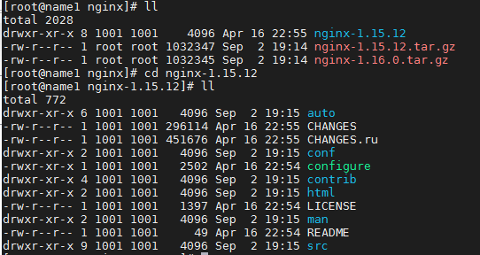
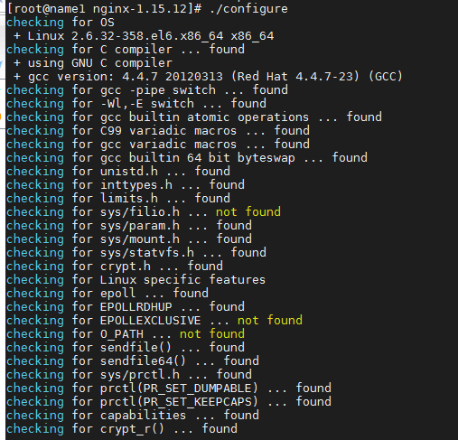
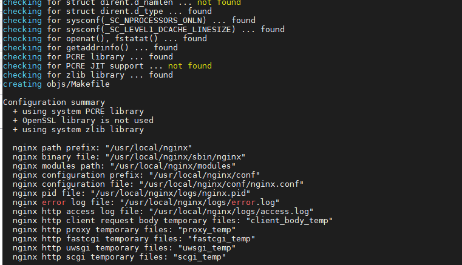
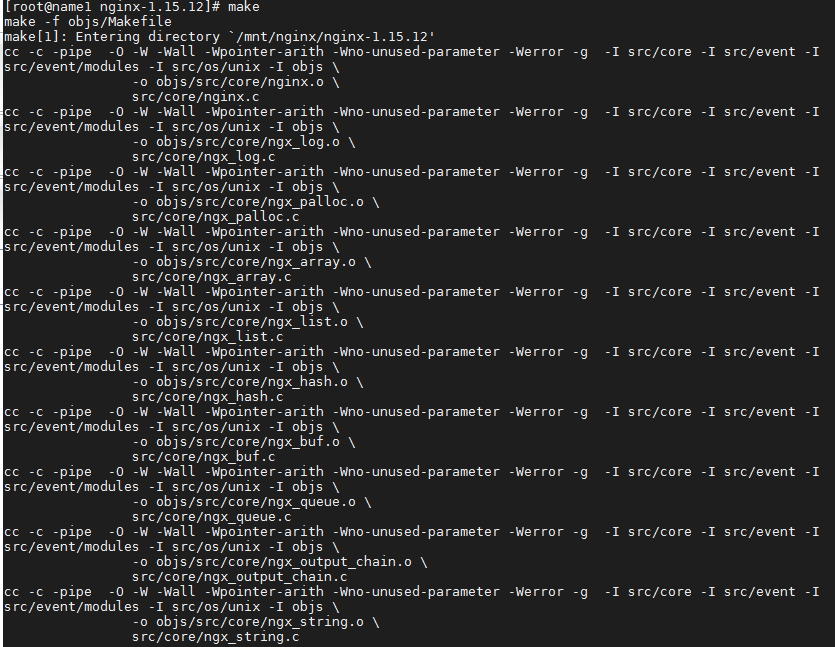
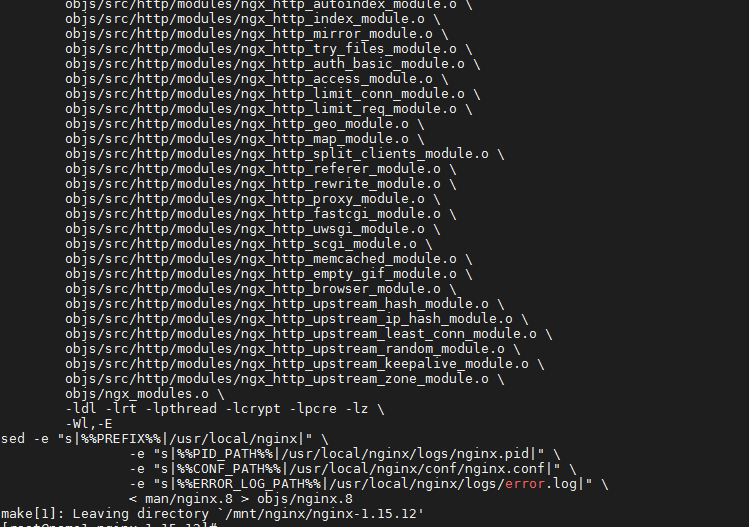
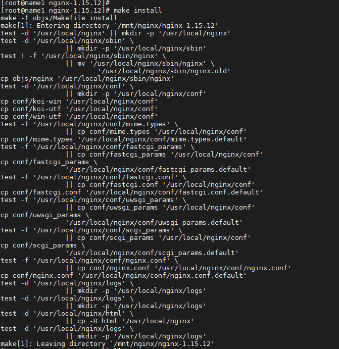
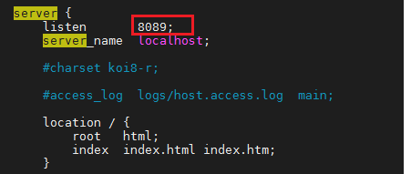
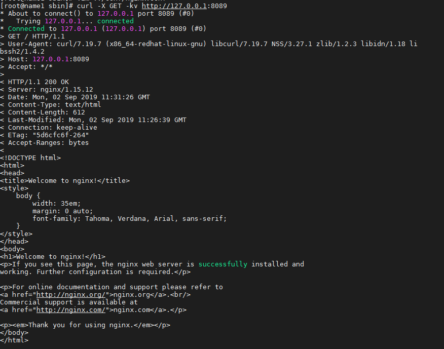

# nginx-install

1.安装依赖

```shell
yum -y install gcc zlib zlib-devel pcre-devel openssl openssl-devel
```


2.下载安装包

下载路径

```shell
http://nginx.org/download/
```



3.进入目录进行安装

```shell
./configure
```





```shell
make
```





```shell
make install
```



4.进行一个简单的配置

```shell
vim /usr/local/nginx/conf/nginx.conf
```



5.启动

```shell
/usr/local/nginx/sbin/nginx 
```


6.测试

