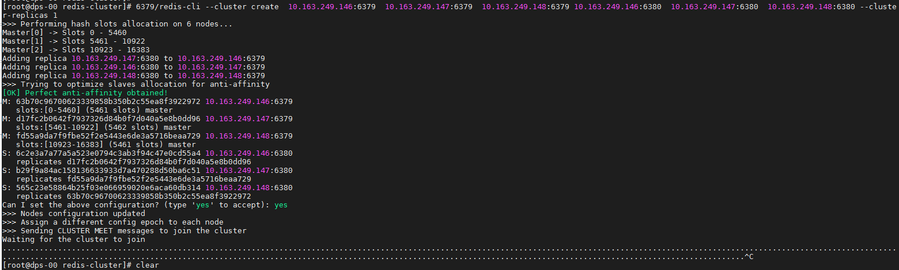

在三台机器上安装redis的集群环境，所有配置已经配置好，一主一从，6个实例已经启动后，创建集群发现就是不能成功，现象如下:



一直处于等待状态，防火墙对应的6379，6380端口已经打开；询问度娘之后，发现还需要把服务端口加上10000的高端端口打开，用于集群通讯使用。

简单点说，对外服务的端口要打开，集群通讯的端口也要打开。

```shell
这里使用的是6379,6380端口，那么对应的高端端口为 16379  16380
```

对应命令:

```shell
firewall-cmd --zone=public --add-port=16379/tcp --permanent
--zone: 添加的域
--add-port : 表示添加端口, 后面的tcp 表示协议
--permanent: 永久添加，也就是重启后仍然生效
```

